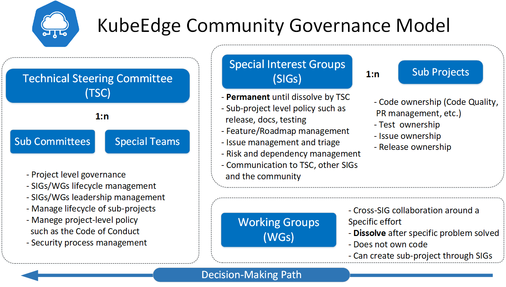

# KubeEdge Open Governance

The governance model adopted here is heavily influenced by a set of CNCF projects, especially drew
reference from [Kubernetes governance](https://github.com/kubernetes/community/blob/master/governance.md).
*For similar structures some of the same wordings from kubernetes governance are borrowed to adhere
to the originally construed meaning.*

## Principles

- **Open**: KubeEdge is open source community.
- **Welcoming and respectful**: See [Code of Conduct](https://github.com/cncf/foundation/blob/master/code-of-conduct.md).
- **Transparent and accessible**: Work and collaboration should be done in public.
  Changes to the KubeEdge organization, KubeEdge code repositories, and CNCF related activities (e.g.
  level, involvement, etc) are done in public.
- **Merit**: Ideas and contributions are accepted according to their technical merit
  and alignment with project objectives, scope and design principles.

## Code of Conduct

KubeEdge follows the [CNCF Code of Conduct](https://github.com/cncf/foundation/blob/master/code-of-conduct.md).
Here is an excerpt:

>  As contributors and maintainers of this project, and in the interest of fostering an open and welcoming community, we pledge to respect all people who contribute through reporting issues, posting feature requests, updating documentation, submitting pull requests or patches, and other activities.

## Community Membership

See [community membership](https://github.com/kubeedge/community/blob/master/community-membership.md)

## Community Groups

The project is comprised of the following types of subgroups:
* Technical Steering Committees
  * Sub Committees
  * Special Teams
* Special Interest Groups, SIGs
  * Subprojects
* Working Groups, WGs

### Technical Steering Committees (TSC)

The KubeEdge Technical Steering Committee (TSC) is the governing body for the KubeEdge 
project, providing decision-making and oversight pertaining to the KubeEdge project bylaws.
The Technical Steering Committee also defines the project values and structure.

All technical steering committee members must be [community members]. Technical steering committees
do not have open membership and do not always operate in the open. 

See [tsc charter] for more details about current Technical Steering Committee operating
mechanics, such as decision, election, etc.

#### Sub Committees

Sub committees will work regarding some topics, such as Security or Code of Conduct. 
Sub committees also do not have open membership and do not always operate in the open. 
The technical steering committee can form sub committees as needed, for bounded or unbounded duration. 
Membership of a sub committee is decided by the technical steering committee, 
however, all committee members must be [community members]. A committee must has a charter, and need to report to the
technical steering committee periodically.

#### Special Teams

The special Teams mainly focuses on work of the community, such as community roadmap update, release management, community operation etc.
Special Teams also do not have open membership and do not always operate in the open. 
The technical steering committee can form special team as needed, for bounded or unbounded duration. 
Membership of a special team is decided by the technical steering committee, 
however, all teams members must be [community members]. A special team must has a charter, 
and need to report to the technical steering committee periodically.

### Special Interest Groups (SIGs)

The KubeEdge project is organized primarily into Special Interest Groups, or
SIGs. Each SIG is comprised of individuals from multiple companies and
organizations, with a common purpose of advancing the project with respect to a
specific topic. SIGs are **permanent** until dissolved by TSC.

The goal is to enable a distributed decision structure and code ownership,
as well as providing focused forums for getting work done, making decisions,
and on-boarding new Contributors. Every identifiable part of the project
(e.g. repository, subdirectory, API, test, issue, PR) is intended to be
owned by some SIG.

SIGs must have open membership and always operate **in the open**.The leadership(SIG chairs and technical leads) 
changes of SIGs need approval by the technical steering committee, for bounded or unbounded duration. 
And all chairs and leaders must be [community members].

#### SIG Chairs

SIGs must have at least one, and may have up to two SIG chairs at any given
time. SIG chairs are intended to be organizers and facilitators, responsible for
the operation of the SIG and for communication and coordination with the other
SIGs, and the broader community.

#### SIG Charter

Each SIG must have a charter that specifies its scope (topics, sub-systems,
code repos and directories), responsibilities, and areas of authority, how members
and roles of authority/leadership are selected/granted, how decisions are made,
and how conflicts are resolved.

SIGs should be relatively free to customize or
change how they operate, within some broad guidelines and constraints imposed by
cross-SIG processes (e.g., the release process) and assets (e.g., the kubeedge repo).

A primary reason that SIGs exist is as forums for collaboration. Much work in a
SIG should stay local within that SIG. However, SIGs must communicate in the
open, ensure other SIGs and community members can find meeting notes,
discussions, designs, and decisions, and periodically communicate a high-level
summary of the SIG's work to the community. SIGs are also responsible to:

- Meet regularly, at least monthly
- Keep up-to-date meeting notes, linked from the SIG's page in the community repo
- Announce meeting agenda and minutes after each meeting, on the KubeEdge mailing
  list and/or slack or other channel.
- Ensure the SIG's decision making is archived somewhere public
- Report activity in overall community meetings
- Participate in release planning meetings, retrospective, etc (if relevant)
- Actively triage issues, PRs, test failures, etc. related to code and tests owned by the SIG
- Use the above forums as the primary means of working, communicating, and collaborating, as opposed
  to private emails and meetings.

#### Technical Leads

Technical Leads are responsible for leading the SIG in correspondence with its technical 
alignment. This alignment includes both internal to the SIG and, more significantly, external
to the entire project.

SIGs can decide on their own if they want to add Technical Leads to their charter or not. 
Depending on the overall size of the SIG, around two to three people can be nominated by the 
SIG Chairs to support the technical aspects of the group. To be able to fulfill their role, 
a Technical Lead should have the same set of permissions as a Chair.

#### Sub Projects

Specific work efforts within SIGs are divided into **subprojects**.
Every part of the code and documentation must be owned by
some subproject. Some SIGs may have a single subproject, but many SIGs
have multiple significant subprojects with distinct (though sometimes
overlapping) sets of reviewers and approvers, who act as
subproject’s technical leaders: responsible for vision and direction
and overall design, choose/approve project approvers/reviewers,
field technical escalations, etc.

### Working Groups (WGs)

Working Groups provide a formal avenue for disparate groups to collaborate around a common problem, 
craft a balanced position, and **dissolved** by TSC after the problem solved. Because they represent the
interests of multiple groups, they are a vehicle for consensus building. If code is developed as part of
collaboration within the Working Group, that code will be housed in an appropriate repository.

Working groups are primarily used to facilitate topics of discussion that are in
scope for KubeEdge but that cross SIG lines. If a set of folks in the
community want to get together and discuss a topic, they can do so without
forming a Working Group.

Because a working group is an official part of the project it is subject to technical steering committee
oversight over its **formation and disbanding**.

#### WG Charter

Each WG must have a charter that specifies its scope (topics, sub-systems), responsibilities, what
WGs are responsible to:

- Exact problem this group is trying to solve
- Stakeholder SIGs involved in this problem this group
- Meeting mechanics
- Organizers of the group, and ensure it continues to meet these requirements

#### WG Organizers

WGs must have at least one, and may have up to two WG Organizers at any given
time. WG Organizers are intended to be organizers and facilitators, responsible for
the operation of the WG and for communication and coordination with the stakeholder
SIGs, and the broader community.

Working Group Organizers are required to give updates to their respective 
sponsoring SIG Chairs. All working group organizers must be [community members].

## CLA
All contributors must sign the CNCF CLA, as described [here](https://github.com/kubernetes/community/blob/master/CLA.md).

## Credits

Sections of this documents have been borrowed from [Kubernetes governance](https://github.com/kubernetes/community/blob/master/governance.md).

[community members]: /community-membership.md
[tsc charter]: /commitee-technical-steering/charter.md