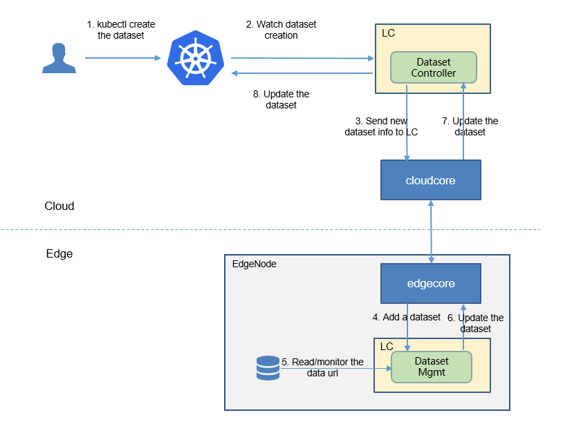

* [Dataset and Model](#dataset-and-model)
   * [Motivation](#motivation)
     * [Goals](#goals)
     * [Non\-goals](#non-goals)
   * [Proposal](#proposal)
     * [Use Cases](#use-cases)
   * [Design Details](#design-details)
     * [CRD API Group and Version](#crd-api-group-and-version)
     * [CRDs](#crds)
     * [Type definition](#crd-type-definition)
     * [Crd sample](#crd-samples)
   * [Controller Design](#controller-design)

# Dataset and Model

## Motivation

Currently, the EdgeAI features depend on the object `dataset` and `model`


This proposal provides the definitions of dataset and model as the first class of k8s resources.

### Goals

* Metadata of `dataset` and `model` objects.
* Used by the EdgeAI features 

### Non-goals
* The truly format of the AI `dataset`, such as `imagenet`, `coco` or `tf-record` etc.
* The truly format of the AI `model`, such as `ckpt`, `saved_model` of tensorflow etc.

* The truly operations of the AI `dataset`, such as `shuffle`, `crop` etc.
* The truly operations of the AI `model`, such as `train`, `inference` etc.


## Proposal
We propose using Kubernetes Custom Resource Definitions (CRDs) to describe 
the dataset/model specification/status and a controller to synchronize these updates between edge and cloud.


### Use Cases

* Users can create the dataset resource, by providing the `dataset url`, `format` and the `nodeName` which owns the dataset.
* Users can create the model resource by providing the `model url` and `format`.
* Users can show the information of dataset/model.
* Users can delete the dataset/model. 


## Design Details

### CRD API Group and Version
The `Dataset` and `Model` CRDs will be namespace-scoped.
The tables below summarize the group, kind and API version details for the CRDs.

* Dataset

| Field                 | Description             |
|-----------------------|-------------------------|
|Group                  | edgeai.io     |
|APIVersion             | v1alpha1                |
|Kind                   | Dataset             |

* Model

| Field                 | Description             |
|-----------------------|-------------------------|
|Group                  | edgeai.io     |
|APIVersion             | v1alpha1                |
|Kind                   | Model             |

### CRDs

- `Dataset` crd

```yaml
apiVersion: apiextensions.k8s.io/v1
kind: CustomResourceDefinition
metadata:
  name: datasets.edgeai.io
spec:
  group: edgeai.io
  names:
    kind: Dataset
    plural: datasets
  scope: Namespaced
  versions:
  - name: v1alpha1
    subresources:
      # status enables the status subresource.
      status: {}
    served: true
    storage: true
    schema:
      openAPIV3Schema:
        type: object
        properties:
          spec:
            type: object
            properties:
              dataUrl:
                type: string
              format:
                type: string
              nodeName:
                type: string
          status:
            type: object
            properties:
              numberOfSamples:
                type: integer
              updateTime:
                type: string
                format: datatime


    additionalPrinterColumns:
    - name: NumberOfSamples
      type: integer
      description: The number of samples in the dataset
      jsonPath: ".status.numberOfSamples"
    - name: Node
      type: string
      description: The node name of the dataset
      jsonPath: ".spec.nodeName"
    - name: spec
      type: string
      description: The spec of the dataset
      jsonPath: ".spec"
``` 

- `Model` crd
```yaml 
apiVersion: apiextensions.k8s.io/v1
kind: CustomResourceDefinition
metadata:
  name: models.edgeai.io
spec:
  group: edgeai.io
  names:
    kind: Model
    plural: models
  scope: Namespaced
  versions:
    - name: v1alpha1
      subresources:
        # status enables the status subresource.
        status: {}
      served: true
      storage: true
      schema:
        openAPIV3Schema:
          type: object
          properties:
            spec:
              type: object
              properties:
                modelUrl:
                  type: string
            status:
              type: object
              properties:
                updateTime:
                  type: string
                  format: datetime
                metrics:
                  type: array
                  items:
                    type: object 
                    properties:
                      key:
                        type: string
                      value:
                        type: string

      additionalPrinterColumns:
        - name: updateAGE
          type: date
          description: The update age
          jsonPath: ".status.updateTime"
        - name: metrics
          type: string
          description: The metrics
          jsonPath: ".status.metrics"
```

### CRD type definition
- `Dataset`

```go
type Dataset struct {
        metav1.TypeMeta `json:",inline"`

        metav1.ObjectMeta `json:"metadata,omitempty"`

        Spec   DatasetSpec   `json:"spec"`
        Status DatasetStatus `json:"status"`
}

type DatasetSpec struct {
        DataUrl  string `json:"dataUrl"`
        Format   string `json:"format"`
        NodeName string `json:"nodeName"`
}

type DatasetStatus struct {
        UpdateTime      *metav1.Time `json:"updateTime,omitempty"`
        NumberOfSamples int          `json:"numberOfSamples"`
}

// +k8s:deepcopy-gen:interfaces=k8s.io/apimachinery/pkg/runtime.Object

type DatasetList struct {
        metav1.TypeMeta `json:",inline"`
        metav1.ListMeta `json:"metadata"`

        Items []Dataset `json:"items"`
} 
```

- `Model`

```go
// +genclient
// +k8s:deepcopy-gen:interfaces=k8s.io/apimachinery/pkg/runtime.Object

type Model struct {
        metav1.TypeMeta `json:",inline"`

        metav1.ObjectMeta `json:"metadata,omitempty"`

        Spec   ModelSpec   `json:"spec"`
        Status ModelStatus `json:"status"`
}

type ModelSpec struct {
        ModelUrl string `json:"modelUrl"`
        Format   string `json:"format"`
}

type ModelStatus struct {
        UpdateTime *metav1.Time  `json:"updateTime,omitempty"`
        Metrics    []ModelMetric `json:"metrics,omitempty"`
}

type ModelMetric struct {
        Key   string `json:"key"`
        Value string `json:"value"`
}

// +k8s:deepcopy-gen:interfaces=k8s.io/apimachinery/pkg/runtime.Object

type ModelList struct {
        metav1.TypeMeta `json:",inline"`
        metav1.ListMeta `json:"metadata"`

        Items []Model `json:"items"`
}
```

### Crd samples
- `Dataset`

```yaml
apiVersion: edgeai.io/v1alpha1
kind: Dataset
metadata:
  name: "dataset-examp"
spec:
  dataUrl: "/code/data"
  format: "txt"
  nodeName: "edge0"
```

- `Model`

```yaml
apiVersion: edgeai.io/v1alpha1
kind: Model
metadata:
  name: model-examp
spec:
  modelUrl: "/model/frozen.pb"
  format: pb
```


## Controller Design
In the current design there is a controller for `dataset`, no controller for `model`.<br/>
 
The dataset controller synchronizes the dataset between the cloud and edge.
- downstream: synchronize the dataset info from the cloud to the edge node.
- upstream: synchronize the dataset status from the edge to the cloud node, such as the information how many samples the dataset has.
<br/>

Here is the flow of the dataset creation:
