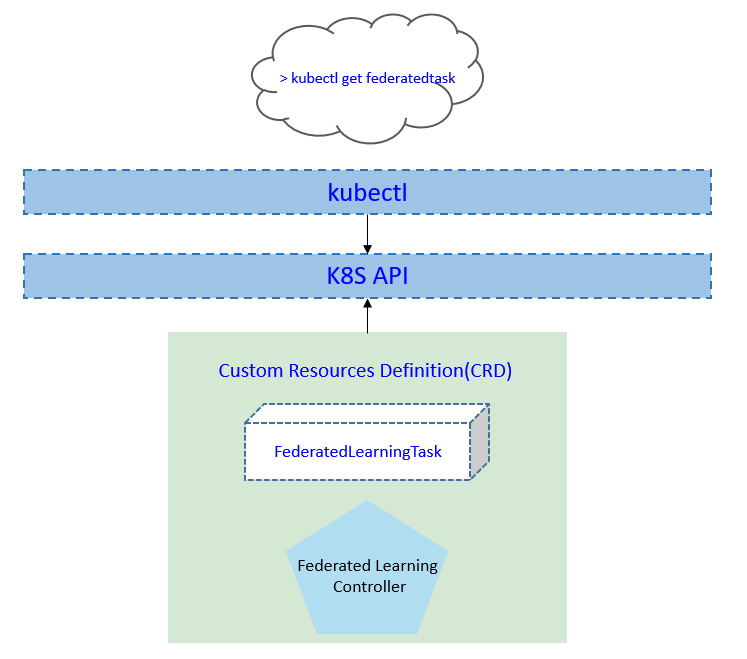
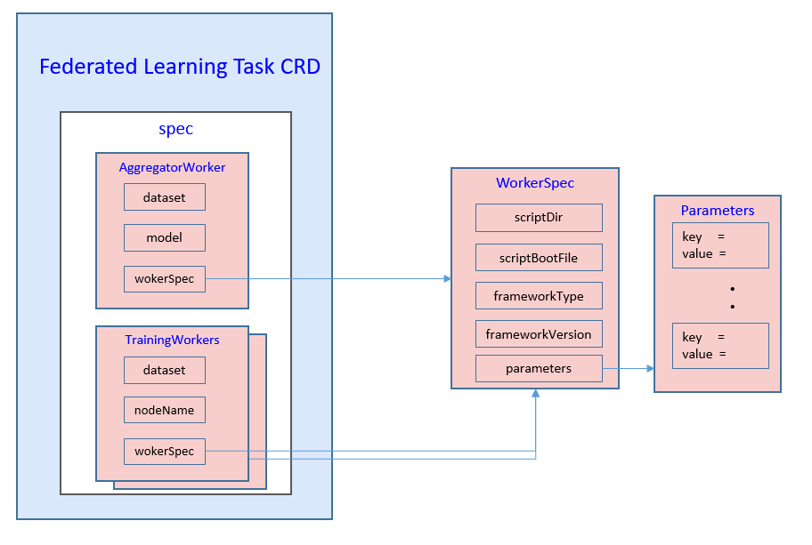
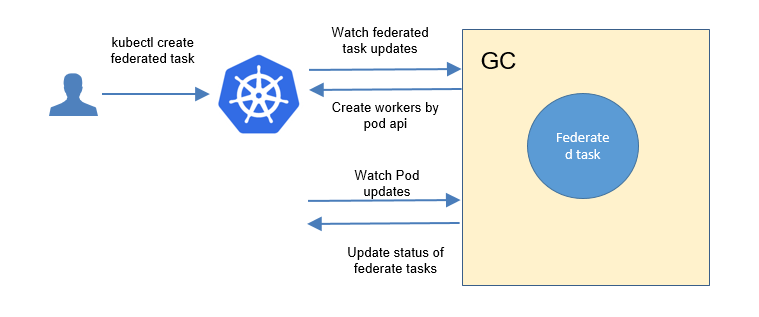
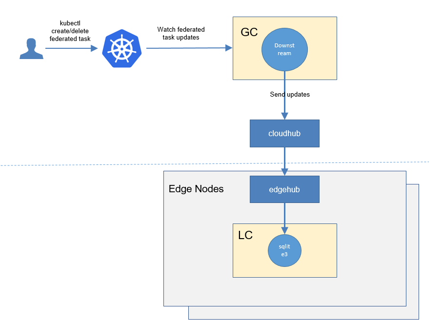
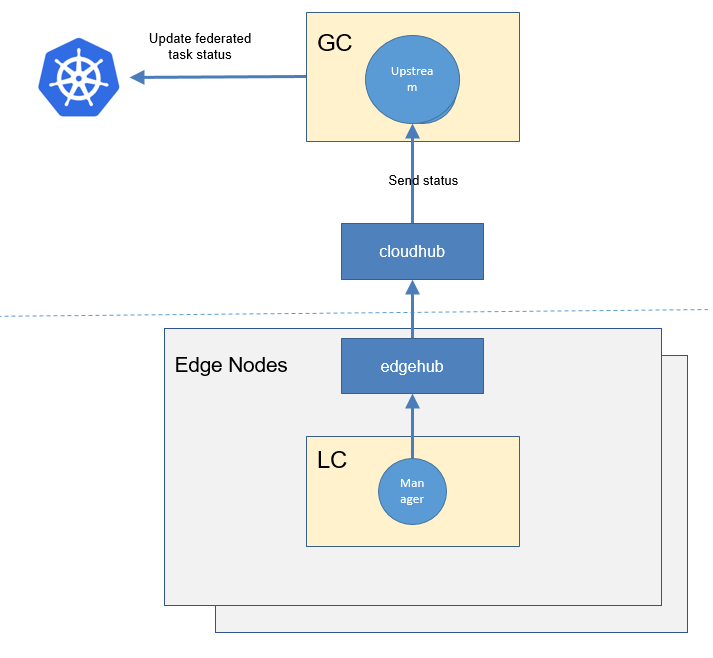
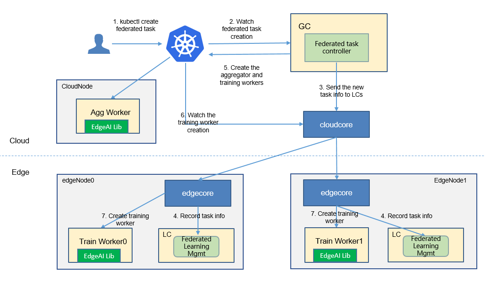

* [Federated Learning](#federated-learning)
   * [Motivation](#motivation)
     * [Goals](#goals)
     * [Non\-goals](#non-goals)
   * [Proposal](#proposal)
     * [Use Cases](#use-cases)
   * [Design Details](#design-details)
     * [CRD API Group and Version](#crd-api-group-and-version)
     * [Federated learning CRD](#federated-learning-crd)
     * [Federated learning type definition](#federated-learning-type-definition)
     * [Federated learning sample](#federated-learning-sample)
     * [Validation](#validation)
   * [Controller Design](#controller-design)
     * [Federated Learning Controller](#federated-learning-controller)
     * [Downstream Controller](#downstream-controller)
     * [Upstream Controller](#upstream-controller)
     * [Details of api between GC(cloud) and LC(edge)](#details-of-api-between-gccloud-and-lcedge)
   * [Workers Communication](#workers-communication)
   
# Federated Learning
## Motivation

For edge AI, data is naturally generated at the edge. based on these assumptions:
* Users are unwilling to upload raw data to the cloud because of data privacy.
* Users do not want to purchase new devices for centralized training at the edge. 
* The sample size at the edge is usually small, and it is often difficult to train a good model at a single edge node.

Therefore, we propose a edge cloud federated learning framework to help to train a model **without uploading raw data**, and **higher precision** and **less convergence time** are also benefits.


### Goals

* The framework can combine data on multiple edge nodes to complete training.
* The framework provides the functions of querying the training status and result.
* The framework integrates some common aggregation algorithms, FedAvg and so on.
* The framework integrates some common weight/gradient compression algorithm to reduce the cloud-edge traffic required for aggregation operations.
* The framework integrates some common multi-task migration algorithms to resolve the problem of low precision caused by small size samples.


## Proposal
We propose using Kubernetes Custom Resource Definitions (CRDs) to describe 
the federated learning specification/status and a controller to synchronize these updates between edge and cloud.



### Use Cases


* User can create a federated learning task, with providing a training script, specifying the aggregation algorithm, configuring training hyperparameters, configuring training datasets.

* Users can get the federated learning status, including the nodes participating in training, current training status, samples size of each node, current iteration times, and current aggregation times.

* Users can get the saved aggregated model. The model file can be stored on the cloud or edge node.

 

## Design Details
### CRD API Group and Version
The `FederatedLearningTask` CRD will be namespace-scoped.
The tables below summarize the group, kind and API version details for the CRD.

* FederatedLearningTask

| Field                 | Description             |
|-----------------------|-------------------------|
|Group                  | edgeai.io     |
|APIVersion             | v1alpha1                |
|Kind                   | FederatedLearningTask             |


### Federated learning CRD


Notes:
1. We use `WorkerSpec` to represent the worker runtime config which all EdgeAI features use.
1. Currently `WorkerSpec` limits to the code directory on host path or s3-like storage.
We will extend it to the support with `pod template` like k8s deployment.
1. We will add the [resources](https://kubernetes.io/docs/concepts/configuration/manage-resources-containers/) support in the future.

Below is the CustomResourceDefinition yaml for `FederatedLearningTask`:

```yaml
apiVersion: apiextensions.k8s.io/v1
kind: CustomResourceDefinition
metadata:
  name: federatedlearningtasks.edgeai.io
spec:
  group: edgeai.io
  names:
    kind: FederatedLearningTask
    plural: federatedlearningtasks
    shortNames:
    - federatedtask
    - ft
  scope: Namespaced
  versions:
  - name: v1alpha1
    subresources:
      # status enables the status subresource.
      status: {}
    served: true
    storage: true
    schema:
      openAPIV3Schema:
        type: object
        properties:
          spec:
            type: object
            properties:
              aggregationWorker:
                type: object
                properties:
                  name:
                    type: string
                  model:
                    type: object
                    properties:
                      name:
                        type: string
                  nodeName:
                    type: string
                  workerSpec:
                    type: object
                    properties:
                      scriptDir:
                        type: string
                      scriptBootFile:
                        type: string
                      frameworkType:
                        type: string
                      frameworkVersion:
                        type: string
                      parameters:
                        type: array
                        items:
                          type: object
                          required:
                          - key
                          - value
                          properties:
                            key:
                              type: string
                            value:
                              type: string
              trainingWorkers:
                type: array
                items:
                  type: object
                  properties:
                    name:
                      type: string
                    model:
                      type: object
                      properties:
                        name:
                          type: string
                    nodeName:
                      type: string
                    workerSpec:
                      type: object
                      properties:
                        dataset:
                          type: object
                          properties:
                            name:
                              type: string
                        scriptDir:
                          type: string
                        scriptBootFile:
                          type: string
                        frameworkType:
                          type: string
                        frameworkVersion:
                          type: string
                        parameters:
                          type: array
                          items:
                            type: object
                            required:
                            - key
                            - value

                            properties:
                              key:
                                type: string
                              value:
                                type: string
          status:
            type: object
            properties:
              conditions:
                type: array
                items:
                  type: object
                  properties:
                    type:
                      type: string
                    status:
                      type: string
                    lastProbeTime:
                      type: string
                      format: date-time
                    lastTransitionTime:
                      type: string
                      format: date-time
                    reason:
                      type: string
                    message:
                      type: string
              startTime:
                type: string
                format: date-time
              completionTime:
                type: string
                format: date-time
              active:
                type: integer
              succeeded:
                type: integer
              failed:
                type: integer
              phase:
                type: string


    additionalPrinterColumns:
    - name: status
      type: string
      description: The status of the federated learning task
      jsonPath: ".status.phase"
    - name: Age
      type: date
      jsonPath: .metadata.creationTimestamp
```

### Federated learning type definition
```go
// +genclient
// +k8s:deepcopy-gen:interfaces=k8s.io/apimachinery/pkg/runtime.Object
//  FederatedLearningTask defines the federatedlearning task which describes the
//  federated learning task
type FederatedLearningTask struct {
	metav1.TypeMeta `json:",inline"`

	metav1.ObjectMeta `json:"metadata,omitempty"`

	Spec   FederatedLearningTaskSpec   `json:"spec"`
	Status FederatedLearningTaskStatus `json:"status,omitempty"`
}

// FederatedLearningTaskSpec describes the details configuration of federatedlearningtask
type FederatedLearningTaskSpec struct {
	AggregationWorker AggregationWorker `json:"aggregationWorker"`
	TrainingWorkers   []TrainingWorker  `json:"trainingWorkers"`
}

// AggregationWorker describes the aggregation worker
type AggregationWorker struct {
	Name       string                `json:"name"`
	Model      modelRefer            `json:"model"`
	NodeName   string                `json:"nodeName"`
	WorkerSpec AggregationWorkerSpec `json:"workerSpec"`
}

// TrrainingWorker describes the training worker of each node
type TrainingWorker struct {
	Name       string             `json:"name"`
	NodeName   string             `json:"nodeName"`
	Dataset    datasetRefer       `json:"dataset"`
	WorkerSpec TrainingWorkerSpec `json:"workerSpec"`
}

type AggregationWorkerSpec struct {
	ScriptDir           string     `json:"scriptDir"`
	ScriptBootFile      string     `json:"scriptBootFile"`
	FrameworkType       string     `json:"frameworkType"`
	FrameworkVersion    string     `json:"frameworkVersion"`
	Parameters          []ParaSpec `json:"parameters"`
}

type TrainingWorkerSpec struct {
	ScriptDir           string       `json:"scriptDir"`
	ScriptBootFile      string       `json:"scriptBootFile"`
	FrameworkType       string       `json:"frameworkType"`
	FrameworkVersion    string       `json:"frameworkVersion"`
	Parameters          []ParaSpec   `json:"parameters"`
}

type ParaSpec struct {
	Key   string `json:"key"`
	Value string `json:"value"`
}

type datasetRefer struct {
	Name string `json:"name"`
}

type modelRefer struct {
	Name string `json:"name"`
}

// +k8s:deepcopy-gen:interfaces=k8s.io/apimachinery/pkg/runtime.Object

// FederatedLearningTaskList is a list of federated learning tasks.
type FederatedLearningTaskList struct {
	metav1.TypeMeta `json:",inline"`
	metav1.ListMeta `json:"metadata"`
	Items           []FederatedLearningTask `json:"items"`
}

// FederatedLearningTaskStatus represents the current state of a federated learning task.
type FederatedLearningTaskStatus struct {

	// The latest available observations of a federated learning task's current state.
	// +optional
	Conditions []FederatedLearningTaskCondition `json:"conditions,omitempty"`

	// Represents time when the task was acknowledged by the task controller.
	// It is not guaranteed to be set in happens-before order across separate operations.
	// It is represented in RFC3339 form and is in UTC.
	// +optional
	StartTime *metav1.Time `json:"startTime,omitempty"`

	// Represents time when the task was completed. It is not guaranteed to
	// be set in happens-before order across separate operations.
	// It is represented in RFC3339 form and is in UTC.
	// +optional
	CompletionTime *metav1.Time `json:"completionTime,omitempty"`

	// The number of actively running pods.
	// +optional
	Active int32 `json:"active,omitempty"`

	// The number of pods which reached phase Succeeded.
	// +optional
	Succeeded int32 `json:"succeeded,omitempty"`

	// The number of pods which reached phase Failed.
	// +optional
	Failed int32 `json:"failed,omitempty"`

	// The phase of the federated learning task.
	// +optional
	Phase FederatedLearningTaskPhase `json:"phase,omitempty"`
}

type FederatedLearningTaskConditionType string

// These are valid conditions of a task.
const (
	// FederatedLearningTaskComplete means the task has completed its execution.
	FederatedLearningTaskCondComplete FederatedLearningTaskConditionType = "Complete"
	// FederatedLearningTaskFailed means the task has failed its execution.
	FederatedLearningTaskCondFailed FederatedLearningTaskConditionType = "Failed"
	// FederatedLearningTaskTraining means the task has been training.
	FederatedLearningTaskCondTraining FederatedLearningTaskConditionType = "Training"
)

// FederatedLearningTaskCondition describes current state of a task.
type FederatedLearningTaskCondition struct {
	// Type of task condition, Complete or Failed.
	Type FederatedLearningTaskConditionType `json:"type"`
	// Status of the condition, one of True, False, Unknown.
	Status v1.ConditionStatus `json:"status"`
	// Last time the condition was checked.
	// +optional
	LastProbeTime metav1.Time `json:"lastProbeTime,omitempty"`
	// Last time the condition transit from one status to another.
	// +optional
	LastTransitionTime metav1.Time `json:"lastTransitionTime,omitempty"`
	// (brief) reason for the condition's last transition.
	// +optional
	Reason string `json:"reason,omitempty"`
	// Human readable message indicating details about last transition.
	// +optional
	Message string `json:"message,omitempty"`
}

// FederatedLearningTaskPhase is a label for the condition of a task at the current time.
type FederatedLearningTaskPhase string

// These are the valid statuses of tasks.
const (
	// FederatedLearningTaskPending means the task has been accepted by the system, but one or more of the pods
	// has not been started. This includes time before being bound to a node, as well as time spent
	// pulling images onto the host.
	FederatedLearningTaskPending FederatedLearningTaskPhase = "Pending"
	// FederatedLearningTaskRunning means the task has been bound to a node and all of the pods have been started.
	// At least one container is still running or is in the process of being restarted.
	FederatedLearningTaskRunning FederatedLearningTaskPhase = "Running"
	// FederatedLearningTaskSucceeded means that all pods in the task have voluntarily terminated
	// with a container exit code of 0, and the system is not going to restart any of these pods.
	FederatedLearningTaskSucceeded FederatedLearningTaskPhase = "Succeeded"
	// FederatedLearningTaskFailed means that all pods in the task have terminated, and at least one container has
	// terminated in a failure (exited with a non-zero exit code or was stopped by the system).
	FederatedLearningTaskFailed FederatedLearningTaskPhase = "Failed"
)
```

#### Validation
[Open API v3 Schema based validation](https://kubernetes.io/docs/tasks/access-kubernetes-api/custom-resources/custom-resource-definitions/#validation) can be used to guard against bad requests.
Invalid values for fields ( example string value for a boolean field etc) can be validated using this.

Here is a list of validations we need to support :
1. The `dataset` specified in the crd should exist in k8s.
1. The `model` specified in the crd should exist in k8s.
1. The edgenode name specified in the crd should exist in k8s.

### federated learning sample
```yaml
apiVersion: edgeai.io/v1alpha1
kind: FederatedLearningTask
metadata:
  name: magnetic-tile-defect-detection
spec:
  aggregationWorker:
    name: "aggregationworker"
    model:
      name: "model-demo1"
    nodeName: "solar-corona-cloud"
    workerSpec:
      scriptDir: "/code"
      scriptBootFile: "aggregate.py"
      frameworkType: "tensorflow"
      frameworkVersion: "1.18"
      parameters:
        - key: "exit_round"
          value: "3"
  trainingWorkers:
    - name: "work0"
      nodeName: "edge0"
      workerSpec:
        dataset:
          name: "dataset-demo0"
        scriptDir: "/code"
        scriptBootFile: "train.py"
        frameworkType: "tensorflow"
        frameworkVersion: "1.18"
        parameters:
          - key: "batch_size"
            value: "32"
          - key: "learning_rate"
            value: "0.001"
          - key: "epochs"
            value: "1"
    - name: "work1"
      nodeName: "edge1"
      workerSpec:
        dataset:
          name: "dataset-demo1"
        scriptDir: "/code"
        scriptBootFile: "train.py"
        frameworkType: "tensorflow"
        frameworkVersion: "1.18"
        parameters:
          - key: "batch_size"
            value: "32"
          - key: "learning_rate"
            value: "0.001"
          - key: "epochs"
            value: "1"
          - key: "min_sample_number_per"
            value: "500"
          - key: "min_node_number"
            value: "3"
          - key: "rounds_between_valida"
            value: "3"

    - name: "work2"
      nodeName: "edge2"
      workerSpec:
        dataset:
          name: "dataset-demo2"
        scriptDir: "/code"
        scriptBootFile: "train.py"
        frameworkType: "tensorflow"
        frameworkVersion: "1.18"
        parameters:
          - key: "batch_size"
            value: "32"
          - key: "learning_rate"
            value: "0.001"
          - key: "epochs"
            value: "1"
          - key: "min_sample_number_per"
            value: "500"
          - key: "min_node_number"
            value: "3"
          - key: "rounds_between_valida"
            value: "3"

```

### Creation of the federated learning task

## Controller Design
The federated learning controller starts three separate goroutines called `upstream`, `downstream` and `federated-learning`controller. These are not separate controllers as such but named here for clarity.
- federated learning: watch the updates of federated-learning-task crds, and create the workers to complete the task.
- downstream: synchronize the federated-learning updates from the cloud to the edge node.
- upstream: synchronize the federated-learning updates from the edge to the cloud node.

### Federated Learning Controller


The federated-learning controller watches for the updates of federated-learning tasks and the corresponding pods against the K8S API server.<br/>
Updates are categorized below along with the possible actions:

| Update Type                    | Action                                       |
|-------------------------------|---------------------------------------------- |
|New  Federated-learning-task Created             |Create the aggregation worker and these local-training workers|
|Federated-learning-task Deleted                 | NA. These workers will be deleted by [k8s gc](https://kubernetes.io/docs/concepts/workloads/controllers/garbage-collection/).|
|The corresponding pod created/running/completed/failed                 | Update the status of federated-learning task.|


### Downstream Controller


The downstream controller watches for federated-learning updates against the K8S API server.<br/>
Updates are categorized below along with the possible actions that the downstream controller can take:

| Update Type                    | Action                                       |
|-------------------------------|---------------------------------------------- |
|New Federated-learning-task Created             |Sends the task information to LCs.|
|Federated-learning-task Deleted                 | The controller sends the delete event to LCs.|

### Upstream Controller


The upstream controller watches for federated-learning-task updates from the edge node and applies these updates against the API server in the cloud.
Updates are categorized below along with the possible actions that the upstream controller can take:

| Update Type                        | Action                                        |
|-------------------------------     |---------------------------------------------- |
|Federated-learning-task Reported State Updated    |  The controller appends the reported status of the Federated-learning-task in the cloud. |

### Details of api between GC(cloud) and LC(edge)
1. GC(downstream controller) syncs the task info to LC:
    ```go
    // POST <namespace>/federatedlearningtasks/<job-name>
    // body same to the task crd of k8s api, omitted here.
    ```

1. LC uploads the task status which reported by the worker to GC(upstream controller):
    ```go
    // POST <namespace>/federatedlearningtasks/<job-name>/status
   
    // WorkerMessage defines the message from that the training worker. It will send to GC.
    type WorkerMessage struct {
        Phase  string        `json:"phase"`
        Status string        `json:"status"`
        Output *WorkerOutput `json:"output"`
    }
    // 
    type WorkerOutput struct {
        Models   []*Model  `json:"models"`
        TaskInfo *TaskInfo `json:"taskInfo"`
    }
    
    // Model defines the model information 
    type Model struct {
        Format  string             `json:"format"`
        URL     string             `json:"url"`
        // Including the metrics, e.g. precision/recall
        Metrics map[string]float64 `json:"metrics"`
    }
    
    // TaskInfo defines the task information
    type TaskInfo struct {
        // Current training round
        CurrentRound int    `json:"currentRound"`
        UpdateTime   string `json:"updateTime"`
    }
    ```

### The flow of federated learning task creation

The federated-learning controller watches the creation of federatedlearningtask crd in the cloud, syncs them to lc via the cloudhub-to-edgehub channel, 
and creates the aggregator worker on the cloud nodes and the training workers on the edge nodes specified by the user.<br/>
The aggregator worker is started by the native k8s at the cloud nodes.  
These training workers are started by the kubeedge at the edge nodes.  

  
## Workers Communication


Todo: complete the two restful apis.