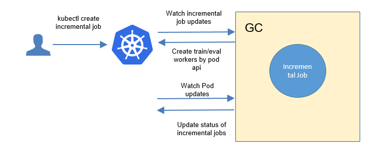
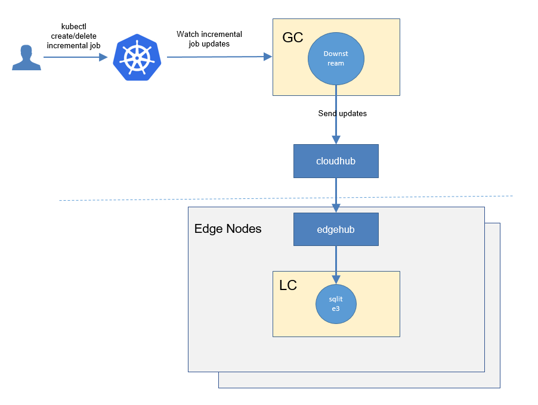
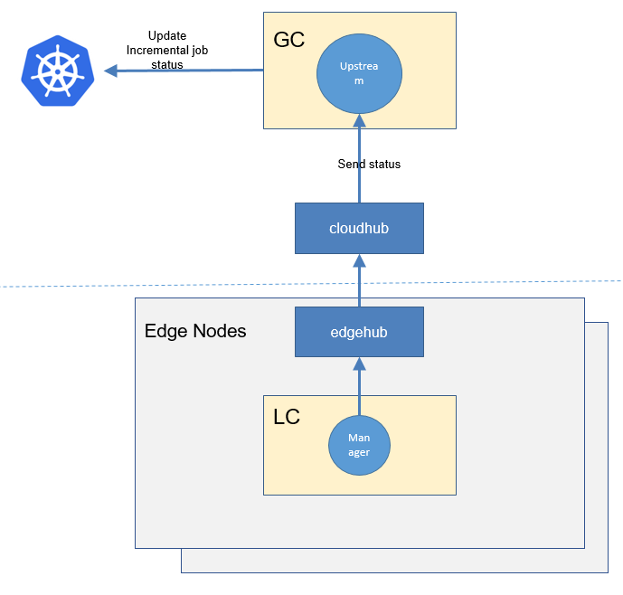
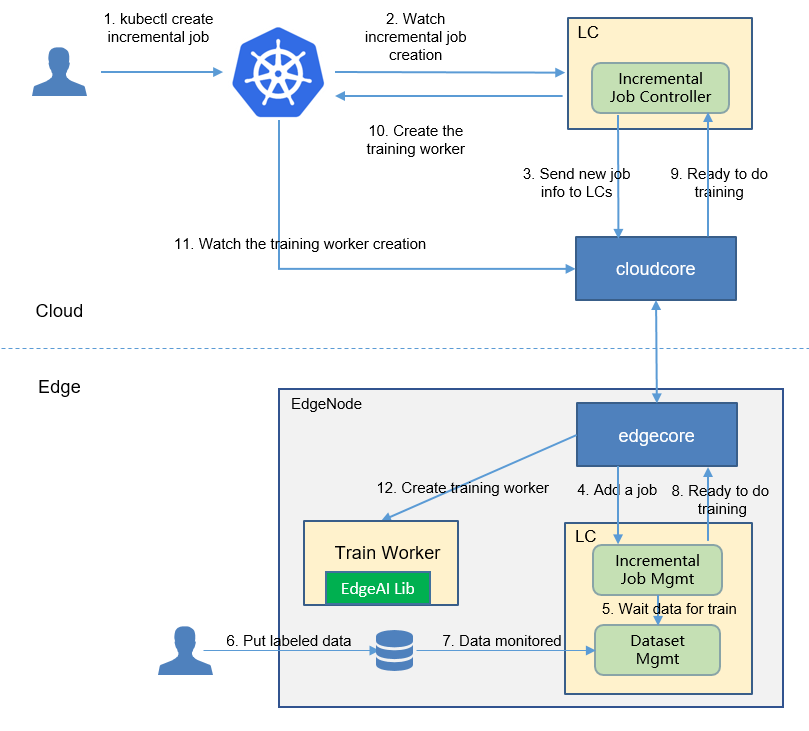
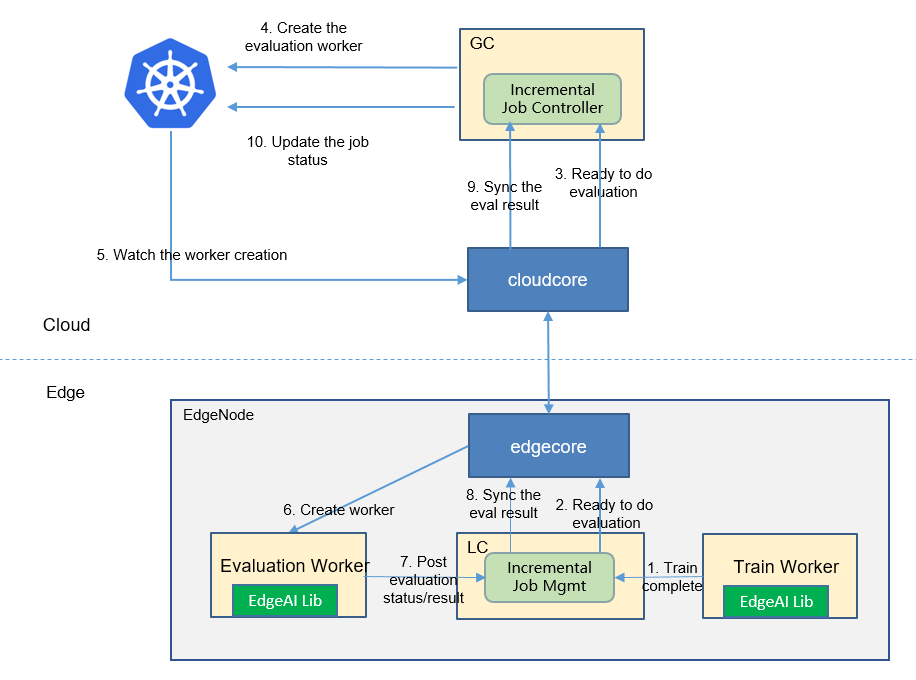
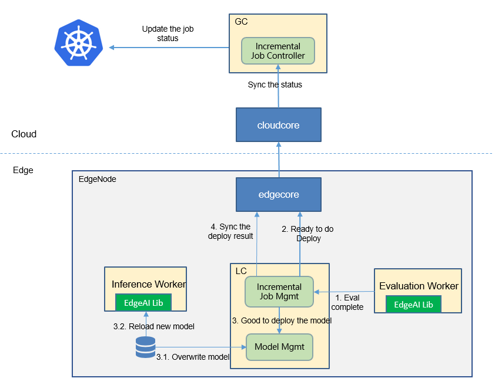

* [Incremental Learning](#incremental-learning)
   * [Motivation](#motivation)
     * [Goals](#goals)
     * [Non\-goals](#non-goals)
   * [Proposal](#proposal)
     * [Use Cases](#use-cases)
   * [Design Details](#design-details)
     * [CRD API Group and Version](#crd-api-group-and-version)
     * [Incremental learning CRD](#incremental-learning-crd)
     * [Incremental learning type definition](#incremental-learning-job-type-definition)
     * [Incremental learning sample](#incremental-learning-job-sample)
     * [Validation](#validation)
   * [Controller Design](#controller-design)
     * [Incremental Learning Controller](#incremental-learning-controller)
     * [Downstream Controller](#downstream-controller)
     * [Upstream Controller](#upstream-controller)
     * [Details of api between GC(cloud) and LC(edge)](#details-of-api-between-gccloud-and-lcedge)
   * [Workers Communication](#workers-communication)

# Incremental Learning
## Motivation


Data is continuously generated on the edge side. Traditionally, the data is collected manually and periodically retrained on the cloud to improve the model effect. This method wastes a lot of human resources, and the model update frequency is slow.  Incremental learning allows users to continuously monitor the newly generated data and by configuring some triggering rules to determine whether to start training, evaluation, and deployment automatically, and continuously improve the model performance.


### Goals


* Automatically retrains, evaluates, and updates models based on the data generated at the edge.
* Support time trigger, sample size trigger, and precision-based trigger.
* Support manual triggering of training, evaluation, and model update.
* support hard sample discovering of unlabeled data,  for reducing the manual labeling workload. 
* Support lifelong learning that reserves historical knowledge to avoid frequent re-training/ re-fine-tuning, and tackles samples uncovered in historical knowledge base.


## Proposal
We propose using Kubernetes Custom Resource Definitions (CRDs) to describe 
the incremental learning specification/status and a controller to synchronize these updates between edge and cloud.


### Use Cases

* Users can create the incremental learning jobs, by providing training scripts, configuring training hyperparameters, providing training datasets, configuring training and deployment triggers.


## Design Details
We use the `job` word to represent the **Constantly Iterative Update** tasks including the train/eval/deploy task.<br/>
There are three stages in a job: train/eval/deploy.

Each stage contains these below states:
1. Waiting: wait to trigger satisfied, i.e. wait to train/eval/deploy
1. Ready: the corresponding trigger satisfied, now ready to train/eval/deploy
1. Starting: the corresponding stage is starting
1. Running: the corresponding stage is running
1. Failed: the corresponding stage failed
1. Completed: the corresponding stage completed


### CRD API Group and Version
The `IncrementalLearningJob` CRD will be namespace-scoped.
The tables below summarize the group, kind and API version details for the CRD.

* IncrementalLearningJob

| Field                 | Description             |
|-----------------------|-------------------------|
|Group                  | edgeai.io     |
|APIVersion             | v1alpha1                |
|Kind                   | IncrementalLearningJob             |

### Incremental learning CRD


Below is the CustomResourceDefinition yaml for `IncrementalLearningJob`:
```yaml
apiVersion: apiextensions.k8s.io/v1
kind: CustomResourceDefinition
metadata:
  name: incrementallearningjobs.edgeai.io
spec:
  group: edgeai.io
  names:
    kind: IncrementalLearningJob
    plural: incrementallearningjobs
    shortNames:
      - incrementaljob
      - ij
  scope: Namespaced
  versions:
    - name: v1alpha1
      subresources:
        # status enables the status subresource.
        status: {}
      served: true
      storage: true
      schema:
        openAPIV3Schema:
          type: object
          properties:
            spec:
              type: object
              properties:
                dataset:
                  type: object
                  properties:
                    name:
                      type: string
                    trainProb:
                      type: number
                nodeName:
                  type: string
                outputDir:
                  type: string
                initialModel:
                  type: object
                  properties:
                    name:
                      type: string
                trainSpec:
                  type: object
                  properties:
                    workerSpec:
                      type: object
                      properties:
                        scriptDir:
                          type: string
                        scriptBootFile:
                          type: string
                        frameworkType:
                          type: string
                        frameworkVersion:
                          type: string
                        parameters:
                          type: array
                          items:
                            type: object
                            properties:
                              key:
                                type: string
                              value:
                                type: string
                    trigger:
                      type: object
                      properties:
                        checkPeriodSeconds:
                          type: integer
                        timer:
                          type: object
                          properties:
                            start:
                              type: string
                            end:
                              type: string
                        condition:
                          type: object
                          properties:
                            operator:
                              type: string
                              enum: [">=",">","=","==","<=","<","ge","gt","eq","le","lt"]
                            threshold:
                              type: number
                            metric:
                              type: string
                evalSpec:
                  type: object
                  properties:
                    workerSpec:
                      type: object
                      properties:
                        scriptDir:
                          type: string
                        scriptBootFile:
                          type: string
                        frameworkType:
                          type: string
                        frameworkVersion:
                          type: string
                        parameters:
                          type: array
                          items:
                            type: object
                            properties:
                              key:
                                type: string
                              value:
                                type: string
                deploySpec:
                  type: object
                  properties:
                    model:
                      type: object
                      properties:
                        name:
                          type: string
                    trigger:
                      type: object
                      properties:
                        checkPeriodSeconds:
                          type: integer
                        timer:
                          type: object
                          properties:
                            start:
                              type: string
                            end:
                              type: string
                        condition:
                          type: object
                          properties:
                            operator:
                              type: string
                              enum: [">=",">","=","==","<=","<","ge","gt","eq","le","lt"]
                            threshold:
                              type: number
                            metric:
                              type: string

            status:
              type: object
              properties:
                conditions:
                  type: array
                  items:
                    type: object
                    properties:
                      type:
                        type: string
                      status:
                        type: string
                      lastProbeTime:
                        type: string
                        format: date-time
                      lastTransitionTime:
                        type: string
                        format: date-time
                      reason:
                        type: string
                      message:
                        type: string
                      data:
                        type: string
                      stage:
                        type: string
                startTime:
                  type: string
                  format: date-time
                completionTime:
                  type: string
                  format: date-time
                active:
                  type: integer
                succeeded:
                  type: integer
                failed:
                  type: integer


      additionalPrinterColumns:
        - name: stage
          type: string
          description: The stage of the incremental learning job
          jsonPath: ".status.conditions[-1].stage"
        - name: status
          type: string
          description: The status of the incremental learning job
          jsonPath: ".status.conditions[-1].type"
        - name: Age
          type: date
          jsonPath: .metadata.creationTimestamp
```

### Incremental learning job type definition
```go
// +genclient
// +k8s:deepcopy-gen:interfaces=k8s.io/apimachinery/pkg/runtime.Object
// IncrementalLearningJob defines the incremental learing job crd
type IncrementalLearningJob struct {
	metav1.TypeMeta `json:",inline"`

	metav1.ObjectMeta `json:"metadata"`

	Spec   IncrementalLearningJobSpec   `json:"spec"`
	Status IncrementalLearningJobStatus `json:"status"`
}

//IncrementalLearningJobSpec describes the details configuration of incremental learning job
type IncrementalLearningJobSpec struct {
	Dataset      IncrementalDataset `json:"dataset"`
	OutputDir    string             `json:"outputDir"`
	NodeName     string             `json:"nodeName"`
	InitialModel InitialModel       `json:"initialModel"`
	TrainSpec    TrainSpec          `json:"trainSpec"`
	EvalSpec     EvalSpec           `json:"evalSpec"`
	DeploySpec   DeploySpec         `json:"deploySpec"`
}

// TrainSpec describes the train worker
type TrainSpec struct {
	WorkerSpec WorkerSpec `json:"workerSpec"`
	Trigger    Trigger    `json:"trigger"`
}

// EvalSpec describes the train worker
type EvalSpec struct {
	WorkerSpec WorkerSpec `json:"workerSpec"`
}

// DeploySpec describes the deploy model to be updated
type DeploySpec struct {
	Model   DeployModel `json:"model"`
	Trigger Trigger     `json:"trigger"`
}

// WorkerSpec describes the details to run the worker
type WorkerSpec struct {
	ScriptDir           string     `json:"scriptDir"`
	ScriptBootFile      string     `json:"scriptBootFile"`
	FrameworkType       string     `json:"frameworkType"`
	FrameworkVersion    string     `json:"frameworkVersion"`
	Parameters          []ParaSpec `json:"parameters"`
}

type Trigger struct {
	CheckPeriodSeconds int       `json:"checkPeriodSeconds,omitempty"`
	Timer              *Timer    `json:"timer,omitempty"`
	Condition          Condition `json:"condition"`
}

type Timer struct {
	Start string `json:"start"`
	End   string `json:"end"`
}

type Condition struct {
	Operator  string  `json:"operator"`
	Threshold float64 `json:"threshold"`
	Metric    string  `json:"metric"`
}

type IncrementalDataset struct {
	Name      string  `json:"name"`
	TrainProb float64 `json:"trainProb"`
}

type InitialModel struct {
	Name string `json:"name"`
}

type DeployModel struct {
	Name string `json:"name"`
}

// +k8s:deepcopy-gen:interfaces=k8s.io/apimachinery/pkg/runtime.Object

// IncrementalLearningJobList is a list of incremental learning jobs.
type IncrementalLearningJobList struct {
	metav1.TypeMeta `json:",inline"`
	metav1.ListMeta `json:"metadata"`
	Items           []IncrementalLearningJob `json:"items"`
}

// IncrementalLearningJobStatus represents the current state of a incremental learning job
type IncrementalLearningJobStatus struct {
	// The latest available observations of a incrementl job's current state.
	// +optional
	Conditions []IncrementalLearningJobCondition `json:"conditions,omitempty"`

	// Represents time when the job was acknowledged by the job controller.
	// It is not guaranteed to be set in happens-before order across separate operations.
	// It is represented in RFC3339 form and is in UTC.
	// +optional
	StartTime *metav1.Time `json:"startTime,omitempty"`

	// Represents time when the job was completed. It is not guaranteed to
	// be set in happens-before order across separate operations.
	// It is represented in RFC3339 form and is in UTC.
	// +optional
	CompletionTime *metav1.Time `json:"completionTime,omitempty"`
}

type IncrementalStageConditionType string

// These are valid stage conditions of a job.
const (
	IncrementalStageCondWaiting   IncrementalStageConditionType = "Waiting"
	IncrementalStageCondReady     IncrementalStageConditionType = "Ready"
	IncrementalStageCondStarting  IncrementalStageConditionType = "Starting"
	IncrementalStageCondRunning   IncrementalStageConditionType = "Running"
	IncrementalStageCondCompleted IncrementalStageConditionType = "Completed"
	IncrementalStageCondFailed    IncrementalStageConditionType = "Failed"
)

// IncrementalLearningJobCondition describes current state of a job.
type IncrementalLearningJobCondition struct {
	// Type of job condition, Complete or Failed.
	Type IncrementalStageConditionType `json:"type"`
	// Status of the condition, one of True, False, Unknown.
	Status v1.ConditionStatus `json:"status"`
	// Stage of the condition
	Stage IncrementalLearningJobStage `json:"stage"`
	// Last time the condition was checked.
	// +optional
	LastProbeTime metav1.Time `json:"lastProbeTime,omitempty"`
	// Last time the condition transit from one status to another.
	// +optional
	LastTransitionTime metav1.Time `json:"lastTransitionTime,omitempty"`
	// (brief) reason for the condition's last transition.
	// +optional
	Reason string `json:"reason,omitempty"`
	// Human readable message indicating details about last transition.
	// +optional
	Message string `json:"message,omitempty"`
	// The json data related to this condition
	// +optional
	Data string `json:"data,omitempty"`
}

// IncrementalLearningJobStage is a label for the stage of a job at the current time.
type IncrementalLearningJobStage string

const (
	IncrementalLearningJobTrain  IncrementalLearningJobStage = "Train"
	IncrementalLearningJobEval   IncrementalLearningJobStage = "Eval"
	IncrementalLearningJobDeploy IncrementalLearningJobStage = "Deploy"
)


```

#### Validation
[Open API v3 Schema based validation](https://kubernetes.io/docs/tasks/access-kubernetes-api/custom-resources/custom-resource-definitions/#validation) can be used to guard against bad requests.
Invalid values for fields (example string value for a boolean field etc) can be validated using this.

Here is a list of validations we need to support :
1. The `dataset` specified in the crd should exist in k8s.
1. The `model` specified in the crd should exist in k8s.
1. The edgenode name specified in the crd should exist in k8s.

### Incremental learning job sample
```yaml
apiVersion: edgeai.io/v1alpha1
kind: IncrementalLearningJob
metadata:
  name: helmet-detection-demo
spec:
  initialModel:
    name: "initial-model"
  dataset:
    name: "incremental-dataset"
    trainProb: 0.8
  trainSpec:
    workerSpec:
      scriptDir: "/model_train/yolov3_algorithms/"
      scriptBootFile: "train.py"
      frameworkType: "tensorflow"
      frameworkVersion: "1.18"
      parameters:
        - key: "batch_size"
          value: "32"
        - key: "learning_rate"
          value: "0.001"
        - key: "max_epochs"
          value: "100"

    trigger:
      checkPeriodSeconds: 60
      timer:
        start: 02:00
        end: 04:00
      condition:
        operator: ">"
        threshold: 500
        metric: num_of_samples
  evalSpec:
    workerSpec:
      scriptDir: "/model_train/yolov3_algorithms/"
      scriptBootFile: "eval.py"
      frameworkType: "tensorflow"
      frameworkVersion: "1.18"

  deploySpec:
    model:
      name: "deploy-model"
    trigger:
      condition:
        operator: ">"
        threshold: 0.1
        metric: precision_delta

  nodeName: edge1
  outputDir: "/helmet-detection/"
```
    
## Controller Design

The incremental learning controller starts three separate goroutines called `upstream`, `downstream` and `incrementallearningjob`controller.<br/>
These are not separate controllers as such but named here for clarity.
- incremental learning: watch the updates of incremental-learning job crds, and create the workers depending on the state machine.
- downstream: synchronize the incremental-learning-job updates from the cloud to the edge node.
- upstream: synchronize the incremental-learning-job updates from the edge to the cloud node.

### Incremental Learning Controller


The incremental-learning controller watches for the updates of incremental-learning jobs and the corresponding pods against the K8S API server.<br/>
Updates are categorized below along with the possible actions:

| Update Type                    | Action                                       |
|-------------------------------|---------------------------------------------- |
|New Incremental-learning-job Created             | Wait to train trigger satisfied|
|Incremental-learning-job Deleted                 | NA. These workers will be deleted by [k8s gc](https://kubernetes.io/docs/concepts/workloads/controllers/garbage-collection/).|
|The Status of Incremental-learning-job Updated               | Create the train/eval worker if it's ready.|
|The corresponding pod created/running/completed/failed                 | Update the status of incremental-learning job.|

### Downstream Controller


The downstream controller watches for the incremental-learning job updates against the K8S API server.<br/>
Updates are categorized below along with the possible actions that the downstream controller can take:

| Update Type                    | Action                                       |
|-------------------------------|---------------------------------------------- |
|New Incremental-learning-job Created             |Sends the job information to LCs.|
|Incremental-learning-job Deleted                 | The controller sends the delete event to LCs.|

### Upstream Controller


The upstream controller watches for the incremental-learning job updates from the edge node and applies these updates against the API server in the cloud.<br/>
Updates are categorized below along with the possible actions that the upstream controller can take:

| Update Type                        | Action                                        |
|-------------------------------     |---------------------------------------------- |
|Incremental-learning-job Reported State Updated    |  The controller appends the reported status of the job by LC in the cloud. |

### Details of api between GC(cloud) and LC(edge)
1. GC(downstream controller) syncs the job info to LC:
    ```go
    // POST <namespace>/incrementallearningjobs/<job-name>
    // body same to the job crd of k8s api, omitted here.
    ```

1. LC uploads the job status which reported by the worker to GC(upstream controller):
    ```go
    // POST <namespace>/incrementallearningjobs/<job-name>/status
   
    // WorkerMessage defines the message from that the training worker. It will send to GC.
    type WorkerMessage struct {
        Phase  string        `json:"phase"`
        Status string        `json:"status"`
        Output *WorkerOutput `json:"output"`
    }
    // 
    type WorkerOutput struct {
        Models   []*Model  `json:"models"`
        TaskInfo *TaskInfo `json:"taskInfo"`
    }
    
    // Model defines the model information 
    type Model struct {
        Format  string             `json:"format"`
        URL     string             `json:"url"`
        // Including the metrics, e.g. precision/recall
        Metrics map[string]float64 `json:"metrics"`
    }
    
    // TaskInfo defines the task information
    type TaskInfo struct {
        // Current training round
        CurrentRound int    `json:"currentRound"`
        UpdateTime   string `json:"updateTime"`
    }
    ```    

### The flows of incremental learning job
- Flow of the `train` stage


- Flow of the `eval` stage



- Flow of the `deploy` stage



## Workers Communication
No need to communicate between workers.