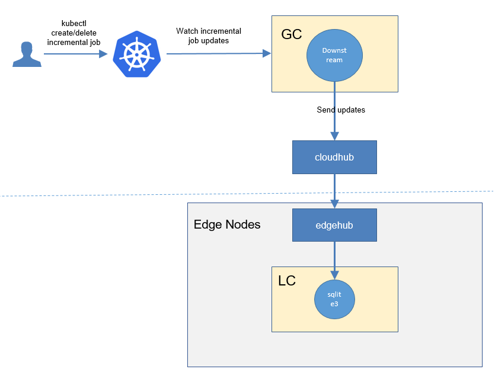
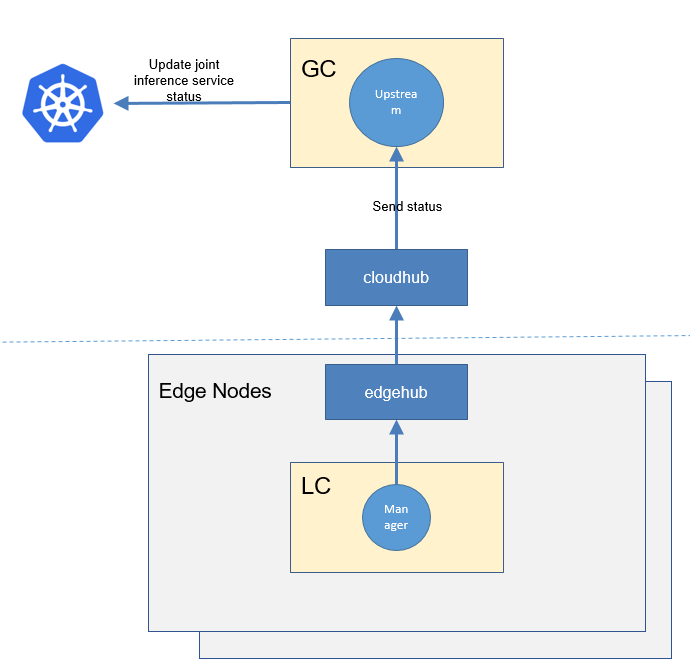
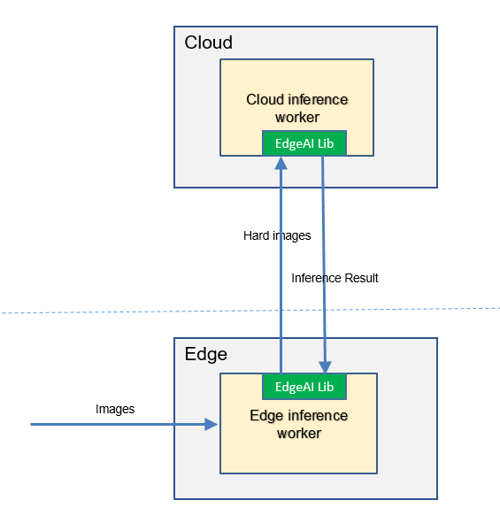

* [Joint Inference](#joint-inference)
   * [Motivation](#motivation)
     * [Goals](#goals)
     * [Non\-goals](#non-goals)
   * [Proposal](#proposal)
     * [Use Cases](#use-cases)
   * [Design Details](#design-details)
     * [CRD API Group and Version](#crd-api-group-and-version)
     * [Joint inference CRD](#joint-inference-crd)
     * [Joint inference type definition](#joint-inference-type-definition)
     * [Joint inference sample](#joint-inference-sample)
     * [Validation](#validation)
   * [Controller Design](#controller-design)
     * [Joint Inference Controller](#joint-inference-controller)
     * [Downstream Controller](#downstream-controller)
     * [Upstream Controller](#upstream-controller)
     * [Details of api between GC(cloud) and LC(edge)](#details-of-api-between-gccloud-and-lcedge)
   * [Workers Communication](#workers-communication)
   
# Joint Inference
## Motivation

Inference on the edge can get a shorter latency and a higher throughput, and inference on the cloud can get better inference precision. 
The collaborative inference technology detects hard samples on the edge and sends them to the cloud for inference. 
**In this way, simple samples inference on the edge ensures latency and throughput, while hard samples inference on the cloud improves the overall precision.**


### Goals
* Joint inference improves the inference precision without significantly reducing the time and throughput.


## Proposal
We propose using Kubernetes Custom Resource Definitions (CRDs) to describe 
the joint inference specification/status and a controller to synchronize these updates between edge and cloud.


### Use Cases

* User can create a joint inference service with providing a training script,
 specifying the aggregation algorithm, configuring training hyper parameters, 
 configuring training datasets.

* Users can get the joint inference status, including the counts of inference at the edge/cloud.


## Design Details

### CRD API Group and Version
The `JointInferenceService` CRD will be namespace-scoped.
The tables below summarize the group, kind and API version details for the CRD.

* JointInferenceService

| Field                 | Description             |
|-----------------------|-------------------------|
|Group                  | edgeai.io     |
|APIVersion             | v1alpha1                |
|Kind                   | JointInferenceService             |

### Joint inference CRD


Below is the CustomResourceDefinition yaml for `JointInferenceService`:

```yaml
apiVersion: apiextensions.k8s.io/v1
kind: CustomResourceDefinition
metadata:
  name: jointinferenceservices.edgeai.io
spec:
  group: edgeai.io
  names:
    kind: JointInferenceService
    plural: jointinferenceservices
    shortNames:
      - jointinferenceservice
      - jis
  scope: Namespaced
  versions:
    - name: v1alpha1
      subresources:
        # status enables the status subresource.
        status: {}
      served: true
      storage: true
      schema:
        openAPIV3Schema:
          type: object
          properties:
            spec:
              type: object
              properties:
                edgeWorker:
                  type: object
                  properties:
                    name:
                      type: string
                    model:
                      type: object
                      properties:
                        name:
                          type: string
                    nodeName:
                      type: string
                    hardExampleAlgorithm:
                      type: object
                      properties:
                        name:
                          type: string
                    workerSpec:
                      type: object
                      properties:
                        scriptDir:
                          type: string
                        scriptBootFile:
                          type: string
                        frameworkType:
                          type: string
                        frameworkVersion:
                          type: string
                        parameters:
                          type: array
                          items:
                            type: object
                            properties:
                              key:
                                type: string
                              value:
                                type: string
                cloudWorker:
                  type: object
                  properties:
                    name:
                      type: string
                    model:
                      type: object
                      properties:
                        name:
                          type: string
                    nodeName:
                      type: string
                    workerSpec:
                      type: object
                      properties:
                        scriptDir:
                          type: string
                        scriptBootFile:
                          type: string
                        frameworkType:
                          type: string
                        frameworkVersion:
                          type: string
                        parameters:
                          type: array
                          items:
                            type: object
                            properties:
                              key:
                                type: string
                              value:
                                type: string
            status:
              type: object
              properties:
                conditions:
                  type: array
                  items:
                    type: object
                    properties:
                      type:
                        type: string
                      status:
                        type: string
                      lastProbeTime:
                        type: string
                        format: date-time
                      lastTransitionTime:
                        type: string
                        format: date-time
                      reason:
                        type: string
                      message:
                        type: string
                startTime:
                  type: string
                  format: date-time
                completionTime:
                  type: string
                  format: date-time
                uploadCount:
                  type: integer

      additionalPrinterColumns:
        - name: Age
          type: date
          jsonPath: .metadata.creationTimestamp
```

### Joint inference type definition
```go
// +genclient
// +k8s:deepcopy-gen:interfaces=k8s.io/apimachinery/pkg/runtime.Object
// JointInferenceService defines the joint inference service crd
type JointInferenceService struct {
        metav1.TypeMeta `json:",inline"`

        metav1.ObjectMeta `json:"metadata"`

        Spec JointInferenceServiceSpec `json:"spec"`
}

// JointInferenceServiceSpec describes the details configuration
type JointInferenceServiceSpec struct {
        EdgeWorker  EdgeWorker  `json:"edgeWorker"`
        CloudWorker CloudWorker `json:"cloudWorker"`
}

// EdgeWorker describes the edge worker
type EdgeWorker struct {
        Name                 string               `json:"name"`
        Model                modelRefer           `json:"model"`
        NodeName             string               `json:"nodeName"`
        HardExampleAlgorithm HardExampleAlgorithm `json:"hardExampleAlgorithm"`
        EdgeWorkerSpec       CommonWorkerSpec     `json:"workerSpec"`
}

// EdgeWorker describes the cloud worker
type CloudWorker struct {
        Name            string           `json:"name"`
        Model           modelRefer       `json:"model"`
        NodeName        string           `json:"nodeName"`
        CloudWorkerSpec CommonWorkerSpec `json:"workerSpec"`
}

type modelRefer struct {
        Name string `json:"name"`
}

type HardExampleAlgorithm struct {
        Name string `json:"name"`
}

type CommonWorkerSpec struct {
        ScriptDir        string   `json:"scriptDir"`
        ScriptBootFile   string   `json:"scriptBootFile"`
        FrameworkType    string   `json:"frameworkType"`
        FrameworkVersion string   `json:"frameworkVersion"`
        Parameters       ParaSpec `json:"parameters"`
}

// +k8s:deepcopy-gen:interfaces=k8s.io/apimachinery/pkg/runtime.Object

// JointInferenceServiceList is a list of joint inference services.
type JointInferenceServiceList struct {
        metav1.TypeMeta `json:",inline"`
        metav1.ListMeta `json:"metadata"`
        Items           []JointInferenceService `json:"items"`
}
```

#### Validation
[Open API v3 Schema based validation](https://kubernetes.io/docs/tasks/access-kubernetes-api/custom-resources/custom-resource-definitions/#validation) can be used to guard against bad requests.
Invalid values for fields ( example string value for a boolean field etc) can be validated using this.

Here is a list of validations we need to support :
1. The `dataset` specified in the crd should exist in k8s.
1. The `model` specified in the crd should exist in k8s.
1. The edgenode name specified in the crd should exist in k8s.

### joint inference sample
```yaml
apiVersion: edgeai.io/v1alpha1
kind: JointInferenceService
metadata:
  name: helmet-detection-demo
  namespace: default
spec:
  edgeWorker:
    name: "edgeworker"
    model:
      name: "small-model"
    nodeName: "edge0"
    hardExampleAlgorithm:
      name: "IBT"
    workerSpec:
      scriptDir: "/code"
      scriptBootFile: "edge_inference.py"
      frameworkType: "tensorflow"
      frameworkVersion: "1.18"
      parameters:
        - key: "nms_threshold"
          value: "0.6"
  cloudWorker:
    name: "work"
    model:
      name: "big-model"
    nodeName: "solar-corona-cloud"
    workerSpec:
      scriptDir: "/code"
      scriptBootFile: "cloud_inference.py"
      frameworkType: "tensorflow"
      frameworkVersion: "1.18"
      parameters:
        - key: "nms_threshold"
          value: "0.6"
```

## Controller Design
The joint inference controller starts three separate goroutines called `upstream`, `downstream` and `joint-inference`controller. These are not separate controllers as such but named here for clarity.
- joint inference: watch the updates of joint-inference-task crds, and create the workers to complete the task.
- downstream: synchronize the joint-inference updates from the cloud to the edge node.
- upstream: synchronize the joint-inference updates from the edge to the cloud node.

### Joint Inference Controller


The joint-inference controller watches for the updates of joint-inference tasks and the corresponding pods against the K8S API server.
Updates are categorized below along with the possible actions:

| Update Type                    | Action                                       |
|-------------------------------|---------------------------------------------- |
|New  Joint-inference-service Created             |Create the aggregation worker and these local-training workers|
|Joint-inference-service Deleted                 | NA. These workers will be deleted by gc.|
|The corresponding pod created/running/completed/failed                 | Update the status of joint-inference task.|


### Downstream Controller


The downstream controller watches for joint-inference updates against the K8S API server.
Updates are categorized below along with the possible actions that the downstream controller can take:

| Update Type                    | Action                                       |
|-------------------------------|---------------------------------------------- |
|New Joint-inference-service Created             |Sends the task information to LCs.|
|Joint-inference-service Deleted                 | The controller sends the delete event to LCs.|

### Upstream Controller


The upstream controller watches for joint-inference-task updates from the edge node and applies these updates against the API server in the cloud.
Updates are categorized below along with the possible actions that the upstream controller can take:

| Update Type                        | Action                                        |
|-------------------------------     |---------------------------------------------- |
|Joint-inference-service Reported State Updated    |  The controller appends the reported status of the Joint-inference-service in the cloud. |

### Details of api between GC(cloud) and LC(edge)
1. GC(downstream controller) syncs the task info to LC:
    ```go
    // POST <namespace>/jointinferenceservices/<name>
    // body same to the task crd of k8s api, omitted here.
    ```

1. LC uploads the task status which reported by the worker to GC(upstream controller):
    ```go
    // POST <namespace>/jointinferenceservices/<name>/status
   
    // WorkerMessage defines the message from that the training worker. It will send to GC.
    type WorkerMessage struct {
        Phase  string        `json:"phase"`
        Status string        `json:"status"`
        Output *WorkerOutput `json:"output"`
    }
    // 
    type WorkerOutput struct {
        TaskInfo *TaskInfo `json:"taskInfo"`
    }
    
    // TaskInfo defines the task information
    type TaskInfo struct {
        // Current training round
        Uploaded int    `json:"uploaded"`
    }
    ```

## Workers Communication


Todo: complete the restful api.