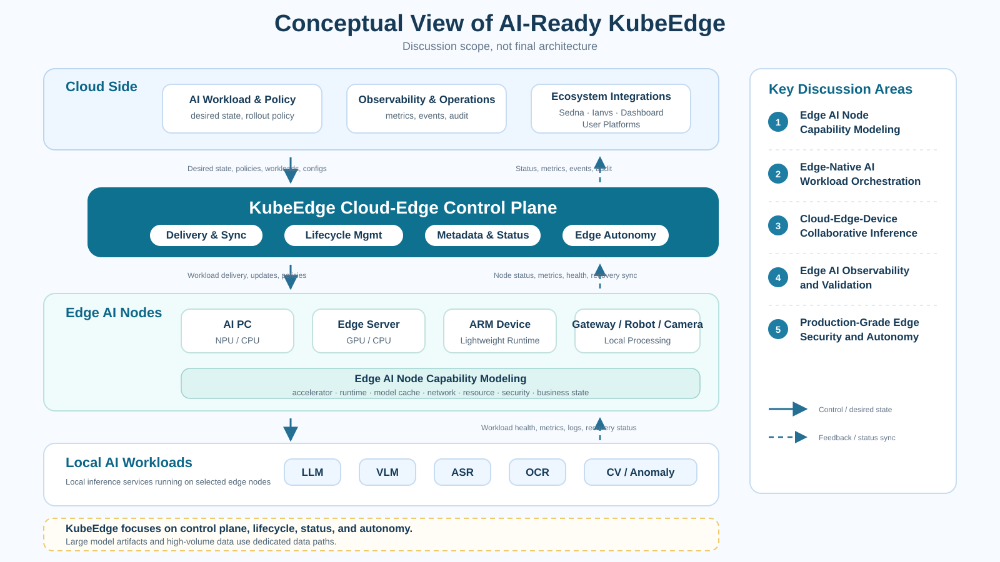

# Toward Edge Intelligence: Making KubeEdge AI-Ready

## Summary

This document opens a discussion on how KubeEdge can better support the next wave of edge AI scenarios.

The goal is not to turn KubeEdge into a full AI platform, model training system, or MLOps product. Instead, this proposal focuses on a more fundamental question:

> What should KubeEdge provide so that AI inference workloads can be deployed, operated, observed, upgraded, and protected across distributed edge environments?

KubeEdge already provides cloud-edge communication, edge application delivery, metadata synchronization, device management, and edge autonomy. These capabilities make KubeEdge a natural foundation for edge AI. However, AI workloads introduce new operational requirements: heterogeneous accelerators, model artifacts, local inference runtimes, weak-network operation, model/runtime observability, safe upgrade, fallback, and production security.

This proposal suggests that KubeEdge should become more **AI-ready** by strengthening five areas:

1. Edge AI node capability modeling;
2. Edge-native AI workload orchestration;
3. Cloud-edge-device collaborative inference;
4. Edge AI observability and validation;
5. Production-grade edge security and autonomy.

The first stage should remain lightweight: documentation, examples, labels/annotations, validation guides, and community discussion. New APIs or CRDs should only be considered after the community reaches agreement on real use cases and common patterns.

## Why This Discussion Matters

AI applications are moving from cloud-only deployment to factories, campuses, stores, parks, AI PCs, edge servers, cameras, robots, gateways, and other field environments.

In these environments, users usually do not only ask, "Can this model run?" They ask more practical questions:

- Which edge nodes are able to run this model or runtime?
- Does the node have GPU, NPU, iGPU, or only CPU?
- Is the model already cached locally?
- Can the service keep running when the cloud-edge network is unstable?
- How can we upgrade a model without interrupting a production site?
- How do we observe inference latency, runtime health, resource usage, and failure reasons?
- How do we protect credentials, model artifacts, and exposed inference endpoints?

A single model demo can usually be deployed manually. The real challenge is to make edge AI deployment repeatable, observable, secure, and scalable.

This is where KubeEdge can provide value.

The market value of KubeEdge in the AI era is not only "managing edge nodes". A stronger value is helping users manage **distributed edge intelligence**: edge nodes, AI runtimes, inference services, model metadata, resource status, network conditions, and production policies across many real-world sites.

## Core Positioning

This proposal uses the following positioning as a starting point for discussion:

> KubeEdge should not become a full AI platform, but it can become the cloud-edge control plane for distributed edge AI workloads.

In this positioning:

- KubeEdge manages desired state, workload delivery, edge AI node capability metadata, edge autonomy, status synchronization, and lifecycle policies.
- AI frameworks, model registries, object storage, training systems, dataset systems, and business applications remain independent or ecosystem-level components.
- Sedna, Ianvs, Dashboard, examples, and user platforms can build on top of or around KubeEdge capabilities.
- Large model files, video streams, audio streams, and high-volume sensor data should use dedicated data paths, not the CloudCore/EdgeCore control channel.


## Conceptual View



> This diagram is a conceptual view for discussion only, not a final architecture. It is intended to clarify the discussion scope and the possible role of KubeEdge as an AI-ready edge control plane.

## Design Principles

### 1. Keep KubeEdge as the control plane

KubeEdge should focus on orchestration metadata, workload lifecycle, status synchronization, and edge autonomy. It should not carry large AI data through the control channel.

### 2. Reuse Kubernetes and KubeEdge mechanisms first

The first stage should use existing Kubernetes resources such as `Deployment`, `DaemonSet`, `Service`, `ConfigMap`, `Secret`, node labels, annotations, affinity, local storage, and existing KubeEdge mechanisms.

### 3. Start with conventions before APIs

Labels, annotations, examples, and validation guides are easier for the community to review and adopt. CRDs such as `ModelDeployment`, `ModelCache`, or `CollaborativeInference` should be treated as future discussion topics, not immediate implementation requirements.

### 4. Make weak-network and offline behavior first-class

Edge AI workloads are often deployed in environments where the cloud-edge connection is unstable. Local inference continuity, recovery after reconnect, and status reconciliation should be part of the validation path.

### 5. Connect ecosystem projects instead of duplicating them

Sedna, Ianvs, Dashboard, examples, and external AI platforms may each play a role. The proposal should clarify collaboration points rather than duplicate the scope of existing projects.

## Discussion Area 1: Edge AI Node Capability Modeling

The first problem is not only to record what hardware an edge node has, but to model what AI capability the node can provide.

For ordinary workloads, CPU, memory, and architecture may be enough for scheduling and operations. For edge AI workloads, this is not sufficient. The cloud side also needs to understand accelerator type, runtime availability, model cache, network state, resource pressure, security posture, and whether the node is currently safe to upgrade.

Therefore, this proposal suggests starting with an **Edge AI Node Capability Model**. In the first stage, the model can be represented by labels and annotations. It should be treated as a lightweight convention for discussion and validation, not as a final API design.

Suggested dimensions:

| Dimension | Examples |
| --- | --- |
| Architecture | `x86_64`, `arm64`, `riscv64` |
| Accelerator | NVIDIA GPU, Intel NPU, AMD NPU, Ascend, iGPU, CPU-only |
| Runtime | Ollama, llama.cpp, ONNX Runtime, OpenVINO, TensorRT, vLLM, custom service |
| Model family | LLM, VLM, ASR, OCR, CV, anomaly detection, audio inference |
| Model cache | cached model name, version, size, cache path, cache status |
| Network state | online, weak-network, offline, reconnecting |
| Resource state | CPU, memory, disk, GPU/NPU utilization, cache capacity |
| Security state | certificate status, token expiration, runtime version, known risk status |
| Production state | production, maintenance, upgrade-allowed, upgrade-blocked |

Example:

```yaml
metadata:
  labels:
    ai.kubeedge.io/accelerator: "intel-npu"
    ai.kubeedge.io/runtime.openvino: "true"
    ai.kubeedge.io/model-family.cv: "true"
  annotations:
    ai.kubeedge.io/model-cache: "yolov8n:v1,qwen2.5-0.5b:v1"
    ai.kubeedge.io/upgrade-policy: "maintenance-window-only"
```

This is not proposed as a final standard. The key point is to make edge AI capability explicit and reusable, so that later work on workload placement, validation, observability, safe upgrade, and Dashboard visibility has a common basis.

## Discussion Area 2: Edge-Native AI Workload Orchestration

After node capability can be modeled, the next question is how to orchestrate AI workloads in an edge-native way.

Here, orchestration does not mean introducing a new scheduler immediately. It means defining a repeatable path for declaring, delivering, running, observing, upgrading, rolling back, and recovering AI inference workloads on KubeEdge-managed edge nodes.

A practical lifecycle may include:

1. Select edge nodes based on AI capability;
2. Prepare runtime image and model artifact path;
3. Pull or reuse model cache;
4. Start inference runtime;
5. Load model;
6. Expose inference service locally or through an edge/cloud path;
7. Report readiness, runtime version, model version, and resource usage;
8. Handle Pod restart, runtime restart, EdgeCore restart, and node reconnect;
9. Upgrade model or runtime safely;
10. Roll back or fall back when upgrade or inference fails.

In the first stage, these steps can be documented and validated with existing Kubernetes resources.

Example metadata:

```yaml
metadata:
  labels:
    ai.kubeedge.io/model-name: "qwen2.5-0.5b"
    ai.kubeedge.io/model-version: "v1"
    ai.kubeedge.io/runtime: "ollama"
    ai.kubeedge.io/runtime-version: "0.x"
    ai.kubeedge.io/cache-status: "hit"
    ai.kubeedge.io/inference-ready: "true"
```

Future discussion may consider whether higher-level concepts are needed:

| Concept | Purpose |
| --- | --- |
| `ModelDeployment` | Declare which model/runtime should run on which edge nodes |
| `InferenceService` | Represent an edge inference service and access method |
| `ModelCache` | Track model artifact cache status on edge nodes |
| `CollaborativeInference` | Describe cloud-edge-device inference routing and fallback |
| `UpgradePolicy` | Define safe upgrade windows, canary strategy, and rollback behavior |
| `FallbackPolicy` | Define behavior for weak-network, overload, runtime failure, or cloud unavailability |

These names are placeholders for discussion, not APIs proposed for immediate implementation.

## Discussion Area 3: Cloud-Edge-Device Collaborative Inference

Edge AI does not always mean running everything on the edge.

A more practical architecture is collaborative:

- Edge small models handle local, low-latency, privacy-sensitive, or cost-sensitive tasks;
- Cloud large models handle complex reasoning or global context;
- Device-side components collect sensor, image, audio, or user interaction data;
- Edge services continue to work when cloud services are unavailable;
- Results, logs, and status are synchronized after network recovery.

KubeEdge does not need to implement all inference routing logic itself. However, KubeEdge can provide the foundation: workload placement, edge autonomy, status synchronization, service management, and metadata for higher-level routing systems.

## Discussion Area 4: Observability and Validation

Edge AI workloads need both infrastructure observability and AI-specific visibility.

Suggested records:

| Category | Examples |
| --- | --- |
| Workload lifecycle | Pod start time, restart count, rollout status, readiness time |
| Model lifecycle | model pull time, cache hit/miss, model load time, model version |
| Inference | request latency, p50/p95, throughput, success rate, error rate |
| Resource | CPU, memory, disk, GPU/NPU utilization, model cache usage |
| Reliability | EdgeCore restart behavior, disconnect/reconnect behavior, offline duration |
| Service access | local access, NodePort, ClusterIP, EdgeMesh, request success rate |
| Security | credential age, token expiration, RBAC scope, image/runtime version |

Ianvs may help define benchmark methodology. Dashboard may visualize node capability and workload status. Examples can provide reproducible manifests and validation scripts.

## Discussion Area 5: Security and Production Readiness

Production edge AI workloads run outside traditional data centers. Edge nodes may be physically exposed, network conditions may be unstable, and model/runtime services may expose new attack surfaces.

A production-readiness checklist should include:

- least-privilege RBAC for AI workload operators;
- secret management for model registries, object storage, and runtime services;
- token expiration and credential rotation;
- signed images or trusted model artifact sources where applicable;
- safe upgrade windows for production edge nodes;
- rollback and fallback after failed upgrade;
- local inference continuity during cloud-edge disconnection;
- status reconciliation after reconnect;
- tests for command injection, privilege escalation, token expiry, unsafe upgrade behavior, and exposed inference endpoints.

This direction can connect edge AI with KubeEdge's existing strengths in edge autonomy and production-grade cloud-edge management.

## Initial Implementation Scope

The first stage should be small and reviewable.

Suggested deliverables:

1. A discussion proposal under the KubeEdge community repository;
2. A reference architecture diagram;
3. A lightweight Edge AI Node Capability Model based on labels and annotations;
4. A reproducible demo using one lightweight LLM or one vision/anomaly detection workload;
5. A validation guide covering model cache, service readiness, Pod restart, EdgeCore restart, disconnect/reconnect, and status synchronization;
6. An observability checklist;
7. A security and production-readiness checklist.

No new KubeEdge API is required in the first stage.

## Possible Demo Paths

### Demo A: Lightweight LLM on a KubeEdge Edge Node

- Prepare a KubeEdge cloud-edge environment;
- Join one x86_64, ARM, or AI PC edge node;
- Add capability labels and annotations;
- Deploy an Ollama or llama.cpp based inference service;
- Run a small model;
- Validate local inference;
- Record startup time, model load time, latency, CPU, memory, and disk usage;
- Restart Pod and EdgeCore;
- Disconnect and reconnect the edge node;
- Verify local inference continuity and status recovery.

### Demo B: Vision or Anomaly Detection on a KubeEdge Edge Node

- Prepare a CPU, GPU, NPU, or AI PC edge node;
- Deploy an ONNX Runtime, OpenVINO, TensorRT, or custom inference service;
- Run a small image, audio, or anomaly detection workload;
- Validate model cache, service exposure, weak-network behavior, and resource metrics.

## Non-Goals

- Build a full AI platform;
- Build a model training platform;
- Build a dataset labeling or data governance platform;
- Define a new AI model format;
- Transfer large model files, video streams, or audio streams through the CloudCore/EdgeCore control channel;
- Replace model registries, object storage systems, inference runtimes, or AI frameworks;
- Require new KubeEdge APIs or CRDs in the first stage;
- Make model quality evaluation the primary objective.

## Relationship with Existing Ecosystem Projects

This proposal should not duplicate existing ecosystem projects.

Possible division of responsibility:

| Component | Possible Role |
| --- | --- |
| KubeEdge | control plane, edge autonomy, workload delivery, metadata/status synchronization |
| Sedna | edge-cloud synergy AI framework and collaborative AI workflows |
| Ianvs | benchmark methodology, test cases, and evaluation reports |
| Dashboard | visibility for node capability, workload status, and validation results |
| Examples | reproducible manifests, scripts, and best practices |
| User platforms | model registry, business workflow, dataset, MLOps, and application-specific logic |

## Roadmap for Discussion

| Phase | Focus |
| --- | --- |
| Phase 0 | Community discussion and scope alignment |
| Phase 1 | Terminology, use cases, non-goals, and architecture diagram |
| Phase 2 | Label/annotation based Edge AI Node Capability Model |
| Phase 3 | Minimal LLM or vision demo on KubeEdge-managed edge nodes |
| Phase 4 | Validation guide for lifecycle, cache, weak-network behavior, and recovery |
| Phase 5 | Dashboard/report visibility and Ianvs-compatible benchmark notes |
| Phase 6 | Security and production-readiness checklist |
| Phase 7 | Evaluate whether structured APIs or CRDs are needed |

## Open Questions

- Should KubeEdge define a common Edge AI Node Capability Model?
- Should the first stage remain example/convention based, or should structured APIs be discussed earlier?
- Which runtime should be used for the first demo: Ollama, llama.cpp, ONNX Runtime, OpenVINO, TensorRT, or another option?
- Which node profile should be validated first: CPU-only x86_64, ARM, AI PC, GPU/NPU-capable node, or low-resource gateway?
- How should KubeEdge, Sedna, Ianvs, Dashboard, and examples divide responsibilities?
- What AI-specific observability should KubeEdge expose directly, and what should be left to external systems?
- What security baseline should be required before edge AI workloads are considered production ready?

## Expected Value

For users, this direction can provide a clearer path for turning scattered edge AI deployments into repeatable, observable, secure, and scalable edge intelligence capabilities.

For the KubeEdge community, it can connect existing strengths in cloud-edge coordination, edge autonomy, and device management with emerging edge AI scenarios.

For ecosystem projects, it can create clearer collaboration points among KubeEdge, Sedna, Ianvs, Dashboard, examples, and user platforms.

Most importantly, this proposal aims to start a community discussion:

> How can KubeEdge evolve from cloud-native edge computing toward AI-ready edge infrastructure?
