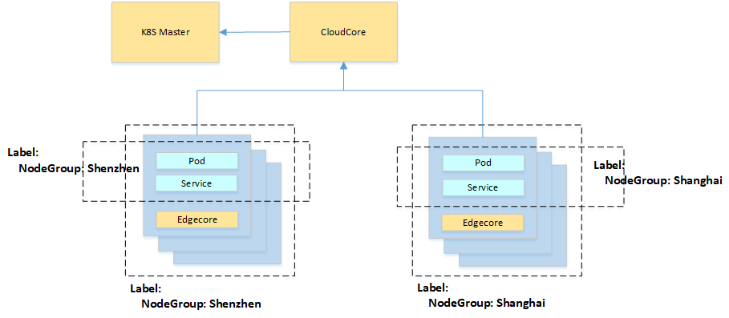
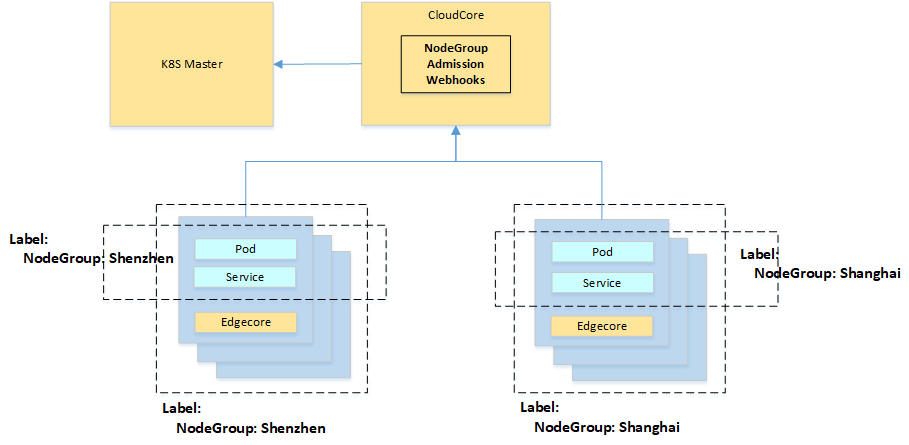
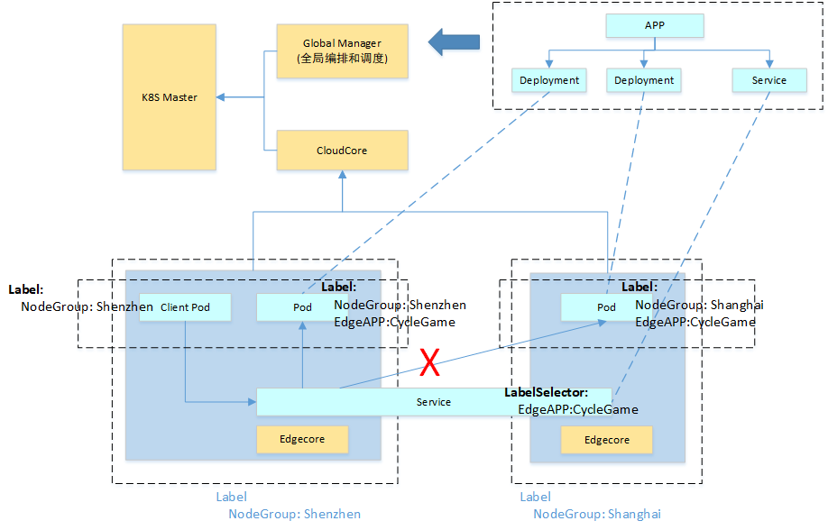
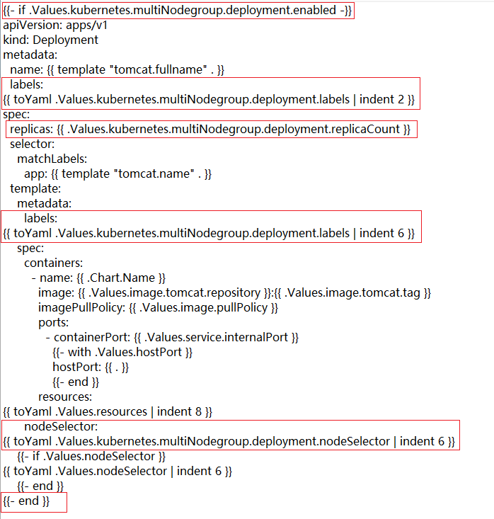
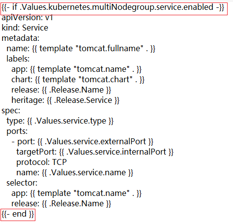
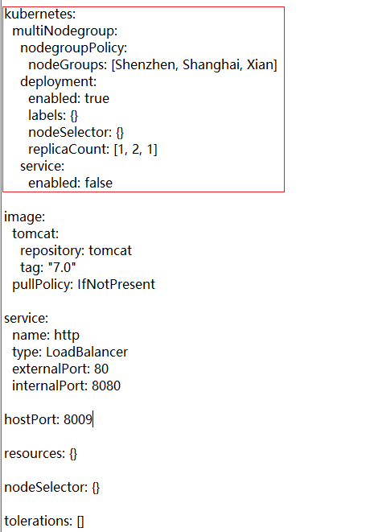

# MEC Resource Management and Application Management

## Background

Resources of MEC stations has the following characteristics：

1. MEC stations are usually deployed in the access aggregation, regional aggregation and national core DC of operators at all levels.
2. The size of nodes in each MEC stations ranges from several to hundreds.
3. There are general server, GPU server, all-in-one machine and other heterogeneous servers.
4. The nodes in a MEC station communicate with each other through the network, but they can't communicate with the nodes in another MEC  station directly.

Edge computing platform based on kubeEdge should provide the following functions: Unified management of multi-level MEC resources、Global scheduling and deployment of edge applications、Unified management of edge microservices、Flexible edge traffic management.

The following chapters are divided into two parts for analysis and design, include Resource management and application deployment in MEC station,  Application management cross MEC stations.

## Resource management and Application deployment in MEC Station

### Use Case

1. An user set up a new MEC station, then install edgecore on all nodes. All these nodes (1-500) are managed by kubeedge, and belong to a MEC station object for unified management.

2. An users set up multiple MEC stations, then install edgecore on all nodes.  All these nodes (1-5000) are managed by kubeedge, and it belongs to multiple MEC station objects for unified management.
3. An user can query the list of MEC station through client of kubeEdge, and get the details of each MEC station.
4. An user can query the node list of each MEC station through client of kubeEdge, and get the detailed information of each node
5. An user deploys an application to the specified MEC station through client of kubeEdge
6. An user can query the list of deployed application instances on the specified MEC station through client of kubeEdge, and get the detailed information of application instances

### Design

#### Overall design

In order to manage multi-level MEC station resources in a single kubernetes cluster, the concept of MEC station needs to be provided. Each MEC station contains several nodes and workload instances.

Kubernetes provides label mechanism to logically group all resources such as node and workload, and makes conditional query according to label

KubeEdge provides the logical MEC station concept based on label. The key points of the scheme are as follows:

1. Use label to divide node resources into MEC stations. Nodes in the same MEC station are labeled with the same label, including “nodegroup: MEC station name”

2. Use label to divide the workload object into MEC station, and label pod, deployment, service and other objects with the same label, including "nodegroup: MEC station name"

3. Deploy workload to the specified MEC station by nodeselector or node affinity. When deploying workload object, specify the label corresponding to MEC station, such as adding label condition ("nodegroup: MEC station name") into nodeselector field.

#### Detailed process

##### Set up node of MEC station

1. Install edgecore on the node of MEC site , the the node is managed by kubeEdge
2. Repeat step 1 until all nodes of MEC station are managed by kubeEdge
3. Through kubectl or kubernetes API, add “nodegroup: MEC site name label” for the node
4. Repeat step 3 until all nodes of MEC station are labeled

##### Query node list of MEC station

1. Through kubectl or kubernetes API, query the node list by the labelselector condition. The labelselector condition includes "nodegroup: MEC site name".
2. Obtain the node list of MEC site through the result returned in step 1, and get the detailed information of each node,

##### Deploy an application to the specified MEC station

1. Write the deployment template, add the label "nodegroup: MEC site name", and add the label condition "nodegroup: MEC site name" into nodeselector field, or add node affinity condition "nodegroup:=MEC site name"
2. Submit the deployment template to deploy the application through kubectl or kubernetes API
3. Write the services template, add the label  "nodegroup: MEC site name"
4. Through kubectl or kubernetes API, submit service template to create microservices

##### Query application list of MEC station

1. Through kubectl or kubernetes API, query the deployment list by the labelselector condition. The labelselector condition includes "nodegroup: MEC site name".
2. From the results returned in step 1, get the list of deployed deployments on the MEC station.
3. Through kubectl or kubernetes API, query the service list by the labelselector condition. The labelselector condition includes "nodegroup: MEC site name".
4. Obtain the list of services deployed on the MEC station from the results returned in step 1.

###  Advanced design (Optional)

In the above design, when deploying an application (such as deployment, etc.), you must specify label and nodeselector (or node affinity) at the same time, which can be error-prone.

In the Advanced design, the admission webhook module is used to automatically add node affinity conditions into the application, and no longer need to specify nodeselector or node affinity.

Main processes:

1. An user write the deployment template, add the label "nodegroup: MEC station name", and submit the deployment template through kubectl or kubernetes API to deploy the application.
2. Kubernetes API server forwards the HTTP request for creating deployment to the admission webhook
3. Admission webhook obtains the details of deployment. If it includes "nodegroup: MEC station name" label, node affinity condition ("nodegroup = MEC station name") is added for deployment, and the modified JSON string is returned to kubernetes API server.

As an optional controller, admission webhook can be deployed in the cloud.

Main functions of admission webhook:

1. Provide a rest server to receive HTTP requests from kubernetes API server
2. Filter HTTP requests according to the object type and operation type, leaving only the creation and update operations of workload objects such as deployment.
3. Obtain the information of deployment from kubernetes API server.  If it includes "nodegroup: MEC station name" label, node affinity condition ("nodegroup = MEC station name") is added for deployment, and the modified JSON string is returned to kubernetes API server.

### Other issues

1.Why not use a namespace to isolate MEC stations

A. MEC stations usually contain node and applications, but the namespace cannot isolate node objects

B. If a namespace is used to isolate the workload object, only one namespace and the workload object belonging to the namespace can exist in a MEC station. But some companies have multiple teams for development, testing, etc. these teams share the resources of a MEC station, and each team uses a namespace to isolate them.

2.MEC station usually has geographic location information, network level information, how to carry

MEC station object can be extended by CRD mechanism, which contains geographic location information and network hierarchy information through fields such as label.

## Application management cross MEC stations

### Use Case

1. Distributed monitoring and detection need to deploy the same set of application instances on multiple MEC station. An user deploys an application to a specified list of MEC stations through client of kubeEdge, then kubeEdge deploys the same set of application instances into each MEC station. The user can adjust the number of application instances in each MEC station through client of kubeEdge.
2. Applications such as cloud game / interactive live broadcast / Ar / VR , need to deploy application instances into multiple MEC stations, but the number of instances in each MEC station needs to be adjusted automatically according to the policy. An user deploys an application to a specified list of MEC station through client of kubeEdge. Then KubeEdge deploys different number of application instances in each MEC station according to the policy. The auto-scale strategy for application instance includes: set the number of application instances by users, automatically adjust the number of application instances according to CPU load, and automatically adjust the number of application instances according to the number of requests.
3. Applications such as cloud game / interactive live broadcast / Ar / VR, need to deploy application instances into multiple MEC stations. The list of MEC stations needs to be automatically selected according to the policy, and the number of instances in each MEC stations needs to be adjusted automatically according to the policy. An user deploy an application and specify the deployment strategy through client of KubeEdge. Then KubeEdge selects list of MEC stations according to the policy, and deploys different number of application instances in each MEC station according to the policy. MEC station selection strategy includes: set MEC stations list by users, and select MEC stations according to geographical coverage. The auto-scale strategy for application instance includes: set the number of application instances by users, automatically adjust the number of application instances according to CPU load, and automatically adjust the number of application instances according to the number of requests.     
4. An user can add one or more MEC stations for an application through client of  kubeedge, then KubeEdge deploys application instances in the newly added MEC station.
5. An user can delete one or more MEC stations for an application through client of kubeEdge, then kubeEdge will delete the application instance in the deleted MEC stations.
6. An User can adjust the number of application instances in the specified MEC station through client of kubeEdge, then kubeEdge adjusts the number of application instances to the expected value in the specified MEC station.

### Design

Deployment and other workload objects of Kubernetes specify node conditions through the label of node, which requires very complex combination conditions to realize the application deployment across MEC stations. Flexible deployment strategies cannot be implemented, and the operation of users is also very difficult, which can not support the above use case.

#### Overall Design

An user submit application (cross MEC stations) requests to the Global Manager module. The global manager module decomposes, schedules and orchestrating applications. Then deployment and service are created into multiple MEC stations,  which may belong to multiple kubernetes clusters.

#### Microservice management cross MEC stations

Within MEC stations, pods can directly access microservices through service name. The service names of microservices in each MEC station should be the same.

Scenario 1: only one service is created in kubernetes cluster, and edgecore/edgemesh provides access control mechanism (recommended)

Service management process cross MEC stations：

1. For a service defined by application, create a service instance in kubernetes cluster and deploy it on all MEC stations.

2. Within MEC stations, pods can directly access microservices through service name. Since the back-end pod instances corresponding to service instances are distributed in multiple MEC stations, edgecore / edgemesh needs to provide access control mechanism.

   For normal services, only the back-end pod instances inside MEC stations can be accessed through service name (distinguished by the label of endpoint back-end POD).

   For Services that containing a specific label (cross_ Type=Cross_ MEC_ Station), through service name, pod can access the back-end pod instances inside MEC station and those in other MEC stations.

Scenario 2: create a service in each MEC station

Problem: the service in each MEC station has the same service name, conflict in kubernetes cluster

#### Global orchestrating and scheduling

As an extension controller of kubernetes, global manager has a set of user oriented API, and its main functions include:

1. Provide  application templates to support the definition of applications cross MEC stations, including workload objects such as deployment and service.
2. Analyze and orchestrate the application template instance, and decompose it into workload objects such as deployment and service
3. According to the deployment requirements of the application, the deployment and service are created into multiple MEC stations according to the policy
4. Responsible for the lifecycle management of application cross MEC stations, including creation, view, update, delete, etc
5. Support multiple kubernetes clusters

There are two ways to provide API in global manager：

A：Extending Helm_App object in kubernetes cluster through CRD, global manager is a extended controller, which manages Helm_App object, and providing external API through kubernetes API server

B：Global manager includes an independent API server to provide external API

#####  Object Model

Provide application template definition by helm template, and the application template  should include deployment, service, MEC station selection strategy, instance auto-scale policy and so on.

Create a release in each MEC station, including deployment, configmap, secret and other objects

Create a release in each kubernetes cluster, including the service object

In helm template, enable control parameter  is added to each kubernetes object (deployment, service, etc.), and the objects contained in each release are controlled by parameters in the values file. See the chapter "application template" for details.

There are two ways to inject control parameters：

A：Add control parameters when writing helm templates by users

B：Global manager obtain the helm template from repo, and adds control parameters to the helm template

##### Application scheduling cross MEC stations

Main functions of application scheduling：

1. Select list of MEC stations for application
2. Create deployment instances and service instances into each MEC station for the application
3. Manage and control the number of deployment instances in each MEC station

Supported MEC Stations selection strategy：

1. set MEC stations list by users
2. select MEC stations according to geographical coverage  <Not supported at the moment>

Supported auto-scale strategy for application instance:

1. set the number of application instances by users
2. automatically adjust the number of application instances according to CPU load <Not supported at the moment>
3. automatically adjust the number of application instances according to the number of requests. <Not supported at the moment>

##### Application lifecycle management

Provide lifecycle management of applications cross MEC stations, and supports creation, query, update, delete and other operations

Query：Query the application list and application details, including the overall status, objects and their status in each MEC station

Update：Update list of MEC stations and the number of instances in each MEC station for an application

Delete：Delete all objects in each MEC station for an application

Please refer to "API definition" and "detailed process" for details

##### Support multiple kubernetes clusters

// TODO

#### Application template and API definition

##### Application template

templates\deployment.yaml

templates\service.yaml

values.yaml

##### API definition

###### Create Helm_App Instance

POST   v1/helm_app/instances

Body:

{

​	name: ""                    //the name of application cross MEC stations

​	template_file_url: ""    //the file path of helm templates

​    values_file_path: ""   //the file path of values file，which contains parameters for the application

}

###### List Helm_App Instances

GET  v1/helm_app/instances

GET  v1/helm_app/instances/{instance_id}

###### Update Helm_App Instances

POST   v1/helm_app/instances/{instance_id}

Body:

{

​    values_file_path: ""   //the file path of values file，which contains parameters for the application

}

Currently, only the list of  MEC stations and the number of instances in each MEC station can be updated

###### Delete Helm_App Instance

DELETE  v1/helm_app/instances/{instance_id}

#### Detailed process

##### Create application

1. According to the application template specification, an user write helm template and upload it to repo
2. The user write values file, which contains parameters for application, including the list of MEC stations, the number of instances in each MEC station, and create an application instance through API
3. Global manager parses the values file to obtain the list of MEC stations and the number of instances.
4. Global manager generates a value file for each MEC station, only deployment object is enabled, and the number of instances, label and nodeselector in deployment are set. A release is created in each MEC station through helm.
5. Global manager generates a value file for each kubernetes cluster, only the service object is enabled. A release is created in each kubernetes cluster through helm.
6. Global manager stores the status of application deployment, list of MEC stations, number of instances in each MEC stations, release list, values file and other information to DB or etcd.

##### Query application

1. An user query application list through API
2. Global Manager obtains the status of application deployment, list of MEC stations, number of instances in each MEC stations, release list, values file and other information from DB or etcd.
3. Global Manager obtains information of each release for helm, including deployed objects and their status.
4. Global manager returns information of application details to user.

##### Update application

1. An user writes a values file, which contains new list of MEC stations and number of instances in each MEC stations, and updates the application instance through API.
2. Global Manager parse value file to obtain the list of MEC stations and the number of instances.
3. Global manager obtains the status of application deployment, list of MEC stations, number of instances in each MEC stations, release list, values file and other information from DB or etcd, and compare with these from the new value file in step 2. 
4. Global manager generates a value file for each newly added MEC station, only deployment object is enabled, and the number of instance, label and nodeselector of deployment are set. A release is created in each MEC station through helm.
5. Global manager delete the corresponding release through helm for each MEC station that is deleted.
6. Global manager generates a value file for each MEC station where the number of instances changes, only deployment object is enabled, and the number of instance, label and nodeselector of deployment are set, and the corresponding release is updated through helm.

##### Delete application

1. An user delete application instance through API.
2. Global manager obtains the status of application deployment, list of MEC stations, number of instances in each MEC stations, release list, values file and other information from DB or etcd.
3. Global Manager delete all the corresponding release through helm. 

