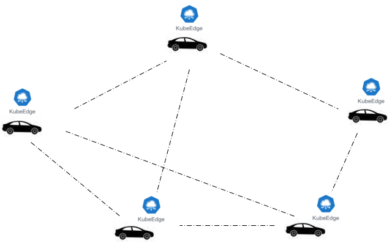
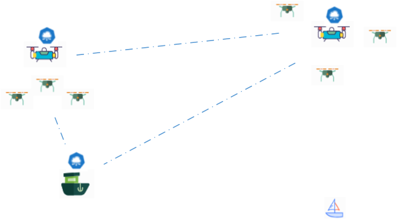
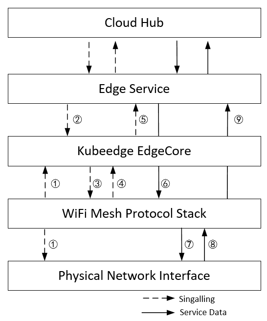

KubeEdge-Wireless Working Group Proposal

# KubeEdge-Wireless Working Group Proposal

Author: Jason Ning

### **Target:** 

- Our goal is to make an open platform to enable **Wireless**-Edge computing, extending native containerized application orchestration capabilities to hosts at **Wireless**-Edge, which built upon kubernetes and provides fundamental infrastructure support for **Wireless**-network, app deployment and meta-data synchronization between cloud and **Wireless**-Edge.
- **Extend** KubeEdge to support **wireless mobile scenarios**.

### Intention:

- With the development of computing and communication technologies, powerful computing equipments constitutes multi-agent systems. The agents have both computing and comunication capacities and interact with each others. Therefore, the problem of wireless agents interaction between multiple agents and system management is the main scenario discussed here. 
- The communication relationship between different Kubeedge nodes can not be easily seen as connect or disconnect,  it should be more fine-grain communication management.

#### Scenario：

##### 	Vehicle Network/Vessel Network/UAV Network:

**Key differences** between wireless and wire:  

- Communication mode may need to change from TCP, IP mode to multi-cast or broadcast mode.
- Network for dynamics scenarios.  

**Description**:  In the mobile scenario, multiple vehicles support similar services, and vehicles wireless connected with each other as KubeEdge nodes. (e.g. NIO ET7 with NVIDIA Orin * 4 , which has computing power of 1016 TOPS)

- Offline autonomy and node management: Five cars form an mesh network, which can transfer information processing between each other in offline conditions.
- Leader selection: Choose a node as a cluster head, to do the overall management of other equipments.
- KubeEdge-wireless should monitor the whole or partly network status, to aid in networking decisions.
- According to the Service Level Agreement, KubeEdge can make decisions on the networking modes and limit the network scope.
- Inspired by 3GPP 36.885 standards.

##### **Air/Sea rescue Collaboration：**

- The environmental complexity of the sea and sky makes communication more difficult.
- The lack of base station support in this scenario necessitates a change in the communication mode.
- The search target area is enlarged, but the individual energy is limited, and cluster head is needed for management.
- It is necessary to study the dynamic network topology to cope with the constantly changing environment of airspace and sea area.

**Proposal:**

- KubeEdge has the ability to manager the complex wireless networking status without sensing by service.
- Blurring the boundary between cloud and edge cloud gives KubeEdge more combinational ways.
- Explore the requirements for kubeEdge in wireless scenario. 

#### To-Do：

- With the change of networking modes, the traditional communication modes of KubeEdge need to be extended, such as including broadcast and multi-cast.

- Topologies will constantly changing, and the scheduling of communication capabilities will become a critical issue.

  - Consider the situation of poor network channel quality.
  - Actively consider the network instability caused by mobility, especial for users joint and exit suddenly.
  - Active feedback to adjust the network, active networking.
- Cloud Native capability down sinking

  - Enable the edge devices to self-organize network and partial autonomy when off-line or discontinuous network. 

  - In most cases, multiple edge devices may spontaneously form a small group, and the outside nodes can join or quit the group.

#### Architecture:

- Provide management abilities for Edge Cluster when disconnecting from the Cloud by selecting an Edge Head; 
- Add Network profiler module to monitor and manage the Edge cluster network resources, which can provide network information for the Edge Head section;
- Edge Cluster management in the dynamic network environment by creating Edge mesh network and the Edge Head
- Support wireless mesh mode for networking, which allow kubeEdge computing nodes quickly  join and exit mesh networking in mobile scenario.

**Network topology management** 

\-    Head selection algorithm

**Computing/Networking resources profilers** 

\-    Computing resources management 

\-    Networking resources management

##### Wireless-Mesh protocol stack

-  Storage the protocols for wireless-networking, including 802.11 mesh protocol, communication source topology, computing source topology and network parameter.

#### **Areas of Focus**

   Wireless communication tech, reenforcement learning, multi-access protocol, Invoke the schema on the communication computing topology，

##### **Participating unit **：

PengCheng Lab，DLMU(Dalian Maritime University)，University of Oslo (Dapeng Lan), ShanghaiTech University (Yang Yang, Liaotao Wu)，SEU(Southeast University )，SJTU(ShangHai JiaoTong university)，CUCC(China Union Communication corporation)

 
