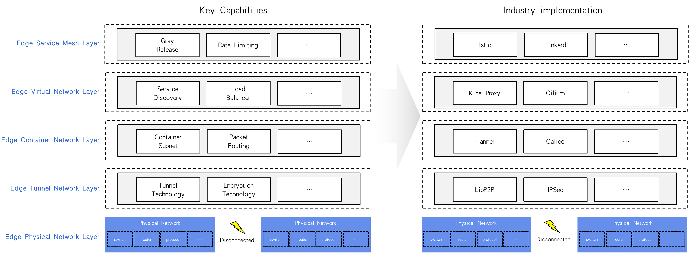

# SIG Networking Charter

This charter adheres to the conventions described in [KubeEdge Open Governance](https://github.com/kubeedge/community/blob/master/GOVERNANCE.md) and uses the Roles and Organization Management outlined in the governance doc.

## Scope

The SIG Networking focuses on optimizing various network communication problems in edge scenarios, such as:
- The edge-to-cloud and edge-to-edge networks are usually separated, and applications cannot communicate directly across subnets.
- The network quality is unstable, and nodes are offline and network jitter is the norm.
- The network structure is complex and configuration management is difficult.
- The network lacks service discovery, load balancing and traffic governance capabilities.

The SIG Networking is dedicated to researching and solving a series of issues related to network connectivity, service collaboration, and traffic governance in edge computing scenarios. In addition, there will be related research on new network mechanisms such as dynamic routing, IP-free communication and task offloading scenarios.

### In scope
#### Areas of Focus
1. According to the network characteristics in edge computing scenarios, divide the scope into multiple layers and focus on each layer to develop solutions in depth:

    
    - Edge Physical Network Layer: Physical networks in edge scenarios are generally based on area isolation, and the physical network layer is almost all hardware infrastructure (such as routers, switches, etc.). It is difficult for us to propose solutions at this layer, so we will keep an eye on the physical network layer, but there will be no in-depth research at present.
    - Edge Tunnel Network Layer: The core task of this layer is to connect the split physical network at the lower layer, so as to shield the complexity of the physical network topology. The main capability of the tunnel network layer is to provide tunnel technology, encryption technology, etc. The mainstream industry implementations include libp2p, ipsec, and wireguard, etc.
    - Edge Container Network Layer: The container network mainly refers to the CNI technology, but the CNI does not support data forwarding across subnets, because the CNI itself still needs the physical network to be able to communicate. Therefore, the edge container network has to rely on the capabilities of the edge tunnel network layer in order to exert the capabilities of the original cni container network configuration, packet encapsulation and routing, and networking policies. The well-known implementations in the industry include flannel, calico, and so on. This upper layer relies on the services provided by the lower layer, and this architecture is very similar to the concept of a computer network stack.
    - Edge Virtual Network Layer: K8s provides the concept of service, which can access a service through a virtual IP address (also called cluster IP). This is the core function of the edge virtual network layer, which is mainly responsible for the transparent proxying and load balancing of the application exposed service. Popular implementations include kube-proxy, and cilium, etc.
    - Edge Service Mesh Layer: This layer will provide richer network policy management capabilities than the container network layer, in addition to many service governance functions, such as grayscale release, circuit breaker, rate limiting, distributed tracing system, and more. At present, products such as istio and linkerd implemented in the industry are very powerful, and this layer is more inclined to integrate existing achievements.

2. Relevant and very useful areas for edge networking:
    - Messaging System: Support distributed message bus, able to publish and subscribe messages, similar to rabbitmq and kafka.
    - Dynamic Routing: In the mobile device scenario, the edge node is no longer a fixed network address, and is often in a weak network environment.

### Out of scope

- Use eBPF-based technology to forward packets in kernel mode to improve performance.
- Network packet processing based on hardware acceleration.

## Roles and Organization Management

This SIG follows and adheres to the Roles and Organization Management outlined in KubeEdge Open Governance and opts-in to updates and modifications to KubeEdge Open Governance.

### Additional responsibilities of Chairs

- Manage and curate the project boards associated with all sub-projects ahead of every SIG meeting so they may be discussed
- Ensure the agenda is populated 24 hours in advance of the meeting, or the meeting is then cancelled
- Report the SIG status at events and community meetings wherever possible
- Actively promote diversity and inclusion in the SIG
- Uphold the KubeEdge Code of Conduct especially in terms of personal behavior and responsibility
