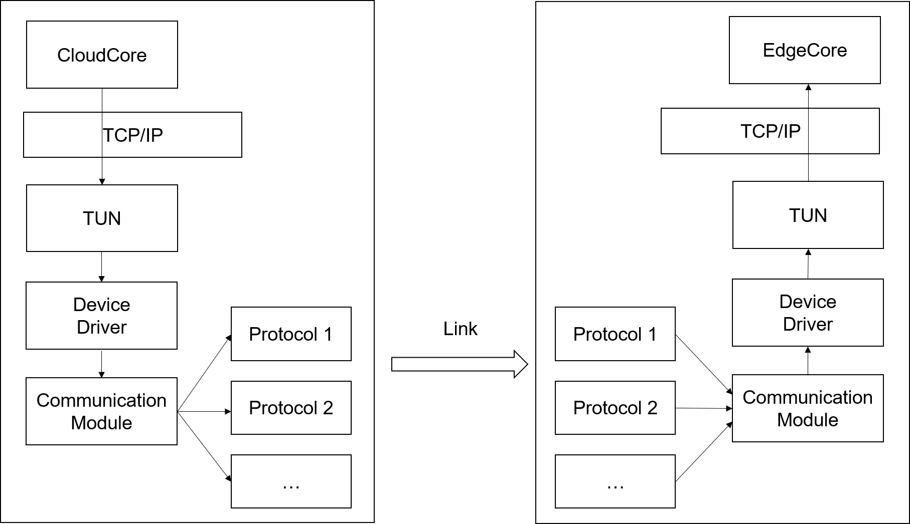
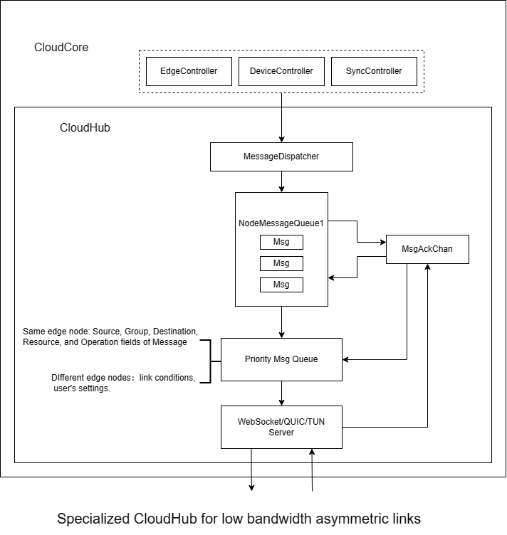
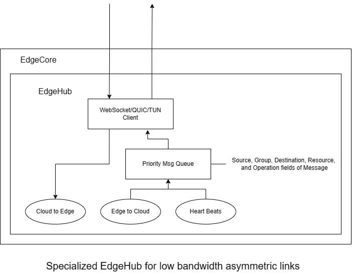
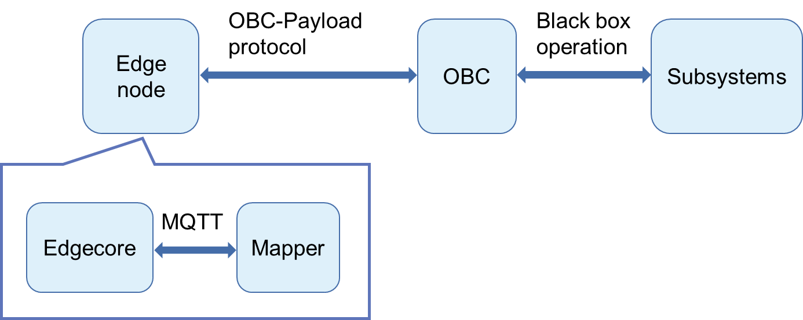

# KubeEdge supports non-IP and low-bandwidth asymmetric networks in heterogeneous network scenarios

## Motivation

In the satellite environment, the edge nodes act as payloads and are connected to the on-board computer via an intra-satellite LAN, which in turn communicates with the cloud on the ground network via a Satellite-Earth link. Therefore, there are two problems in porting KubeEdge to the satellite environment: cloud-side communication and device management.

In terms of cloud-side communication, the Satellite-Earth heterogeneous network does not support IP end-to-end communication, the available bandwidth is low and the upstream and downstream are highly asymmetric, and there is a window period for Satellite-Earth communication.

In terms of device management, there are many types of on-board devices with different access methods and protocols. And the management authority of satellite platform equipment and other payloads is in the satellite master, which cannot be directly accessed as the edge node of the satellite payload.

Due to the two types of problems described above, there are some difficulties in deploying and using KubeEdge in satellite scenarios and other similar heterogeneous network environments.

### Goals

* Support creating peer-to-peer IP tunnels through TUN devices combined with data link services, so that the two components of cloud edge cloudcore and edgecore in heterogeneous networks are in the same virtual network.
* Support the deployment and use of KubeEdge in low-bandwidth asymmetric networks with adaptive operation.
* Support KubeEdge's software definition of satellite platform devices, allowing applications and cloud users to access satellite devices in the form of virtualized devices.

## Proposal

### Use Cases

- Users can deploy and use KubeEdge based on heterogeneous network communication mode in special network environments such as satellites, UAV clusters, aircraft and ships to realize cloud-side communication under heterogeneous networks and device management of external computing loads.

## Design Details

### Cloud-Edge Communications：Heterogeneous network with no IP support between Cloud and Edge

Since the traditional public IP communication is not supported in the heterogeneous network environment such as Satellite-Earth link, KubeEdge cannot be used normally. In this regard, we have designed a heterogeneous network communication mode for KubeEdge, so that upper layer applications can have public IP communication capability in heterogeneous network environment without any awareness. Users can enable this mode by modifying the KubeEdge configuration file.

1. TUN device

A TUN is a virtual network device in the OS kernel. A virtual network device is implemented entirely in software and provides exactly the same functionality as a hardware network device to the software running on the operating system, while a TUN emulates a network layer device and operates on layer 3 packets such as IP data packets.

2. Character driver

Data written at the character device /dev/net/tun is sent to the TUN virtual interface and enters the TCP/IP stack of the operating system for processing, just like data entering the operating system from a physical NIC.

3. Communication Module

A generic interface that receives raw messages generated by the character driver and packages them in the packet format required by the custom protocol.

4. Custom Protocols

A custom protocol is the transition between a universally applicable communication module and a data chain of diverse forms. As an example of a satellite scenario, a custom protocol is used to connect a payload operating as an edge node to the satellite OBC, either by Ethernet or by serial port.

5. Data chains

The data chain is the data link between the cloud and the edge end of the custom protocol. In the satellite deployment scenario, it can refer to the satellite-ground link from the satellite OBC, to the UV-band component or the X-band component, and then to the ground station;  In the UAV cluster deployment scenario, it can refer to the link from the UAV on-board antenna to the UAV master.

### Cloud-Edge Communications：Connection between Cloud and Edge based on low bandwidth asymmetric links

Due to the transparent transmission characteristics of WebSocket/QUIC, the cloud-side messages cannot be parsed outside CloudCore and EdgeCore, and the adaptation of KubeEdge's communication components (CloudHub and EdgeHub) to low-bandwidth asymmetric links is not suitable for a non-invasive approach (such as KubeEdge's components). Therefore, it is feasible to add the communication components themselves to KubeEdge as transformation objects and as optional compilation options.

1. Specialized CloudHub

Adding cloudhub's awareness of link state, it senses the RTT of the link by the time interval between sending a message and receiving its ACK, and dynamically adjusts the sending rate in the case of unsatisfactory link state. In addition, the NodeMsgQueue no longer directly hands over the messages to be sent to the WebSocket/QUIC Server, but first enters the Priority Msg Queue for temporary storage, and its priority setting is based on a mixture of two types of priorities:

- For messages sent to the same edge node, prioritization is done based on Message (message format of beehive) Source, Group, Destination, Resource, and Operation fields.
- For messages sent to different edge nodes, prioritization is done according to the link conditions of different edge nodes and user's settings.

2. Specialized Edgehub

The Cloud-Edge messages sent by the EdgetoCloud concurrent process and HeartBeats concurrent process are no longer delivered directly to the WebSocket/QUIC Client, but are first staged in the Priority Msg Queue, whose priority setting is based on:

- Prioritization based on Message (beehive's message format) Source, Group, Destination, Resource, and Operation fields.

### Device management: edge nodes cannot be deployed in the master, lacking management rights of the device

Edge nodes as payload, and satellite OBCs communicate with some protocol to obtain system resource monitoring data from OBCs, while the interaction between OBCs and individual subsystems and the real reading and writing process of sensors are treated as black-box operations.

- Since the read and write to each device through a unified interface (i.e. OBC-load communication protocol), the modeling of the device does not have to be limited to the physical boundaries of the device, and the devicemodel and deviceInstance can be written at different granularities according to user requirements, treating the whole satellite platform, a single subsystem or a single sensor as a device.
- Mapper implements the OBC-load communication protocol, acquires system resource monitoring data, maps the data to user-defined device instances and converts them into mqtt format to send to edgecore.
