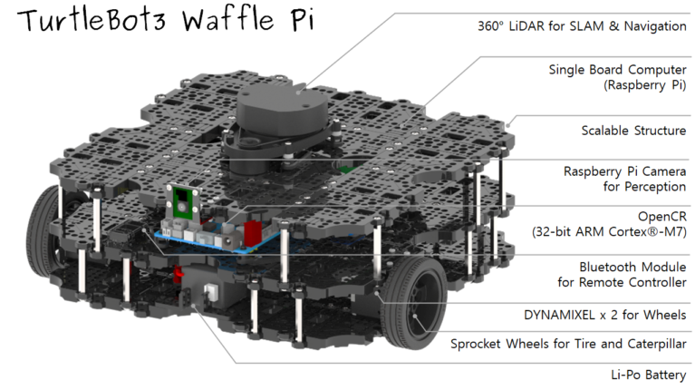

## 1 Motivation

The multi-robot system has become the development trend of the robotics industry. The multi-robot system has better robustness than a single robot and has a broader application space. The correctness and effectiveness of the multi-robot coordination and control algorithm can be verified by simulating the process of multi-robot system completing tasks in the environment through computer simulation.

### 1.1 Goals

- Add a park model to Gazebo, and add a variety of robots to cooperate to complete the inspection tasks of the entire park. And based on KubeEdge for multi-robot scheduling, planning and collaborative simulation.
- Robot :  wheeled robot;
- The cloud is responsible for the task distribution of each robot, as well as dynamic multi-robot scheduling. The edge(robots) feeds back its own status information in real time.
- Multiple robots collaborate to complete the inspection of a park scene (traversing the park)
- The cloud server is responsible for the task distribution of each robot and the dynamic scheduling of multiple robots. The edge robot feeds back its own state information in real time.

## 2 Proposal

### 2.1 Design Architecture

#### 2.1.1 Cloud function

- The cloud receives the position, speed, and other running status information of each robot at the edge in real time, which is used as the basis for task issuance and dynamic task adjustment.
- According to the scheduling strategy, the cloud sends tasks to the edge end: the location of the target point and the planned inspection path. And according to the status information reported by each robot in real time, it is adjusted in real time.
- Functions of scheduling strategy:  spatial-temporal prioritized planning approach.
  - Planning strategy should allows for centralized coordination of all robots, preventing dead-locks and improving efficiency, and gives every vehicle sufficient autonomy to react flexibly to dynamic environments.
  - Planning  strategy should consider the robot priority and time.

#### 2.1.2 Edge function

- Based on the target point information and path information sent by the cloud, the edge robot moves in the Gazebo environment by simulating the motion controller.
- In the process of moving, The robot is equipped with a LiDAR sensor to collect information about the surrounding environment, and combined with their own pose and speed to conduct own local path planning.
- The edge robot reports its own status information in real time during the process of moving.

### 2.2 Design Detail

Our work mainly refers to：tuw_multi_robot from ros wiki (https://github.com/tuw-robotics/tuw_multi_robot, http://wiki.ros.org/tuw_multi_robot). this repository includes ros packages to plan routes for multiple robots on a search graph. It creates a search graph out of a pixel map and tries to find a path for multiple robots using an extended approach for prioritized planning. The inputs are the tuw_multi_robot_msgs/RobotInfo messages which include the robots pose, the map and the desired goal poses. The output are multiple synchronized routes given to the individual robots.

The communication between the MRRP(Multi Robot Route Planner) and the robots in this project is based on the ROS master mechanism, which indicates that all information can be communicated in each part ideally. However, in reality, different robots have their own ROS master, and when there are a large number of robots, it needs to have high computing power requirements for the MRRP  (for example, 50 robots in a warehouse). Therefore, in our project, each robots belong to edge, and the MRRP is in the cloud, which is more closer to the real application as shown in the picture.

#### 2.2.1 Cloud

- There will be a preset global map（2d map by single line lidar SLAM) in the cloud. 
  - First, MRRP  receives a pixel map (occupancy_grid) and converts it into a voronoi graph describing the original map.
  - Second, The segmentation algorithm splits the Voronoi path generated into segments used as vertices for the graph.  Every vertex can be mapped to an area on a map describing the environment and a path segment composed of way points traverses each area to connecting vertices.
  - Finaly, MRRP planning paths for multi robots and avoid collisions by extending the search graph.

- Information received in the cloud:  position, speed, and other running status information ,etc of each robot.

- Information distributed from cloud: Current target point of each robotGlobal path.
  - Topic name : /robot_id/route

#### 2.2.2 Edge

- The edge robot moves in the gazebo environment by simulating the motion controller according to the target point information and path information sent by the cloud. 

- Our simulation robot is based on turtlebot3 Waffle Pi. (http://wiki.ros.org/turtlebot3)

  - Robot model and sensors:

    

- First, the robot builds an environment map based on  LiDAR for cloud MRRP.

  - using 2D salm Gmapping.  (http://wiki.ros.org/gmapping)

- Second, in the process of moving, the side-end robot is positioned in real time through the simulated single-line lidar on body; And combined with their own posture, speed. Do local path planning.
  - local path planning: dwa local planner. (http://wiki.ros.org/dwa_local_planner)

- Finally, During the driving process, the edge-end robot sends its own status information to the cloud in real time.
  - Information: Position, speed, posture, status information, etc.
  - Topic name : /robot_info
  - Communication mode: Edgemesh. (https://github.com/kubeedge/edgemesh)

