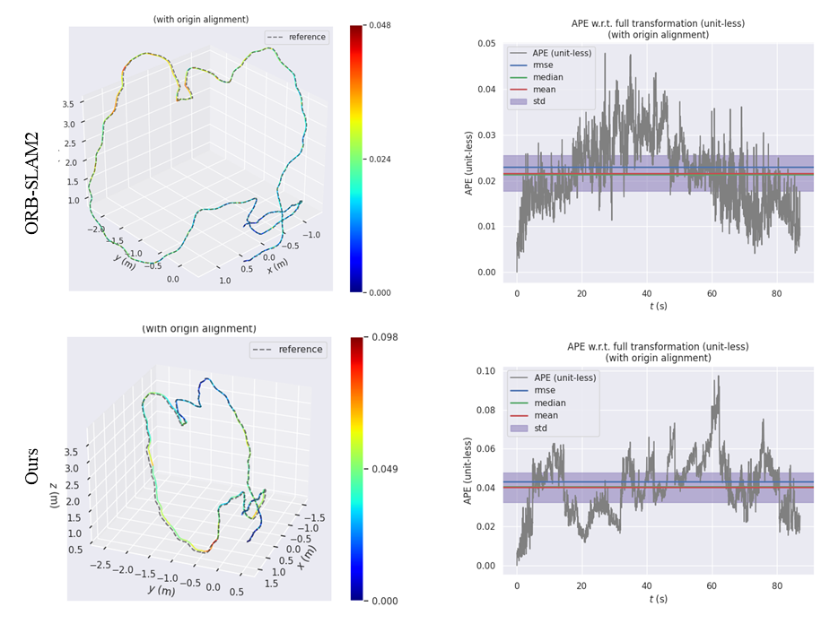

# Implement VSLAM algorithm based on KubeEdge

This project aims to develop a Visiual SLAM application on an edge-side robot and implementing compute offloading to reduce the compute and memory resource pressure on edge-side.

## Prerequisites

1. Kubeedge  1.10.1+
2. Edgemesh  1.11.0+

## Steps to reproduce

1. Make sure your cluster is set up and [edgemesh](https://kubeedge.io/en/docs/advanced/edgemesh/) is enabled.

2. Clone the community/sig-robotics respository.

   ```bash
   git clone https://github.com/kubeedge/community
   ```

3. Prepare your RGBD dataset or RGBD-sensors on the edge-side.

   > We use [TUM Datasets](https://vision.in.tum.de/data/datasets/rgbd-dataset/download) and its format in our development and test process.

4. With all nodes running on the cluster, we create the deployment by using the yaml file below.

   > For example, we have a cloud node and two edge nodes, named edge01 and edge02

   `cloud-deployment.yaml`

   ```yaml
   spec:
     template:
       spec:
         nodeName: edge02
   ```

   `edge-deployment.yaml`

   ```yaml
   spec:
     template:
       spec:
         nodeName: edge01
   ```

   Download [TUM Datasets](https://vision.in.tum.de/data/datasets/rgbd-dataset/download) to your edge node, and mount it within k8s.

   ```yaml
   spec:
     template:
       spec:
         - name: data-mount
           hostPath: 
             path: [your_absolute_path]/workspace/data
   ```

5. Make sure you have replace the `PATH_TO_SEQUENCE_FOLDER` ,`ASSOCIATIONS_FILE` in [edge-deployment.yaml](edge-deployment.yaml) and `TUN_NAME` in [cloud-deployment.yaml](cloud-deployment.yaml)to your own parameters.

   ```yaml
   env:
   - name: PATH_TO_SEQUENCE_FOLDER
     value: /workspace/data/YOUR_DATA_FOLDER
   - name: ASSOCIATIONS_FILE
     value: /workspace/Edgeslam/Examples/RGB-D/YOUR_CONFIG.yaml
   ```

   ```yaml
   env:
   - name: TUM_NAME
     value: TUM2
   ```

6. Create the applications deployment.

   ```bash
   kubectl apply -f edge-deployment.yaml
   kubectl apply -f cloud-deployment.yaml
   ```

7. If your edge-side node support X11 GUI, you will see a frame windows and a map window. The trajectory will be saved under `/workspace/edgeslam/Examples`  folder.

## Validation

The works we has used for reference including [ORB_SLAM2](https://github.com/raulmur/ORB_SLAM2), and combined the performance on [TUM datasets](https://vision.in.tum.de/data/datasets/rgbd-dataset/download). We illustrate the overall framework of ours in the chart and figures.

|    RMSE    | ORBSLAM2 | Ours |
| :--------: | :------: | :--: |
|  fr2_desk  |   0.05   | 0.12 |
| fr3_office |   0.02   | 0.04 |



**Conclusion**: Through the cloud-edge collaboration, the computational pressure on edge devices is reduced while ensuring better localization accuracy results.

## Development Tools

Due to the different application scenarios of robots, for cases that customer require, we provide some tools and environments to accelerate development process.

You can locally build a mutually isolated cloud and side container. To simulate edgemesh network communication, we need to first define a docker-network:

```bash
docker network create orbslam-cloud
```

Start the containers:

```bash
sudo ./scripts/run_container_cloud.sh
sudo ./scripts/run_container_edge.sh
```

## Reference

* [raulmur/ORB_SLAM2](https://github.com/raulmur/ORB_SLAM2)
* [droneslab/edgeslam](https://github.com/droneslab/edgeslam)
* [turlucode/ros-docker-gui](https://github.com/turlucode/ros-docker-gui)