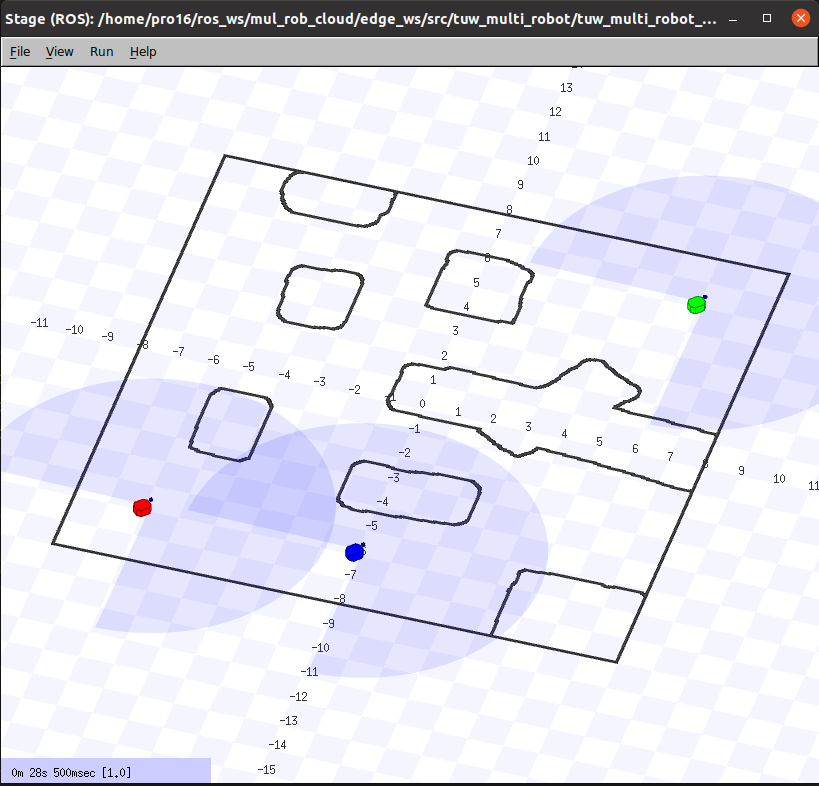
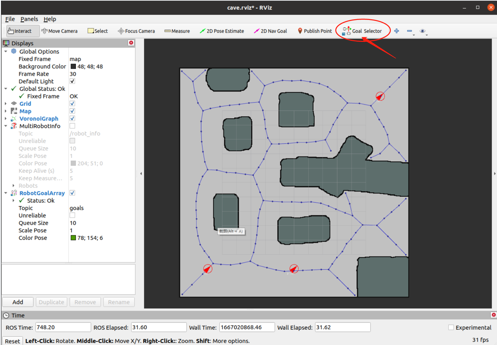
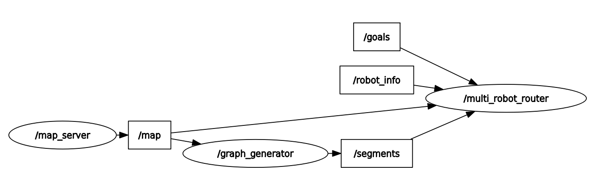

## README

### Environment

**Cloud**:

- ubuntu 20.04
- ROS - neotic 
- OpencCV 4.5

**Edge**

- ubuntu 20.04
- ROS - neotic 

### Setup

**Step 1**: You should set the ROS host on the cloud and the edge, and install the relevant dependencies

**Cloud**

```
sudo apt install libdxflib-dev
sudo apt install ros-neotic-map-server

# ~/.bash add
export ROS_MASTER_URI=http://CLOUD_IP:11311
export ROS_HOSTNAME=CLOUD_HOSTNAME
export ROS_IP=CLOUD_IP
source ~/.bashrc
```

**Edge**

```
sudo apt install ros-neotic-stage-ros

# ~/.bash add
export ROS_MASTER_URI=http://EDGE_IP:11311
export ROS_HOSTNAME=EDGE_HOSTNAME
export ROS_IP=CLOUD_IPCD ..
source ~/.bashrc
```


### **Edge Install and Run**

```
cd edge_ws/
git clone --branch $ROS_VERSION git@github.com:tuw-robotics/tuw_geometry.git 
git clone git@github.com:tuw-robotics/tuw_msgs.git 
catkin_make
source devel/setup.bash
roslaunch tuw_multi_robot_demo edge.launch 
```

**Step 2**:  First run the edge node, and you will see three robots in the environment in the window, and the terminal displays that three robots have been successfully online.

**Edge_show**



**Edge ROS node**


### **Cloud Install and Run**

```
cd cloud_ws/
git clone --branch $ROS_VERSION git@github.com:tuw-robotics/tuw_geometry.git 
git clone git@github.com:tuw-robotics/tuw_msgs.git 
catkin_make
source devel/setup.bash
roslaunch tuw_multi_robot_demo Cloud.launch room:=cave nr_of_robots:=3
```

**Step 3**: Run the cloud node. At this time, you will see the rviz interface and generate the split path node. You can set the target point positions for the three robots in order.

**Cloud show**



**Cloud ROS node**


