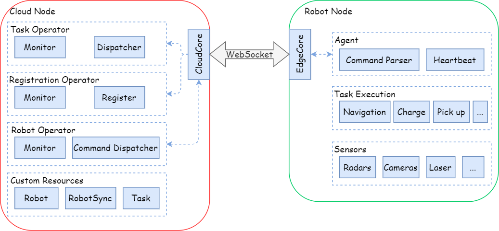
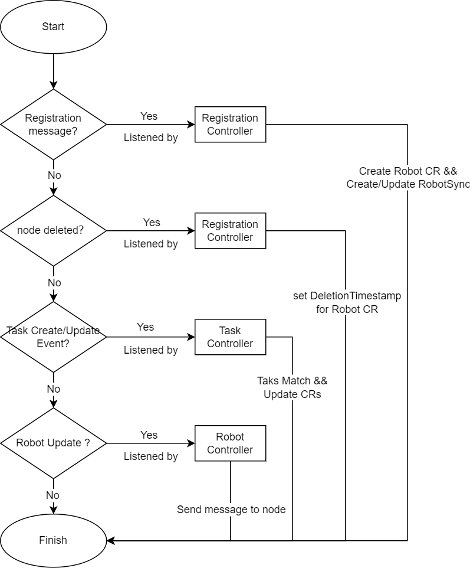
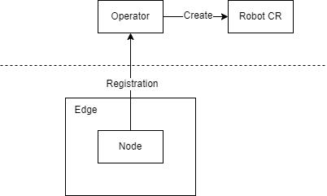
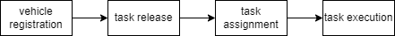

# Definition of Cloud Robot CRD and Operator

## Background

The emergence of cloud-native architecture has further facilitated the development of cloud-native robotics technology. Cloud-native architecture encompasses characteristics such as containerization, microservices, and elastic scalability. These features enable robotic systems to adapt more effectively to complex work environments and diverse task requirements. Leveraging containerization technology for deployment and management, the maintainability, scalability, and flexibility of robot systems are significantly improved.

Despite the widespread application of cloud-native robotics in industries such as industrial automation and logistics and warehousing, there is still a lack of a universal management and control solution that offers high availability and scalability for robots. This significantly hinders the broader adoption of cloud-native robotics and impedes further development in the robotics industry. A comprehensive set of CRDs and Operators is thus needed to enhance the scalability, flexibility, and availability of robots.

This proposal presents a design solution for a universal CRDs and Operator, enabling resource monitoring and automated control of cloud-native robots. 

## Goals

For developers or end users of CRDs and Operators, the goal of this project is to provide the following capabilities

CRDs are defined to achieve

- Difining robot resources
- Extending the robot API to enable robot control

Operator is designed to achieve

- automatizing  robotic operations
- Monitoring robot status
- automatizing fault handling
- adaptive controlling

## Proposal

The CRDs and Controllers is designed to provide more flexible and scalable management solutions for cloud robots connected to the KubeEdge platform.

project scope：

The scope of this project includes

- Providing a series of CRDs  and an Operator for managing cloud robotics based on KubeEdge architecture
  - CRDs to define robot properties and states
  - CRDs to extend teh robot API, through which we can control the robot
  - A series of controllers to realize the automatic control of the robot
- This project is to design the robot CRD based on the interface definition of industrial mobile robots proposed by the Mobile Robot Industry Alliance

targeting users：

- Developers：Building a complete solution for cloud robot management based on KubeEdge
- End users：Publishing tasks according to requirements and realizing automatic robot control

## Design Details

### Architecture

For this project, the architecture adopted basically follows the overall architecture of KubeEdge. The structure diagram of the project is shown in the figure below

The current predominant approach for managing cloud robots is to treat the robot as a unified entity, considering it as a Device and accessing the KubeEdge platform for management and scheduling purposes.

However, given that a robot is inherently composed of diverse sensors and controllers, it is more appropriate to view it as a combination of heterogeneous components rather than an indivisible arrangement. Consequently, in this solution, a robot is treated as an edge node, with its sensors and controllers serving as the device access platform for that node.

## CRD design

The purpose of this proposal is to propose a set of universal CRD and Operator for cloud robot. Since most industrial robot companies in China have joined the Mobile Robot Industry Alliance, the data interface specifications for robots and their scheduling systems proposed by them are widely applicable. This proposal refers to this specification to design the robot CRD.

To achieve our goal, we need three kinds of CRDs: **robot CRD**, **task CRD** and **robotSync CRD**. The robot CRD and task CRD describe the robot status and task information respectively, and the robotSync CRD is used to record the number of robot CR and their configuration informations. When the key information of the robot changes, the status information must be reported immediately, otherwise the information is reported in the form of a heartbeat frame at a period set by the user. Task resources are created by users and delivered by the Controller.

- The fields contained in the **robot** resource can be described as the table below:

|        Fields       |   Type   |              Description               |
| :-----------------: | :------: | :------------------------------------: |
|       robotID       |   uint   |            Unique ID of a robot        |
| registration_status | boolean  |  Indicates whether robot is registrated  |
|      position       |  struct  | Indicates the location of the robot, including coordinates, the last point passed, etc. |
|   running_status    |  struct  | Represents information related to robot motion, including linear velocity and angular velocity |
|     task_info     |  struct  | Including the identification of orders and tasks, a task can be represented by a series of points and segments |
|    battery_status    |  struct  | Including information such as remaining battery power, charging status, etc. |
|   abnormal_events   | struct[] |         Record the exception information of the node         |
|    robot_status     | boolean  |  indicates whether robot is ready for scheduling  |

-  The fields contained in the task resource can be described as the table below:

|          Field          |   Type   |                 Description                 |
| :---------------------: | :------: | :-----------------------------------------: |
|         orderID         |   uint   | The unique identification of the order in the system, used to identify whether multiple tasks belong to the same order |
|         taskID          |   uint   | The orderID and taskID jointly identify the task status currently executed by the robot |
|       allocated         |  string  | Empty if not assigned, otherwise the assigned robotID |
|  point_status_sequence  | struct[] |     Sequence of points already received and not executed     |
| segment_status_sequence | struct[] |    Sequence of segment already received and not executed     |
| task_destination_ID  |  uint  | Describe the task destination point ID  |

- The fields contained in the robotSync resource can be describe as follow:

|          Field          |   Type   |             Description         |
| :---------------------: | :------: | :-----------------------------: |
|     registed_robots     | string[] | Keep a list of registered nodes, including nodes name and a list of node devices |

## Controller design

The Controller is mainly used to monitor the newly added custom resources in the cluster, or the changes of existing resources, and execute corresponding logic based on these informations.

For *taskController*

1. When a new task resource is created in the cluster, taskController should monitor this change
2. The taskController match the task to a node that can execute the task
3. Then the Controller should modify the task_info field of the node

For the *robotControlelr*

1. The robotController monitors the changes of the robot resources
2. According to the changes, the Controller send the corresponding command to the node

For the *registrationController*

1. Listen for registration messages from robot nodes, and monitor the status of node at the same time
2. Creating the robot CR if it receives the registration message and maintain the informations of robotSync CR. If the node goes offline, set the DeletionTimeStamp for the corresponding robot CR

The processing logic of each Controller is shown in the figure below:

### Robot Registration

1. Registration Controller judges whether the node has been registered by comparing the number of nodes and robot CR
2. If a node is not registered, send a message to the node to remind the registration
3. When receiving a registration request, on the one hand, create a robot CR, and on the other hand, fill in the information in the registration request to robotSync

### Use case

Take the fleet scheduling system as an example:

Fleet scheduling can be divided into four stages

1. vehicle registration:
   - The registrationController checks the number of registered robots in the robotSync CR(create it if not exist) and the number of nodes ,  if they are inconsistent, it sends a message to the unregistered node to remind the registration
   - After the Registration Controller receives the registration request, it creates a robot CR and updates the registration information to the robotSync CR at the same time
2. task release:
   - The user creates a task CR on the cloud according to the specific task process
3. task assignment:
   - The taskController monitors the creation of the task CR and obtains the task content then selects a suitable robot from the registered robot list in robotSync to assign this task. It also modifies the task_info field in the corresponding robot CR
4. task execution:
   - The robotController listens to changes in the fields of the robot CR and obtains task-related information then it sends action messages to the corresponding nodes

## Roadmap

- July 2023: **project preparation stage.**
  - Deploy a KubeEdge experimental environment
  - Clarify the requirements and project deliverables
  - Further refine the project implementation plan based on this
- August 2023: **project development stage.**
  - According to the detailed plan of the previous stage, start the coding work of CRD
  - Implement the logic of the controllers according to the design of the CRDs, perform testing and validate the functionality
- September 2023: **project improvement stage.**
  - Complete the finishing work of the previous stage and further improve the code according to the requirements of the community
  - Start writing the end-of-term report
- October 2023: **project closure stage.**
  - Project optimization and integration