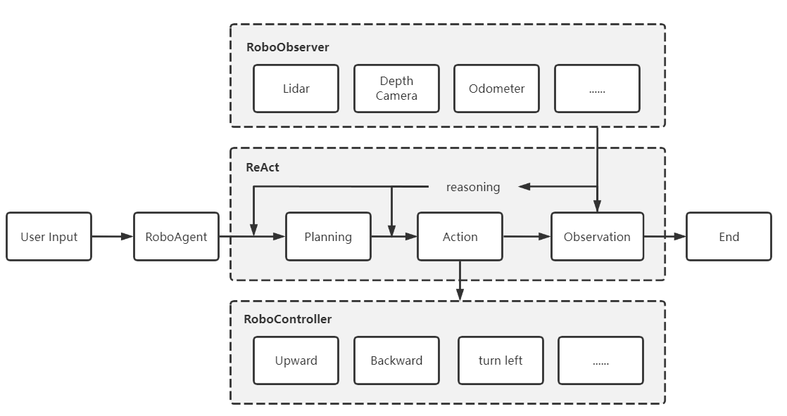
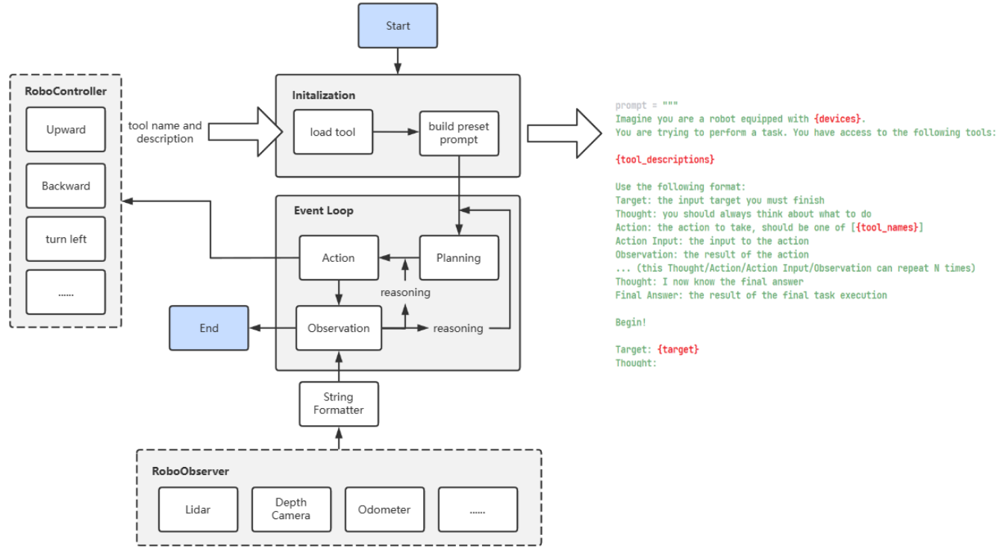

<center>
    <h1>Generating Action Sequences for Robot Task Plans using LLM</h1>
</center>


# 1. Background
Since Google proposed the SayCan framework, empowering robots with large language models to interpret complex task instructions has become a popular research topic. The demand for robots is no longer limited to simple command execution; instead, there is a desire for semantic understanding and task execution based on the exploration of underlying needs. Technologies like ChatGPT have driven the advancement of this field, while RoboSDK and ROS, which provide a unified API for cloud-based, robot-centric applications, can fulfill data collection and task execution requirements for heterogeneous devices.

This project use **prompt technique** to drive complex Robot operations, user utilize a prompt like  `Go to the kitchen and help me get an apple.` This prompt makes Robot go to the kitchen and find the apple, take it away, and finally take it back to the owner.

Current research：
- google [SayCan](https://say-can.github.io/)
- Microsoft [PromptCraft-Robotics](https://github.com/microsoft/PromptCraft-Robotics/tree/main)
- Nvidia [VOYAGER](https://github.com/MineDojo/Voyager)

This proposal provides a basic robot LLM Agent (RoboAgent) for RoboSDK, enabling robot developers and users to use LLM prompt to drive robots in an intelligent manner.

# 2. Goals
For developers or end users of RoboSDK, the goals of the RoboAgent are:

1. Test the perception, planning, and control algorithms of a robot in complex navigation and grasping tasks, both indoors and outdoors, based on given instructions (e.g. "Go to the front of that BYD car and check if anything important has been left behind"). Utilize large language models like ChatGPT for this purpose.

2. Perform closed-loop verification of the developed algorithms in **Gazebo** simulation environment.

3. Deploy the data transmission model and other development processes using RoboSDK.


# 3. Proposals
By building RoboAgent and its related components on RoboSDK, RoboSDK can have the ability to handle complex robot tasks based on LLM (Large Language Models).

The scope of RoboAgent and its related suite includes:
- Building a RoboAgent capable of task planning, environment observation, and phenomena reasoning based on prompt techniques such as ReAct, self-ask, tree-of-thoughts, to enable complex task planning and processing abilities.
- Providing a generic interface for large language models (LLM) to empower RoboAgent with inference and planning capabilities.
- Building the RoboToolKit suite based on prompt techniques like ReAct, which interfaces with the control interface built on RoboSDK to provide action-related instructions and control capabilities to RoboAgent.
- Providing the ability for RoboAgent to perceive the environment by accessing the sensor interface data of RoboSDK.
- Providing relevant documentation, sample templates, and auxiliary tools to reduce the learning curve for users.
- Creating related test cases and test reports.

This design targets developers aiming to build complex robots based on LLM using RoboSDK.

# 4. Design Details

## Architecture Design
To better build the capabilities of RoboAgent in task planning, environment perception, and reasoning, and to enable RoboAgent to handle complex robot instructions, we need to build the RoboAgent and related tool suites, including Planning, Action, Reasoning, and Observation. The following diagram illustrates the system architecture built based on this concept.




In this architecture, after RoboAgent receives a user input, it performs task planning to generate a sequence of sub-tasks. Then, RoboAgent constructs the required actions based on the sub-task sequence and executes the Robot instructions through the relevant controller. After execution, RoboAgent observes the environment to observe the changes that occurred as a result of the executed actions. For example, the distance to the car ahead is 5 meters (thing, distance, x, y, z). Based on the observed data, the Robot performs next-action reasoning to determine whether to execute the next sub-task or revise/update the task planning. This process continues until RoboAgent determines the completion of all sub-tasks, marking the entire task as finished and ending the task scheduling process.

> It should be noted that the Planning, Action, and Observation capabilities of RoboAgent are driven by large language models combined with techniques like ReAct and self-ask.

## Module Design
This plan consists of three main modules: RoboAgent module, RoboController module, and RoboObserver module.

- `RoboAgent`: This core module handles the behavior control and task scheduling of the Robot. It provides functions for user input to initiate task scheduling, as well as functionalities of its sub-modules such as task planning, behavior control, environment perception, behavior reasoning, event looping, etc.
- `RoboController`: This module provides behavior controllers for the Robot. It contains an array of Operators, where each Operator offers control for a specific type of behavior.
- `RoboObserver`: This module provides environment perception for the Robot. It contains an array of Sensors, where each Sensor provides information about the environment and its own operational status for the current state of the Robot.

## Flow Design
**For developers, a general development flow is as follows:**

1. Build a complete robot system in the hardware part.
2. Implement the relevant RoboSDK interfaces for all control and environment perception capabilities of the robot, such as implementing functionalities for a smart car robot, such as moving forward, backward, turning, etc.
3. Initialize the Controller and Observer and pass them to the RoboAgent for initialization. An example code snippet for this step is as follows:
```

```python

class Operator:
    name: str
    description: str
    ...

class Sensor:
    name: str
    description: str
    ...

    def get_data():
        ...


class RoboController:
    operators: List[Operator]
    ...

class RoboObserver:
    sensors: List[Sensor]
    ...

    def get_observation() -> str:
        ...

class RoboAgent:
    robo_controller: RoboController
    robo_observer: RoboObserver
    ...


def main():
    controller = RoboController(operators)
    observer = RoboObserver(sensors)
    robo_agent = RoboAgent(
        robo_controller=controller,
        robo_observer=observer
    )

```
4. Users can use it to input tasks that need to be executed on the RoboAgent and start task planning.

```python
def main():
    robot_agent.run("请帮我去客厅的桌子上拿一个苹果")
```

**The internal execution process of a RoboAgent is roughly as follows**



A preliminary prompt example is as follows:

```python
prompt = """
Imagine you are a robot equipped with {devices}. You are trying to perform a task. You have access to the following tools:

{tool_descriptions}

Use the following format:
Target: the input target you must finish
Thought: you should always think about what to do
Plans: you should be an overall plan.
    - first step you need to do
    - second step you need to do
    ...
Thought: 
Action: the action to take, should be one of [{tool_names}]
Action Input: the input to the action
Observation: the result of the action
... (this Thought/Action/Action Input/Observation can repeat N times)
Thought: I now know the final answer
Final Answer: the result of the final task execution

Performance Evaluation:
1. Continuously review and analyze your actions to ensure you are performing to the best of your abilities.
2. Constructively self-criticize your big-picture behavior constantly.
3. Reflect on past decisions and strategies to refine your approach. You got to change your plans in some cases.
4. Every command has a cost, so be smart and efficient. Aim to complete tasks in the least number of steps.


Begin!

Target: {target}
Thought:
"""


```


# 5. Roadmap
Upon the release of RoboAgent, the roadmap would be as follows.

- 2023.7 Optimize the architectural design and establish a preliminary framework for modular components, while conducting functional validation.
- 2023.8 Complete the basic functions of RoboAgent and attempt to optimize the details based on it.
- 2023.9 Conduct simulation testing, improve documentation and related examples.
