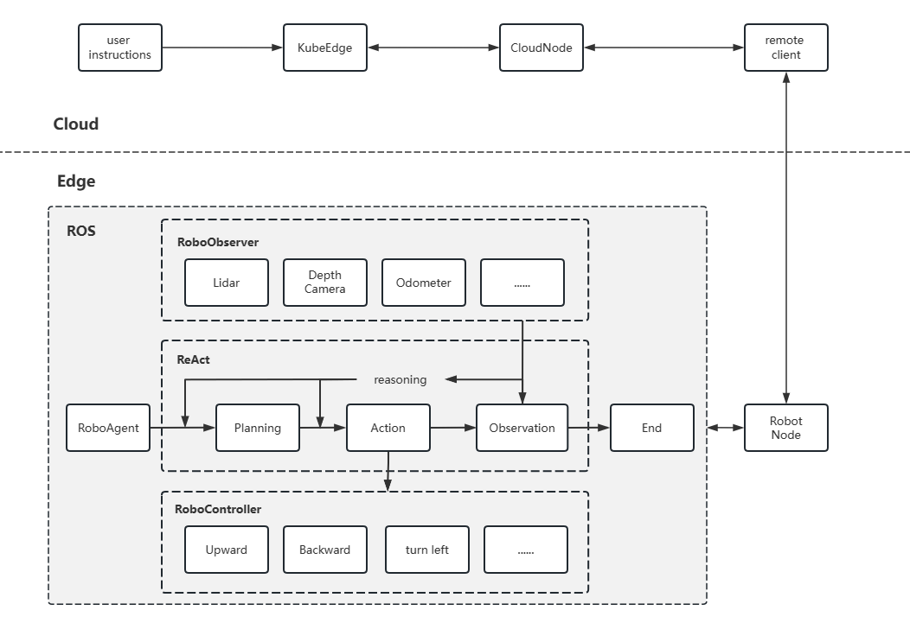
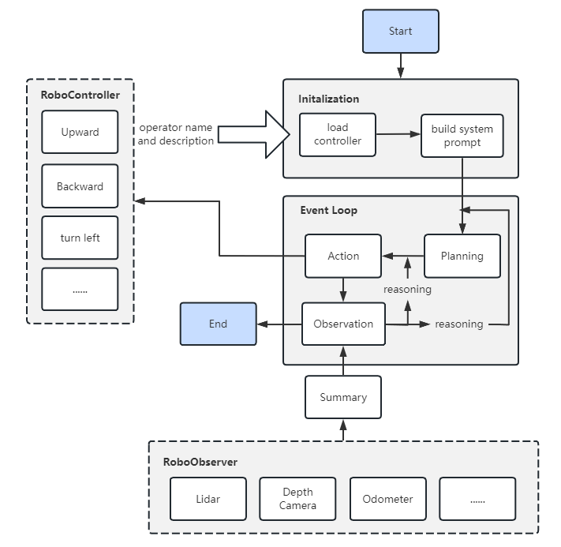

<center>
    <h1>Generating Action Sequences for Robot Task Plans using LLM</h1>
</center>

# 1. Background

Since Google proposed the SayCan framework, empowering robots with large language models to interpret complex task instructions has become a popular research topic. The demand for robots is no longer limited to simple command execution; instead, there is a desire for semantic understanding and task execution based on the exploration of underlying needs. Technologies like ChatGPT have driven the advancement of this field, while ROS2 which provide a unified API for cloud-based, robot-centric applications, can fulfill data collection and task execution requirements for heterogeneous devices.

This project use **prompt technique** to drive complex Robot operations, user utilize a prompt like  `Go next to the car ahead.` This prompt makes Robot generate a list of instruction plans and try to go next to the car.

Current researches：

- google [SayCan](https://say-can.github.io/)
- Microsoft [PromptCraft-Robotics](https://github.com/microsoft/PromptCraft-Robotics/tree/main)
- Nvidia [VOYAGER](https://github.com/MineDojo/Voyager)

This proposal aim to build a large language model driven Agent called RobotAgent, who has the ability to receive user requirements, analyze the requirements and generate a list of tasks. Moreover, execute tasks to meet user requirements.

# 2. Goals

For developers or end users of ROS2, the goals are:

1. Developers can use SDK of RobotAgent to control their robot more easier. Developers pass user requirements to RobotAgent, who can provide the ability of analyzing requirements, generating plans, execute task.

2. Developers can use simulation tool like **[Gazebo](https://gazebosim.org/home)** to simulate the how RobotAgent to generate lists of plans and execute them. Furthermore, it is possible to attempt to construct abilities that can be applied in reality.

3. Provide easier to use the client of RobotAgent for developers.

# 3. Proposals

By building RobotAgent and its related components.The scope of RobotAgent and its related suite includes:

- Building a RobotAgent capable of task planning, environment observation, and phenomena reasoning based on structural prompt to enable complex task planning and processing abilities based on the ability of LLM.
- Providing the ability to utilize large language models for RobotAgent.
- Building the RobotController. RobotAgent can use RobotController to control the robot. Developer need to implement all abilities of the robot.
- Building the RobotObserver. RobotAgent can use RobotObserver know about current environment information, which helps RobotAgent make a better decision-making.
- Providing relevant documentation, sample templates, and auxiliary tools to reduce the learning curve for users.

This design targets developers aiming to build complex robots based on LLM using RobotAgent.

# 4. Design Details

## Architecture Design

To better build the capabilities of RobotAgent in task planning, environment perception, and reasoning, and to enable RobotAgent to handle complex robot instructions based on the ability of LLM, we need to build the RobotAgent and related tool suites, including Planning, Action, Reasoning, and Observation. In addition, we need to address issues regarding the illusion of large language models and the effectiveness of result outputs. It is necessary to incorporate validators and evaluation components into the system architecture for proper assessment. The following diagram illustrates the system architecture built based on this concept.



In this architecture:

- In ROS, a node client is created to communicate with Robot, which integrates directly with the existing RobotAgent for communication.
- After receiving user requests from client, the RobotAgent uses LLM for task planning and generates a sequence of subtasks. Task planning is based on user input and robot capabilities, determining the optimal way to accomplish the required tasks.
- RobotAgent constructs the actions to be executed based on the subtask sequence and executes robot commands through relevant controllers. This involves invoking ROS robot controllers to perform specific actions such as movement and object manipulation.
- After executing a single command, RobotAgent performs environmental perception, observing the changes in the environment after the execution. For example, the distance to the car in front is 5 meters (thing, distance, x, y, z). Upon receiving the environmental perception data, the robot engages in reasoning for the next step based on its current behavior and environmental perception.
- Based on the observed data, the robot engages in reasoning for the next action, determining whether to execute the next subtask or modify/update the task plan. If task plan modification is necessary, RobotAgent returns to the task planning step to regenerate the subtask sequence.
- The above cycle of control, perception, and reflection is repeated until RobotAgent determines the completion of all subtasks, indicating the completion of the entire task and concluding the task scheduling.

> It should be noted that the Planning, Action, and Observation capabilities of RobotAgent are driven by large language models combined with techniques like ReAct and self-ask.

## Module Design

This plan consists of three main modules: RobotAgent module, RobotController module, and RobotObserver module.

- `RobotAgent`: This core module handles the behavior control and task scheduling of the Robot. It provides functions for user input to initiate task scheduling, as well as functionalities of its sub-modules such as task planning, behavior control, environment perception, behavior reasoning, event looping, etc.
- `RobotController`: This module provides behavior controllers for the Robot. It contains an array of Operators, where each Operator offers control for a specific type of behavior.
- `RobotObserver`: This module provides environment perception for the Robot. It contains an array of Sensors, where each Sensor provides information about the environment and its own operational status for the current state of the Robot.

## Flow Design

**For developers, a general development flow is as follows:**

1. Build a complete robot system in the hardware part.
2. Implement the relevant RobotController interfaces for all control and environment perception capabilities of the robot, such as implementing functionalities for a smart car robot, such as moving forward, backward, turning, etc. An example code snippet for this step is as follows:

```Python

# control robot
class Operator:
    name: str
    description: str
    ...


# robot sensor
class Sensor:
    name: str
    description: str
    ...

    def get_data():
        ...


class RobotController:
    def __init__(self, operators: List[Operator]) -> None:
        self.operators: List[Operator] = operators

        if self.get_operator("stop") is None:
            raise ValueError("Please provide stop operator")

    def execute_action(self, action_name: str, *args, **kwargs) -> None:
        """Execute action by action_name."""

    def get_operator(self, action_name: str) -> Operator:
        """Get operator by action_name"""


class RobotObserver:
    def __init__(self, sensors: List[Sensor]) -> None:
        self.sensors: List[Sensor] = sensors

    def get_data(self, sensor_name: str) -> None:
        """Get data from sensor_name"""

    def get_sensor(self, sensor_name: str) -> Sensor:
        """Get sensor object by sensor_name"""


class RobotAgent:
    robo_controller: RobotController
    robo_observer: RobotObserver
    
    def generate_tasks():
        """Generating a list of tasks based on user requirements."""

    def run(user_requirements: str):
        """Main loop for RobotAgent to control robot."""


def main():
    controller = RobotController(operators)
    observer = RobotObserver(sensors)
    robo_agent = RobotAgent(
        robo_controller=controller,
        robo_observer=observer
    )

```
4. User can use it to input tasks that need to be executed on the RobotAgent and start task planning.

```python

def chat_and_control_robot(user_requirement: str):
    """Say the user requirements to RobotAgent and work it."""
    agent = RobotAgent(**params)        
    agent.run("Could you please help me to ...")

```

**The internal execution process of a RobotAgent is roughly as follows**




Some prompt examples is as follows:

```python
## Role
You are a robot assistant with the ability to control a robot through instructions. You need to think and execute control tasks in the order they are presented to you, using the robot to fulfill the user's requests.

## Robot Brief
The robot is a ROS2 robot car.

## Skill
The robot has the following capabilities, which you can utilize:
{skills}

## Environment information
{environment}

## User Demand
{user_demand}

## Pending Control Task Queue
{pending_tasks}

## Your Task
- You need to execute each step in the given order.
- If all tasks in the task queue have been completed, output the relevant stop command.

## Output format
The output should be formatted as a JSON instance that conforms to the JSON schema below.

As an example, for the schema {"properties": {"foo": {"description": "a list of strings", "type": "array", "items": {"type": "string"}}}, "required": ["foo"]}
the object {"foo": ["bar", "baz"]} is a well-formatted instance of the schema. The object {"properties": {"foo": ["bar", "baz"]}} is not well-formatted.

Here is the output schema:
{"properties": {"task": {"description": "control task", "allOf": [{"$ref": "#/definitions/Task"}]}}, "required": ["task"], "definitions": {"Task": {"title": "Task", "type": "object", "properties": {"id": {"title": "Id", "description": "Autoincrement task id", "type": "integer"}, "name": {"title": "Name", "description": "task name", "type": "string"}, "parameters": {"title": "Parameters", "description": "task parameters", "type": "object"}, "reason": {"title": "Reason", "description": "Reason for task execution", "type": "string"}}, "required": ["id", "name", "parameters", "reason"]}}}

```

- Generate Initialization tasks

```text
## Role
You are now a Robot Assistant. Your task is to accurately understand the user's requirements and help them control the robot effectively to meet their needs.

## Robot Brief
A ROS2 robot car.

## Skills
The robot has the following capabilities, which you can utilize appropriately:
{skills}

## Task
Your task is to understand the user's input requirements and generate a series of task plans for the robot based on its current capabilities.

## Attention
-Let's take a deep breath and think step by step.
-The task planning should not exceed the robot's capabilities.
"""

OUTPUT_FORMAT = """
## Output format
The output should be formatted as a JSON instance that conforms to the JSON schema below.

As an example, for the schema {"properties": {"foo": {"description": "a list of strings", "type": "array", "items": {"type": "string"}}}, "required": ["foo"]}
the object {"foo": ["bar", "baz"]} is a well-formatted instance of the schema. The object {"properties": {"foo": ["bar", "baz"]}} is not well-formatted.

Here is the output schema:
{"properties": {"tasks": {"description": "task sequences", "type": "array", "items": {"$ref": "#/definitions/Task"}}}, "required": ["tasks"], "definitions": {"Task": {"title": "Task", "type": "object", "properties": {"id": {"title": "Id", "description": "Autoincrement task id", "type": "integer"}, "name": {"title": "Name", "description": "task name", "type": "string"}, "parameters": {"title": "Parameters", "description": "task parameters", "type": "object"}, "reason": {"title": "Reason", "description": "Reason for task execution", "type": "string"}}, "required": ["id", "name", "parameters", "reason"]}}}
```


# 5. Roadmap

Upon the release of RobotAgent, the roadmap would be as follows.

- 2023.7 Optimize the architectural design and establish a preliminary framework for modular components, while conducting functional validation.
- 2023.8 Complete the basic functions of RobotAgent and attempt to optimize the details based on it.
- 2023.9 Conduct simulation testing in Gazebo.
