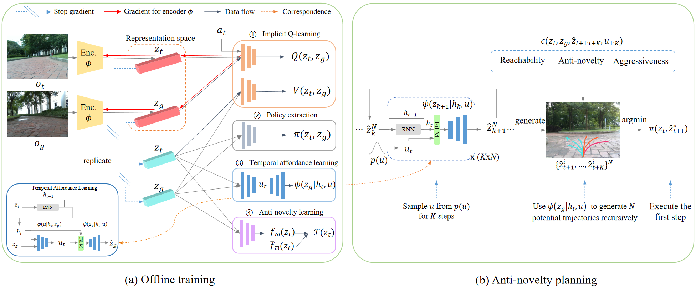
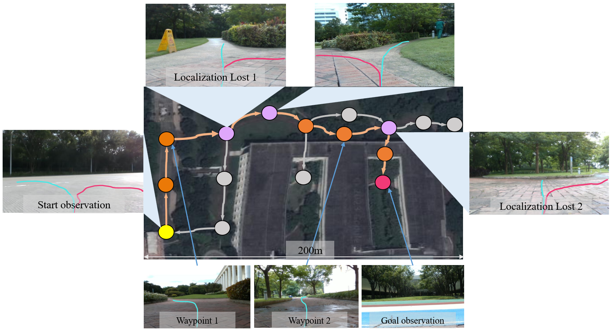

# Offline Visual Navigation without Metric Map

## Background

Existing learning-based navigation studies mainly develop the algorithms in simulation environment that often suffer from **sim-to-real gap** issue when transferring to the real world. Recently, there is some work dedicated to lift the simulation assumptions by learning directly from offline real-world dataset that are not necessarily collected from experts, such as ViNG [1], ReViND [2], and ViNT [3], which use either imitation learning (IL) or offline reinforcement learning (ORL). This route has been proven to achieve broader generalization for executing real-world tasks and thereby step towards generic AI agents. Moreover, the efforts in navigation tasks integrate offline learned policy with an image-node neural topological SLAM [4] for handling long-horizon reasoning that pure RL policy cannot tackle, which has a significance value for replacing the conventional metric maps that are hard to store and update. Therefore, this work aims to follow this technical route and explore how to achieve a **robust** AI agent in the navigation tasks **without sim-to-real gap** and **without metric maps**. 

Through real-world testing, we observe that due to the limited state distribution in the offline dataset, when facing the **out-of-distribution (OOD)** observations induced by illumination and scenario changes and the accumulative errors, the localization loss issue often arises that the robot fails to localize itself on a given map. In this case, the robot may get stuck or make infeasible decision, which significantly decreases the navigation success rates and even results in collision. And this often requires tedious human monitoring and correction. To address this issue, our work poses the question and takes one step forward:’ can we leverage the prior knowledge from offline data to guide the robot to **self-correct** the trajectory autonomously without human intervention or specific data collection?’ To this end, our key idea is learning from offline dataset to predict whether future trajectories lie in the prior distribution, and plan the future trajectories that can drive the robot to the familiar places autonomously. Real-world experiments show our method achieves +26% average success rates and x2 longer the average distance until intervention than the baselines (ViNG and ReViND), proving that our method can significantly reduce the human intervention for practical applications. This project, called "*SCALE: Self-Correcting Visual Navigation for Mobile Robots via
Anti-Novelty Estimation*", has been accepted by 2024 ICRA, see paper: https://ieeexplore.ieee.org/document/10610847.
<!-- https://arxiv.org/abs/2404.10675. -->

## Goals

For developers and end users, the goals of this project are:
- Building an image-goal conditioned visual navigation system with only visual input and without metric maps. The models are trained by directly learning from real-world offline datasets that does not suffer from any sim-to-real gap.
- The system can be easily integrated into an instruction-followed navigation tasks by grounding the languages on the visual semantics similar to LM-Nav [5]. 
- The system can be robust to the OOD observations induced by illumination and scenario changes and accumulative error issues using the proposed self-correcting method so as to achieve long-horizon navigation with little human intervention during the process. 
- Providing an offline dataset collection method to enable the users to finetune on the new environments. Meanwhile, curating a large real-world trajectory dataset collected from diverse end devices in different scenarios, with different illuminations and seasons, and on different robots, which is absent in the current open-source datasets and is important to facilitate the models to be more generalized and robust.

## Proposals

### Project Scope

- This project considers the image-goal visual navigation task in both indoor and outdoor scenarios, which **inputs a RGB image and a specified goal image** and **outputs the actions (linear and angular velocities)** of the mobile robots at timestep t without LIDAR, GPS or IMU information. Its **downstream tasks** can include park delivery, mobile manipulation, or offline training a generic agent. 
- This project provides **both training and deployment pipelines** for using our method in the users' scenarios, while trained models can be used either on cloud or on edge since they are not too large for real-time inference. 
- The method requires first collecting some trajectories of the scene for pre-building a topological map where images as nodes and the number of traversing steps as edges for topological planning and localization. Then, the navigation models are trained on the collected trajectoris, after which the complete system can conduct image-goal conditioned travels in the scene while is robust to the localization loss issue.

### Targeting Users

- Users that need a training pipeline of offline imitation learning or reinforcement learning that does not suffer from sim-to-real gap and can scale to handling larger datasets to achieve a generic AI agent similar to ViNT [3].
- Users that need a visual navigation system in the deploying environments to implement image-goal navigation tasks such as park delivering given an image as a goal.
- Users that need a non-metric map representation, i.e., an image-node topological graph for long-horizon planning and localization with low storing and updating cost.
- Developers that want to build a customized visual navigation system for mobile or mobile manipulation tasks according to their preference.

## Design Details

### Architecture Design

**Fig. 1. Overall pipelines for offline training and online inference.**
(a) SCALE first pretrains a self-consistent representation space $z$ by the VAE-style loss, then fine-tunes it by the gradients from $Q(s, a, g)$ in the IQL. Next, we train the policy network $π$, temporal affordance model $ψ$ and the novelty predictor $f_ω$ over the trained representation space.
(b) During inference, when the robot gets lost, SCALE randomly samples some transition $u$ from the prior $p(u)$ and feds it to the temporal affordance model to generate some multi-step latent trajectories recursively. Then it evaluates the candidates in terms of the reachability, anti-novelty and aggressiveness. Finally, it selects the optimal trajectory and executes the first step, then repeats until being successfully localized again.    

The complete navigation system consists of 1) an image-goal conditioned visual navigation policy and value function, 2) a self-correcting module for autonomously recovering the localization and 3) a neural topological SLAM module, where the pipelines of the first two terms are illustrated in Fig. 1.

- **Image-goal conditioned visual navigation**: we use implicit Q-learning (IQL) [6], an offline reinforcement learning method to learn the value function and policy from offline dataset. In practice, we find two techniques useful for successfully learning the value functions from purely visual input: 1) *Negative sampling* is necessary for value learning with paired image inputs, where we assign image pairs that are separated less than or equal to a threshold of timesteps $d_{max}$ as the positive samples $B_+$ and those separated beyond the threshold are assigned as the negative samples $B_−$. 2) *Relative goal embedding*, the difference between goal and current image embeddings, *i.e.*, $∆z_{g,t} = z_g – z_t$, is more effective than directly using goal embedding $z_g$ as the input for the goalconditioned networks to perceive the goal orientation.
- **Self-correction for localization recovery**: we self-supervisedly learn an affordance model from offline dataset for generating potential future trajectories in the latent space. On the one hand, to predict multi-step trajectories, we use conditional generation model to learn the latent space with forward-inverse cycle consistency (FICC). On the other hand, we take advantage of the surrounding pixels in history frames using recurrent neural network (RNN) to predict some aggressive trajectories that are largely beyond the current field-of-view. Furthermore, we learn a novelty estimator via random network distillation (RND) [7] technique to evaluate the predicted future states. Intuitively, the reachability and aggressiveness facilitate the reasonability and diversity, while the anti-novelty strategy can induce the robot to the familiar places.
- **Neural topological SLAM**: we construct a topological map in the environment where each node is a previously observed image and each edge refers to the traversability between two nodes that is estimated by the learned value function. The localization process is conducted by searching the highest value prediction between current image and all the images on the map. 

An example of the integration of visual navigation, neural topological SLAM, and localization recovery modules is illustrated in Fig.2. Our method combines the topological visual navigation with a novel localization recovery module. We first build a topological map (gray cycles and lines) based on the offline dataset. Next, starting at the yellow cycle, we use the localization module to do active initialization. Then, given a goal image, we search a route (orange cycles) on the topological graph and execute to the goal (red cycle) step by step.

  
  

**Fig. 2. Visual navigation with neural topological SLAM and localization recovery**. 

### Data Collection

We manually teleoperate the mobile robot to collect the trajectory datasets in the deployed scenarios. Commonly, a totally 30-minute dataset in each scenario is enough for training the navigation policy. In each trajectory of the dataset, the data consists of an onboard RGB image $o_t$ and the estimated pose $p_t = (x, y, θ)$ from odometry at each timestep. Note that the estimated pose in offline dataset is only used to calculate the robot action for offline training, while we only use RGB image as the observation during inference.

## References
[1] D. Shah et al., “ViNG: Learning Open-World Navigation with Visual Goals”, 2021.  
[2] D. Shah et al., “Offline Reinforcement Learning for Visual Navigation”, 2022.  
[3] D. Shah et al., “ViNT: A Foundation Model for Visual Navigation”, 2023.                     
[4] D.S. Chaplot et al., “Neural Topological SLAM for Visual Navigation”, 2020  
[5] D. Shah et al., “LM-Nav: Robotic Navigation with Large Pre-Trained Models of Language, Vision, and Action”, 2022  
[6] Kostrikov et al., “Offline Reinforcement Learning with Implicit Q-Learning”, 2021.  
[7] Burda et al., “Exploration by Random Network Distillation”, 2018.