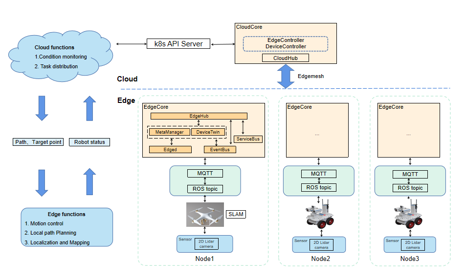
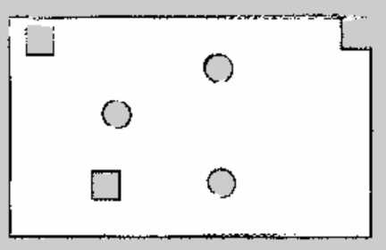
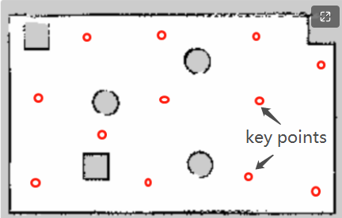
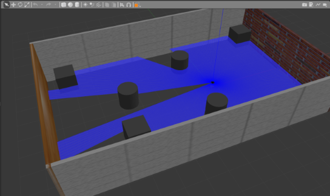
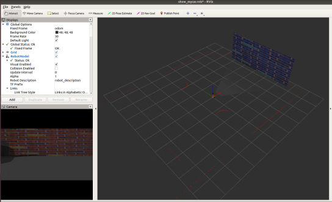

## 1 Motivation

The multi-robot system has become the development trend of the robotics industry. The multi-robot system has better robustness than a single robot and has a broader application space. The correctness and effectiveness of the multi-robot coordination and control algorithm can be verified by simulating the process of multi-robot system completing tasks in the environment through computer simulation.

### 1.1 Goals

- Add a park model to Gazebo, and add a variety of robots to cooperate to complete the inspection tasks of the entire park. And based on KubeEdge for multi-robot scheduling, planning and collaborative simulation.
- Robot : quadrotor UAV, wheeled robot;
- The cloud is responsible for the task distribution of each robot, as well as dynamic multi-robot scheduling. The edge(robots) feeds back its own status information in real time.
- Multiple robots collaborate to complete the inspection of a park scene (traversing the park)
- The cloud server is responsible for the task distribution of each robot and the dynamic scheduling of multiple robots. The edge robot feeds back its own state information in real time.

## 2 Proposal

### 2.1 Design Architecture

#### 2.1.1 Cloud

- The cloud receives the position, speed, and other running status information of each robot at the edge in real time, which is used as the basis for task issuance and dynamic task adjustment.
- According to the scheduling strategy, the cloud sends tasks to the edge end: the location of the target point and the planned inspection path. And according to the status information reported by each robot in real time, it is adjusted in real time.
- Scheduling strategy: like a multi-trip dealer problem (maintain a dynamic task list, update the scheduled task of each robot according to the working status of the robot)

#### 2.1.2 Edge

- Based on the target point information and path information sent by the cloud, the edge robot moves in the Gazebo environment by simulating the motion controller.
- In the process of moving, The robot is equipped with a lidar sensor to collect information about the surrounding environment, and combined with their own pose, speed to conduct  local path planning.
- The edge robot reports its own status information in real time during the process of moving.

### 2.2 Design Details

#### 2.2.1 Cloud

- There will be a preset global map（2d map by single line lidar SLAM) in the cloud.

- Information received in the cloud:  position, speed, and other running status information ,etc of each robot.
- Information distributed from cloud: Current target point of each robot，Global path.
- scheduling strategy:
  - Maintain a dynamic task list, get the key points of the map, and traverse the map by reaching the key points.
  - According to the working state of the robot, update the scheduling task of each robot, and assign the latest target point from the task list in real time.
  - 

#### 2.2.2 Edge

- The edge robot moves in the gazebo environment by simulating the motion controller according to the target point information and path information sent by the cloud, 
- Use the rbotix package as the motion controller. (http://wiki.ros.org/arbotix)

- In the process of moving, the side-end robot is positioned in real time through the simulated single-line lidar on board; And combined with their own posture, speed. Do local path planning.
  - Sensor: single-line lidar,  RGB camera, RGBD camera, etc.
  - local path planning: dwa local planner (http://wiki.ros.org/dwa_local_planner)

- During the driving process, the edge-end robot sends its own status information to the cloud in real time.
  - Information: Position, speed, posture, status information, etc.
  - Communication mode: Edgemesh. (https://github.com/kubeedge/edgemesh)

