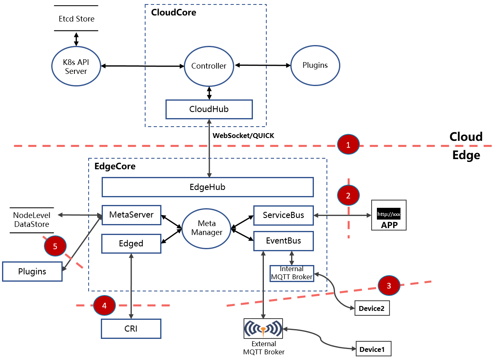

# KubeEdge Threat Model And Security Protection Analysis

## Background

As the first cloud-native edge computing community, KubeEdge provides solutions for cloud-edge synergy and has been widely adopted in industries including Transportation, Energy, Internet, CDN, Manufacturing, Smart campus, etc. With the accelerated deployment of KubeEdge in this area based on cloud-edge synergy, the community will improve the security of KubeEdge continuously in cloud-native edge computing scenarios.

The KubeEdge community attaches great importance to security and has set up[ Sig Security](https://github.com/kubeedge/community/tree/master/sig-security) and[ Security Team](https://github.com/kubeedge/community/tree/master/security-team) to design KubeEdge system security and quickly respond to and handle security vulnerabilities. To conduct a more comprehensive security assessment of the KubeEdge project, the KubeEdge community cooperates with Ada Logics Ltd. and The Open Source Technology Improvement Fund performed a holistic security audit of KubeEdge and output a security auditing report, including the security threat model and security issues related to the KubeEdge project. Thank you to experts Adam Korczynski and David Korczynski of [Ada Logics](https://adalogics.com/) for their professional and comprehensive evaluation of the KubeEdge project, which has important guiding significance for the security protection of the KubeEdge project. Thank you Amir Montazery and Derek Zimmer of OSTIF and Cloud Native Computing Foundation (CNCF) who helped with this engagement.

 The discovered security issues have been fixed and patched to the latest three minor release versions (v1.11.1, v1.10.2, v1.9.4) by KubeEdge maintainers according to the [kubeedge security policy](https://github.com/kubeedge/kubeedge/security/policy). Security advisories have been published [here](https://github.com/kubeedge/kubeedge/security/advisories).

This article will analyze the threat model of KubeEdge, and carry out the mitigations.

## Target Audience

There are a number of groups who may find it useful to understand some of the risks and possible mitigations inherent in the use of KubeEdge:

- Contributors of KubeEdge. A general threat model could be useful to people who are developing KubeEdge, looking at things to think about.

- Organizations deploying KubeEdge. Where organizations are using KubeEdge in their clusters, it could be useful for them to know of common attacks and possible weaknesses, so they can review their own configuration.

- Security assessors who are responsible for assessing the security of existing and newly deployed Kubernetes clusters that use KubeEdge.

- Developers who need to understand updates to, and attacks against KubeEdge to proactively avoid things in the future.

## KubeEdge threat-model and mitigations

According to the KubeEdge security auditing report, there are the threat actors:

- External malicious attackers, representing actors that access KubeEdge from outside.
- Internal attackers, including inadvertent internal actors who accidentally cause issues.
- Supply chain attackers, representing attackers that subvert components of the KubeEdge software supply chain.

In the following sections the KubeEdge community will do an overall system security analysis of KubeEdge, which is mainly based on the [STRIDE threat modeling](https://en.wikipedia.org/wiki/STRIDE_(security)) and the [KubeEdge security audit](https://github.com/kubeedge/community/blob/master/sig-security/sig-security-audit/KubeEdge-security-audit-2022.pdf). The goals of the following sections are helping developers or users understand the potential security threats in the system, the content includes a list of corresponding mitigations currently available in the KubeEdge community and security reinforce recommendations for users and developers.

### Attack surface of external malicious attackers

We construct the attack surface of external malicious attackers by way of the KubeEdge architectural diagram, which is shown in the following figure:

As shown in the diagram above, when the trust relationship flows from low to high, there is a trust boundary, which is marked with sequence numbers in the diagram. The following will analyze in detail the trust boundary in the KubeEdge system architecture and give a list of corresponding mitigations currently available in the KubeEdge community and security reinforce recommendations.

#### Threat ID 1：CloudCore connection to EdgeCore

**Description：**

EdgeCore has a separate level of authority in the overall system, in that an attacker in control of EdgeCore should not be able to negatively affect other edge nodes, e.g. by way of manipulation of CloudCore. In this sense the trust relationship flows from low to high in that EdgeCore has lower authority over KubeEdge than CloudCore, and CloudCore should be considered the highest level of trust in the KubeEdge ecosystem (Reference from the security audit report under section `KubeEdge attack surface enumeration`).

**Impact**

The attacker maliciously modifies the traffic packets between the CloudCore and EdgeCore, resulting in the threat of spoofing and tampering.

**Mitigation：**

- Traffic between the CloudCore and EdgeCore service has been encrypted using TLS version 1.2, and the encryption algorithm suite is TLS_ECDHE_ECDSA_WITH_AES_128_GCM_SHA256, by default, only this algorithm is supported in the whitelist to prevent clients from using unsafe algorithms to launch a connection and cause security risks.
- Mutual authentication has been required between the connection of the CloudCore and EdgeCore service, to ensure that only authenticated endpoints can communicate with each other.
- Certificates which are used for mutual authentication can be appropriately validated and the default validity period of the certificate is one year. After the certificate expires, it becomes invalid to prevent the certificate from being exploited by attackers. Based on the existing certificate rotation mechanism of the kubeedge project, users can realize the automatic replacement of expired certificates to ensure business continuity.

**Recommendations**

- [Recommendation ID 1 - Encrypt with a private key of a safe length](#recommendation-id-1---encrypt-with-a-private-key-of-a-safe-length)
- [Recommendation ID 2 - Use a CA certificate from a trusted source](#recommendation-id-2---use-a-ca-certificate-from-a-trusted-source)

#### Threat ID 2：HTTP server connection to EdgeCore

**Description：**

The HTTP server in EdgeCore exposes EdgeCore locally on the system and the applications on the local system do not have a high level of authority over the full KubeEdge cluster. In this context, EdgeCore should be protected against attempts from the local system to thwart KubeEdge. In this sense the trust relationship flows from low to high in that the local applications have lower authority over the KubeEdge ecosystem than EdgeCore (Reference from the security audit report under section `KubeEdge attack surface enumeration`).

**Impact**

The data received by the ServiceBus component is often not controlled by the management plane, and attackers can launch malicious packet attacks on the ServiceBus component, resulting in the risk of spoofing and tampering in the communication process. ServiceBus component exceptions will only affect a single edge node service failure and will not cause a crash to the entire KubeEdge system.

**Mitigation：**

- The ServiceBus component only listens on the local host port, the service scope has been restricted, and only the local process is allowed to access. The security of this component is guaranteed by restricting the access rights of the local user.
- There is an audit log which records the log of connection access when the server receives the client connection, allowing administrators to detect the occurrence of attacks in time, and stop the ServiceBus service in time to prevent the attack from continuing.
- The ServiceBus service is closed by default following the principle of default security. We also alert users of the risks of enabling ServiceBus service in the user guide book.

**Recommendation：**

- [Recommendation ID 3 - Strictly restrict access rights of edge nodes](#recommendation-id-3---strictly-restrict-access-rights-of-edge-nodes)

- [Recommendation ID 4 - Strictly restrict permissions for app deployment](#recommendation-id-4---Strictly-restrict-permissions-for-app-deployment)

- [Recommendation ID 5 - Strictly verify the validity of the application image](#recommendation-id-5---strictly-verify-the-validity-of-the-application-image)

#### Threat ID 3：MQTT broker connection to EdgeCore

**Description：**

The Devices can reach EdgeCore by way of the MQTT broker. There is a trust boundary here where the Devices themselves should not be able to negatively affect the overall KubeEdge system. For example, if an attacker controls a device, the overall system should be protected against possible attacks from this device. In this sense the trust relationship flows from low to high in that the devices have lower authority over the KubeEdge system than EdgeCore (Reference from the security audit report under section `KubeEdge attack surface enumeration`).

**Impact**

The data received by the EdgeCore component is often not controlled by the management plane, and attackers can launch malicious packet attacks on the EdgeCore component, resulting in the risk of spoofing and tampering in the communication process. EdgeCore component exceptions will only affect a single edge node service failure and will not cause a crash to the entire KubeEdge system.

**Mitigation：**

- The MQTT Broker only listens on the local host port, the service scope has been restricted, and only the local process is allowed to access. The security of this component is guaranteed by restricting the access rights of the local user. The EventBus component can also be used as a client to connect to an external third-party MQTT Broker. If the user uses a third-party MQTT Broker, please refer to the security guide documentation of the corresponding third-party MQTT Broker service provider for detailed mitigation measures.
- EventBus only processes specific topics in MQTT Broker, and users can't access EdgeCore with a malicious topic through this channel.

**Recommendation：**

- [Recommendation ID 3 - Strictly restrict access rights of edge nodes](#recommendation-id-3---strictly-restrict-access-rights-of-edge-nodes)
- [Recommendation ID 4 - Strictly restrict permissions for app deployment](#recommendation-id-4---Strictly-restrict-permissions-for-app-deployment)

- [Recommendation ID 5 - Strictly verify the validity of the application image](#recommendation-id-5---strictly-verify-the-validity-of-the-application-image)
- [Recommendation ID 6 - Strictly restrict the access of edge devices](#recommendation-id-6---strictly-restrict-the-access-of-edge-devices)

#### Threat ID 4：Edged manages and monitors K8s resources

**Description：**

Edged handles the running of Pods. The containers in these pods have low authority over the KubeEdge system and privileges thus flow from low to high. An attacker in control of some components in the containers should not be able to grow a foothold of more of the KubeEdge system (Reference from the security audit report under section `KubeEdge attack surface enumeration`).

**Impact**

If the CRI plugin accessed by Edged is maliciously forged by an attacker, there is a threat of spoofing and tampering of the CRI plugin, resulting in abnormal local services.

**Mitigation：**

- Edged only accesses the trusted path locally of the CRI plug-in (usually served as the Unix domain sockets file descriptor), the access path is configured by administrator, and file descriptor is minimized the permissions to avoid malicious replacement by attackers.

**Recommendation：**

- [Recommendation ID 3 - Strictly restrict access rights of edge nodes](#recommendation-id-3---strictly-restrict-access-rights-of-edge-nodes)
- [Recommendation ID 7 - Strictly review the configuration of CRI plugins on edge nodes](#recommendation-id-7---strictly-review-the-configuration-of-cri-plugins-on-edge-nodes)

#### Threat ID 5：MetaServer provides HTTP services at edge nodes

**Description：**

The MetaServer starts a HTTP server and acts as an edge api-server for Kubernetes operators. It is a highly trusted piece of the KubeEdge architecture. This makes it susceptible to attention from attackers that would seek to control the operators communicating with the MetaServer (Reference from the security audit report under section `EdgeCore: MetaServer`).

**Impact**

The data received by the MetaServer component is often not controlled by the management plane, and attackers can launch malicious packet attacks on the MetaServer component, resulting in the risk of spoofing and tampering in the communication process. MetaServer component exceptions will only affect a single edge node service failure and will not cause a crash to the entire KubeEdge system.

**Mitigation：**

- The MetaServer component only listens on the local host port, the service scope has been restricted, and only the local process is allowed to access. The security of this component is guaranteed by restricting the access rights of the local user.
- The MetaServer component is disabled by default following the principle of default security. We also alert users of the risks of MetaServer service in the user guide book.

**Recommendation：**

- [Recommendation ID 3 - Strictly restrict access rights of edge nodes](#recommendation-id-3---strictly-restrict-access-rights-of-edge-nodes)
- [Recommendation ID 4 - Strictly restrict permissions for app deployment](#recommendation-id-4---Strictly-restrict-permissions-for-app-deployment)

- [Recommendation ID 5 - Strictly verify the validity of the application image](#recommendation-id-5---strictly-verify-the-validity-of-the-application-image)

### Attack surface of internal malicious attackers

Possible risks from internal malicious attackers mainly include administrators or operators who accidentally cause issues by deploying malicious deployments into the cluster, performing high-risk configurations, and so on.

**Mitigation：**

- The KubeEdge community has provided detailed [functional descriptions of each component](https://kubeedge.io/en/docs) to guide system administrators or operators to operate properly and reduce security risks caused by accident or misconfiguration. Due to the continuous iteration of KubeEdge, this document will also continue to be updated and refined.

**Recommendation：**

- [Recommendation ID 3 - Strictly restrict access rights of edge nodes](#recommendation-id-3---strictly-restrict-access-rights-of-edge-nodes)
- [Recommendation ID 4 - Strictly restrict permissions for app deployment](#recommendation-id-4---Strictly-restrict-permissions-for-app-deployment)
- [Recommendation ID 8 - Strictly divide the permissions of each role in the system](#recommendation-id-8---strictly-divide-the-permissions-of-each-role-in-the-system)
- [Recommendation ID 9 - Follow up and update the KubeEdge version in time](#recommendation-id-9---follow-up-and-update-the-KubeEdge-version-in-time)

### Attack surface of supply chain attackers

Supply chain attacks are an ever-present threat, exploiting weakpoints to interfere with software. Attacks can occur at every link in a typical software supply chain, which puts an extra burden on anyone involved in complex critical systems. 

**Mitigation：**

- KubeEdge was one of the first adopters of SLSA and has achieved Supply chain Levels for Software Artifacts (SLSA) compliance in collaboration with Ada Logics. SLSA is a security framework, a check-list of standards and controls to prevent tampering, improve integrity, and secure packages and infrastructure in our projects. For detailed SLSA description, please refer to[ https://slsa.dev/spec/v0.1/#supply-chain-threats](https://slsa.dev/spec/v0.1/#supply-chain-threats).
- The dependabot which achieves third-party dependency library check function has been enabled in the CI/CD pipeline of the KubeEdge Repo, the third-party dependency libraries are detected in time and updated in the KubeEdge version to reduce the risk of being attacked.
- The KubeEdge community has established a complete vulnerability handling strategy, including the entire process of vulnerability reporting, vulnerability processing, vulnerability disclosure and release, which can fix security vulnerabilities in time. For detailed vulnerability handling and disclosure policies, please see [here](https://github.com/kubeedge/community/blob/master/security-team/SECURITY.md).
- KubeEdges is developed through GitHub, and releases are built in an automatic build service. This sets the project up for SLSA compliance with a great foundation. The KubeEdge community will continuously make the pursuance of compliance on top of this foundation.

**Recommendation：**

- [Recommendation ID 10 - Strictly verify the binary files according to the verification files released by the community](#recommendation-id-10---strictly-verify-the-binary-files-according-to-the-verification-files-released-by-the-community)
- [Recommendation ID 11 - Achieve SLSA compliance in your projects](#recommendation-id-11---achieve-slsa-compliance-in-your-projects)

### Recommendations

#### Recommendation ID 1 - Encrypt with a private key of a safe length

**Description：**

It is recommended that users generate a private key of at least 2048 bits, encrypt and store the private key locally, and set the private key file with minimal access rights, which can only be read by the owner.

#### Recommendation ID 2 - Use a CA certificate from a trusted source

**Description：**

It is recommended that the certificates are issued from a mutually trusted Certificate authority.

#### Recommendation ID 3 - Strictly restrict user login permissions of edge nodes

Strictly limit the local permissions of edge nodes, limit the user login permissions of external users, and reduce unnecessary authorization.

#### Recommendation ID 4 - Strictly restrict permissions for app deployment

**Description：**

Strictly limit the authority of edge node application deployment, only system services and administrators can have the authority to deploy privileged containers.

#### Recommendation ID 5 - Strictly verify the validity of the application image

**Description：**

Strictly verify the validity of application images when deploying applications on edge nodes, to prevent malicious applications from being deployed.

#### Recommendation ID 6 - Strictly restrict the access of edge devices

**Description：**

Strictly review the devices connected to edge nodes to avoid unnecessary device access.

#### Recommendation ID 7 - Strictly review the configuration of CRI plugins on edge nodes

**Description：**

Strictly review the configuration of the CRI plug-in, and use the official recommended configuration of the CRI corresponding plug-in.

#### Recommendation ID 8 - Strictly divide the permissions of each role in the system

**Description：**

Strictly divide the permissions of each role in the system, and implement fine-grained control of system role permissions through RBAC, OPA, etc.

#### Recommendation ID 9 - Follow up and update the KubeEdge version in time

**Description：**

Vulnerabilities will be solved and merged in the latest 3 minor release versions, and it is recommended that users follow the community [security advisory](https://github.com/kubeedge/kubeedge/security/advisories) to obtain vulnerability disclosure information, and follow up and update the KubeEdge version in time.

#### Recommendation ID 10 - Strictly verify the binary files according to the verification files released by the community

**Description：**

Before take the binary files released by the community, users should strictly verify the binary files with the verification files (file format: checksum_*binary file name*.txt). The release package address is [here](https://github.com/kubeedge/kubeedge/releases).

#### Recommendation ID 11 - Achieve SLSA compliance in your projects

**Description：**

In the process of building from source code, users or vendors should refer to the SLSA to improve integrity, and secure packages and infrastructure in your projects, businesses or enterprises.

## Appendix

### Important Links

- [Security Policy](https://github.com/kubeedge/kubeedge/security/policy)
- [Security audit report](https://github.com/kubeedge/community/tree/master/sig-security/sig-security-audit/KubeEdge-security-audit-2022.pdf)
- [Security advisories](https://github.com/kubeedge/kubeedge/security/advisories)
- [KubeEdge threat model and security protection analysis](https://github.com/kubeedge/community/tree/master/sig-security/sig-security-audit/KubeEdge-threat-model-and-security-protection-analysis.md) (This document)
- [User guide book](https://kubeedge.io/en/docs/)
- [SLSA Introduce](https://slsa.dev/spec/v0.1/#supply-chain-threats)
- [KubeEdge release page](https://github.com/kubeedge/kubeedge/releases)

