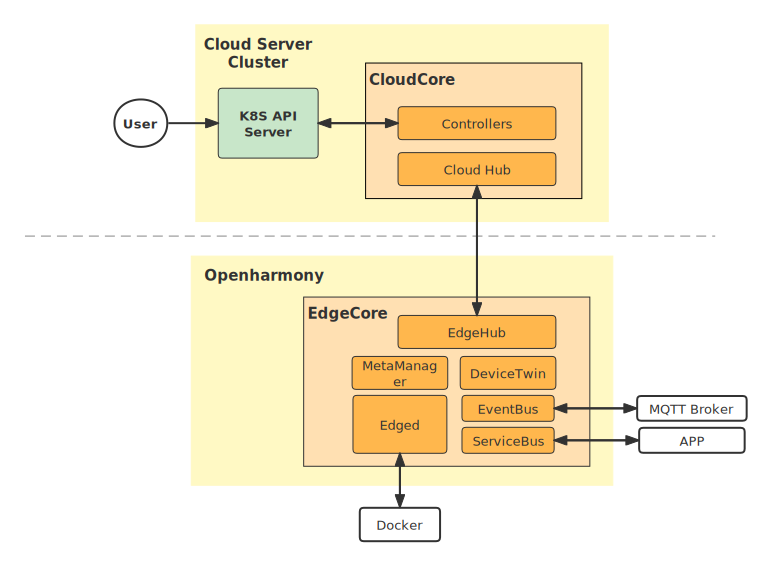

# OpenHarmony  as  an  edge of  KubeEdge

## Background

Cloud computing is far away from terminal devices (such as cameras and sensors). Computing in the cloud has high requirements for real-time computing, which may cause long network delay, network congestion, and service quality deterioration. And terminal devices often lack the computing power to compete with the cloud. Under such demand, edge computing arises at the historic moment, extending the cloud computing capability to the edge node near the terminal to solve the above problems. KubeEdge as the world's first Kubernetes native open source edge computing platform, relying on Kubernetes container scheduling and scheduling capabilities, by managing users' edge nodes, provide the ability to extend cloud applications to the edge, link edge side and cloud data. To meet customers' demands for remote control, data processing, analysis and decision making and intelligence of edge computing resources. At the same time, the cloud provides unified device/application monitoring, log collection and other operation and maintenance capabilities, providing enterprises with a complete edge computing solution of edge cloud collaborative integration services.

At present, the cloud can support KubeEdge as long as it supports K8S deployment, while the edge node system needs to support docker, containerd and other container technologies to support the deployment and operation of KubeEdge edge. Docker is the most common container technology available today, with deployments supporting distributions for MAC, Windows, and Linux (Ubuntu,  Debin, Arch). However, an important area for edge computing power is the Internet of Things and mobile devices (e.g. robots, set-top boxes, etc.), which are basically operating systems like Android, OpenHarmony , etc. We hope to further expand the application scenarios of cloud native edge computing KubeEdge in the mobile domain. At present, we have tried to deploy KubeEdge on Android operating system, but some manufacturers have the root permission to deploy KubeEdge, which will be a great obstacle, while OpenHarmony has not tried. OpenHarmony is an open source project incubated and operated by the OpenAtom Foundation. So if you empower OpenHarmony, you can extend KubeEdge to the entire ecosystem.

## Goals

The purpose of project which is supporting KubeEdge edge nodes run on OpenHarmony is :

- Front: Expand the system types of edge nodes supported by KubeEdge
- Side: Extend the current OpenHarmony standard system capabilities to support Docker container technology and run KubeEdge

## Proposals

So the project which is "Supporting KubeEdge edge nodes run on OpenHarmony"  is to extend the current OpenHarmony standard system capabilities to support container technology and run KubeEdge  to extend the operating system supported by edge Computing edge node.

#### The expected overall structure is:

#### The project can be broken down into two main tasks:

- Modify the internal configuration of the OpenHarmony standard system so that it can run Docker
- OpenHarmony standard system run KubeEdge edgecore program.

#### Project feasibility:

- OpenHarmony standard system is the Linux kernel that meets the requirements of docker runtime
- KubeEdge can be deployed to OpenHarmony either by cross-compilation or direct compilation
- Existing projects have tried to install and run Docker and KubeEdge in Android system

## Design details

#### Task 1: OpenHarmony runs the Docker container
1. Modify the kernel configuration of the OpenHarmony standard system so that it can run Docker
    (1) Modify kernel configuration cgroup and namespace related features, kernel CPUSET, network, overlay Filesystem, etc
    (2) Check whether the OpenHarmony standard system has the required file directory structure and can be read and written, if there is no need in the compilation image is created.
2. Compile and run the modified OpenHarmony standard system on RK3568
3. Install docker container engine components on OpenHarmony using docker static binaries
4. Prepare related directories and routes on OpenHarmony system before running Docker.
5. Run Docker and test docker availability with Hello-world.

#### Task 2: Install kubeEdge on OpenHarmony standard system
KubeEdge static edgecore: cross-compile KubeEdge static edgecore: 

1. cross-compile KubeEdge static edgecore

2. Import static edgecore ADB to OpenHarmony standard system

#### Task 3: Build the overall kubeEdge framework and test the usability of the framework
1. Ubuntu Cloud cluster uses keadm to deploy KubeEdge cloudcore
2. Obtain the token from the cloud
3. Rk3568 runs KubeEdge edgecore
4. Test: check whether there is rK3568 side terminal in the cloud and send service to RK3568 edge terminal in the cloud to judge whether KubeEdge runs normally.

## Road map

####  6.27-7.24 KubeEdge cloud node deployment

-  Familiar with deployment operation: In the first two weeks, I will try to deploy KubeEdge on the side of Ubuntu and Raspberry PI operating system.
- Cloud construction: The cloud node of KubeEdge project will be completed in the next two weeks.
#### 7.25-8.21 OpenHarmony install Docker

-  Familiar with deployment operations: Docker is deployed using static binaries on other Linux kernel operating systems such as the Raspberry PI operating system
- Docker deployment: Docker is deployed using static binaries on OpenHarmony standard systems
#### 8.22-9.18 Install KubeEdge in OpenHarmony

- Method 1: Use KubeEdge official edge binaries to deploy on OpenHarmony
- Method 2 try: Use KubeEdge source code to compile the edge binary file on host and deploy it on OpenHarmony
#### 9.18-9.30 Summary

- Project Output: KubeEdge edge nodes run on OpenHarmony operating system devices
- Organize project documents, presentations, and code

